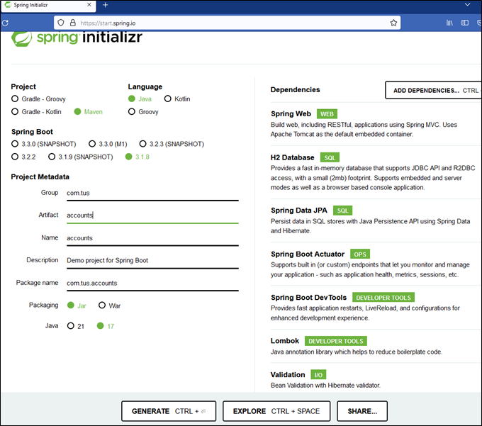
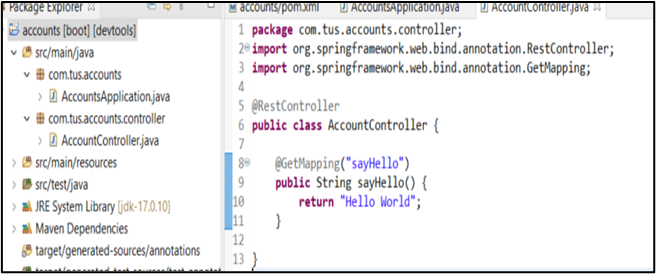

# Lab#1 Getting started with Springboot – Helloworld Example

1.	Create a new project from Spring.io. Add the dependencies shown. Java 17 is required for Springboot 3.
 

2.	Generate and Import the Maven Project into your IDE.

3.	Now Add a Restcontroller class to your project as shown below.

4.	Test the application.

