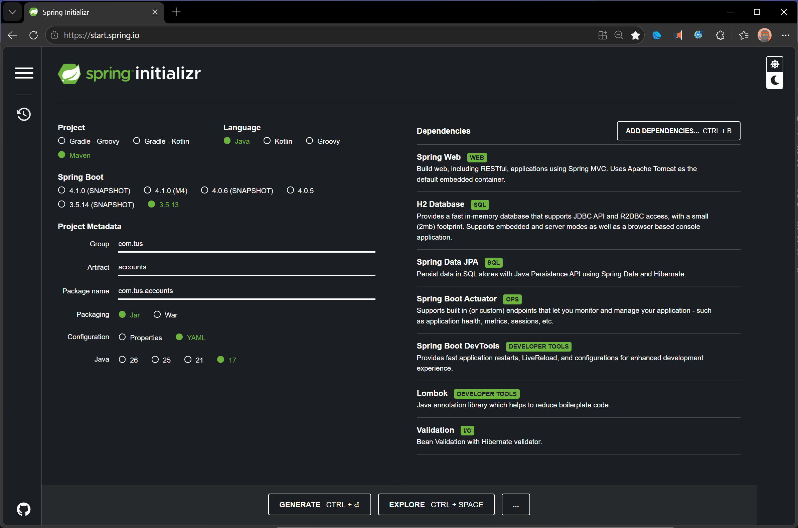
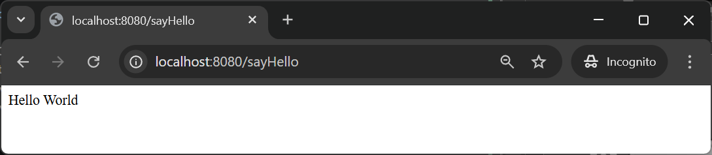

# RESTful API Lab 1

## Lab#1 Getting started with Springboot – Helloworld Example

### 1.	Create a new project from Spring.io. Add the dependencies shown. Java 17 is required for Springboot 3.
 


    Figure 1. Spring Initializer

### 2.	Generate and Import the Maven Project into your IDE.

### 3.	Now Add a Restcontroller class to your project as shown below.

```java title="AccountController.java" linenums="1"
package com.tus.accounts.controller;
import org.springframework.web.bind.annotation.RestController;
import org.springframework.web.bind.annotation.GetMapping;

@RestController
public class AccountController {
    @GetMapping("/sayHello")
    public String sayHello() {
        return "Hello World";
    }
}
```

### 4.	Test the application.

`localhost:8080/sayHello`

