# RESTful API Lab 2

## Lab#2 Configuring H2 DB and YAML application.properties

In this lab we will continue from the previous lab and configure the application to use an in-memory H2 database.

### 1. Rename application.properties as application.yml  and update with following properties (file provided)
 
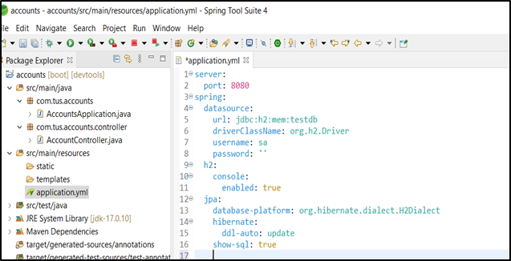

### 2. Create a file called scheme.sql (provided) in the resources folder with the following data.
 
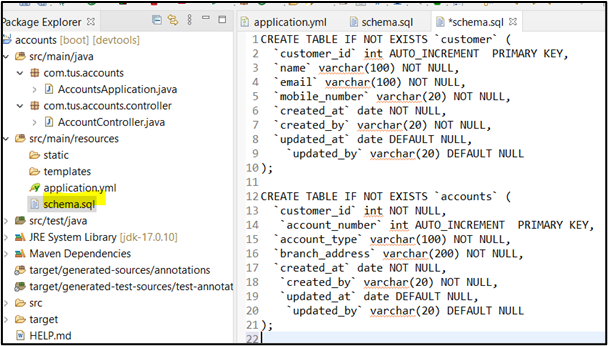

### 3. Restart the server. It will start on port 8080 based on yml file.
### 4. Go to the h2-console in the browser. You should see the two tables have bee created.
 
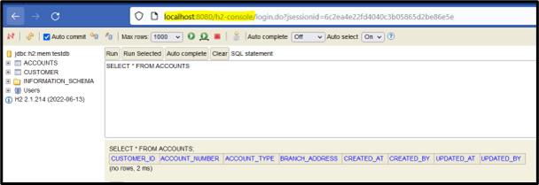

Now we will write Spring Data JPA entities & repositories to interact with DB tables

### 4. Create a new package for the entity classes as show below.
 
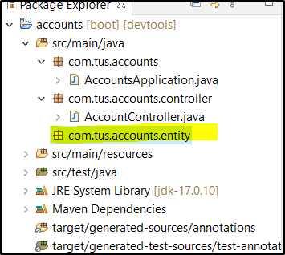

### 5. Add the classes BaseEntity, Accounts and Customers (given) and examine the code.
 
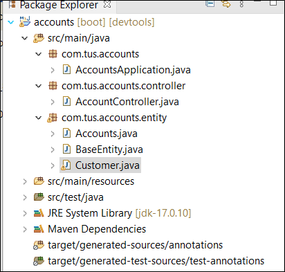

### 6. Now Add the Repository interfaces
 
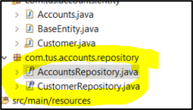

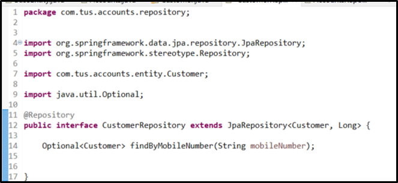

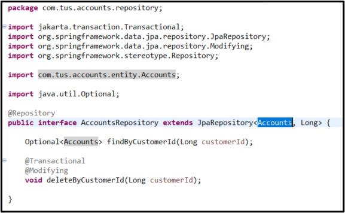
 
We will use the Data Transfer Object pattern to transfer data – not the entity classes themselves.

### 7. Create a new package with class AccountsDto and CustomerDto. These classes uses Lombok (You may need to turn on annotations in your IDE or install a Lombok jar)
 
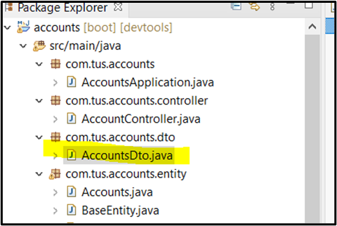 

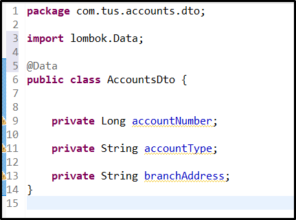 

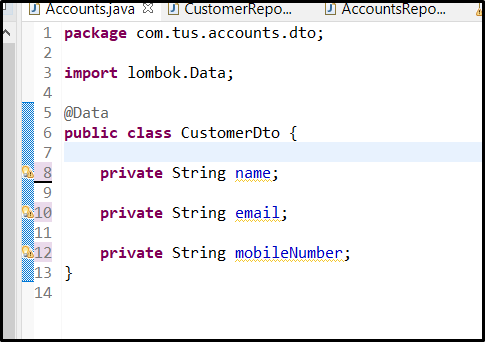 
 
### 8. Also add a ResponseDto and an ErrorResponseDto class
 
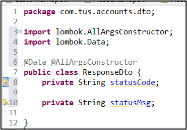 

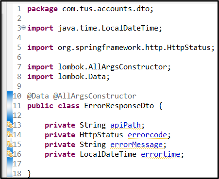 
