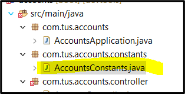
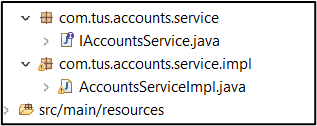
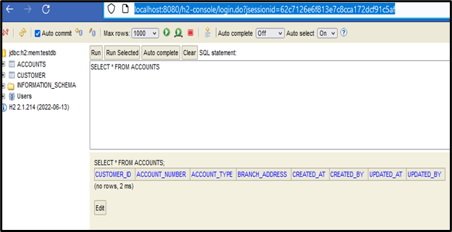
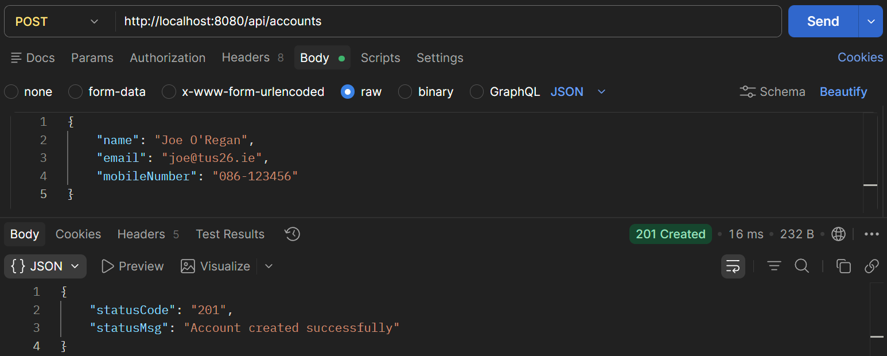
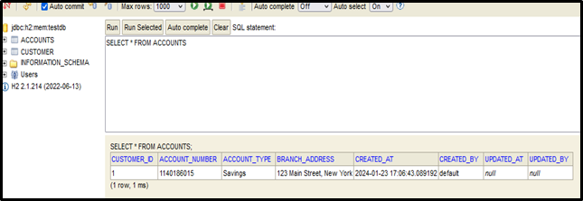
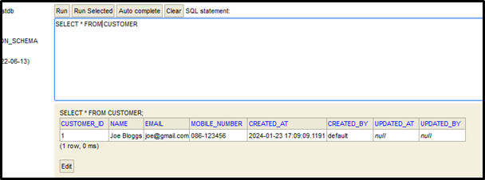

# RESTful API Lab 3

## Files

src/main/java/com/tus/accounts

1. [AccountsConstants](#1-accountsconstants)  
    - /constants/AccountConstants.java  
2. [AccountController POST](#2-accountcontroller-post)  
    - /controller/AccountController.java  
3. [Service & ServiceImpl](#3-service-serviceimpl)  
    - /service/IAccountsService.java  
    - /service/impl/AccountsServiceImpl.java  
4. [AccountsMapper & CustomerMapper](#4-accountsmapper-customermapper)  
    - /mapper/AccountsMapper.java  
    - /mapper/CustomerMapper.java  
5. [AccountsServiceImpl createAccount](#5-accountsserviceimpl-createaccount)
    - /service/IAccountsService.java  
    - /service/impl/AccountsServiceImpl.java  
6. [Controller - Call Service Layer](#6-controller-call-service-layer)
    /AccountController.java  
7. [H2 Console Table](#7-h2-console-table)
8. [Postman](#8-postman)
9. [H2 Console Data](#9-h2-console-data)

---

## Lab#3 Building a Rest API to support the creation of a new account and customer details.

In this lab we are creating the API that will allow the creation of a new account and customer.

---

Note: If you have problems with Lombok  
<https://stackoverflow.com/questions/35842751/lombok-not-working-with-sts>

---

### 1.	AccountsConstants

Add class AccountsConstants provided to a new package com.tus.accounts.constants. This class will store error messages.
 


### 2.	AccountController POST

Update the AccountController class for the PostMapping as shown. You can add /accounts to the PostMapping path
 
``` java title="AccountController.java"

@RestController
@RequestMapping(path = "/api", produces = MediaType.APPLICATION_JSON_VALUE)
public class AccountController {

    @PostMapping()
    public ResponseEntity<ResponseDto> createAccount(@RequestBody CustomerDto customerDto) {
        return ResponseEntity
            .status(HttpStatus.CREATED)
            .body(new ResponseDto(AccountsConstants.STATUS_201, AccountsConstants.MESSAGE_201));
    }
```

### 3.	Service & ServiceImpl

Add a packages service and serviceImpl. These will hold the interface for the Service layer and its implementation. Note: don’t need to use @Autowired in Springboot 3.



```java title="IAccountsService.java" linenums="1"
package com.tus.accounts.service;

import com.tus.accounts.dto.CustomerDto;

public interface IAccountsService {
	void createAccount(CustomerDto customerDto);
}
```

```java title="AccountsServiceImpl.java" linenums="1"
package com.tus.accounts.service.impl;

import org.springframework.stereotype.Service;

import com.tus.accounts.dto.CustomerDto;
import com.tus.accounts.repository.AccountsRepository;
import com.tus.accounts.repository.CustomerRepository;
import com.tus.accounts.service.IAccountsService;

import lombok.AllArgsConstructor;

@Service
@AllArgsConstructor
public class AccountsServiceImpl implements IAccountsService {
    private AccountsRepository accountsRepository;
    private CustomerRepository customerRepository;

    public void createAccount(CustomerDto customerDto) {
    		// TODO
    }
}
```

### 4.	AccountsMapper & CustomerMapper

We will now create a mapper class (code given) for AccountsMapper and CustomerMapper. This is to map data between the Entity classes and the DTO classes.
 
```java title="CustomerMapper.java" linenums="1"
package com.tus.accounts.mapper;

import com.tus.accounts.dto.CustomerDto;
import com.tus.accounts.entity.Customer;

public class CustomerMapper {
	public static CustomerDto mapToCustomerDto(Customer customer, CustomerDto customerDto) {
		customerDto.setName(customer.getName());
		customerDto.setEmail(customer.getEmail());
		customerDto.setMobileNumber(customer.getMobileNumber());
		return customerDto;
	}
	
	public static Customer mapToCustomer(CustomerDto customerDto, Customer customer) {
		customer.setName(customerDto.getName());
		customer.setEmail(customerDto.getEmail());
		customer.setMobileNumber(customerDto.getMobileNumber());
		return customer;
	}
}
```

```java title="AccountsMapper.java" linenums="1"
package com.tus.accounts.mapper;

import com.tus.accounts.dto.AccountsDto;
import com.tus.accounts.entity.Accounts;

public class AccountsMapper {
	public static AccountsDto mapToAccountsDto(Accounts accounts, AccountsDto accountsDto) {
		accountsDto.setAccountNumber(accounts.getAccountNumber());
		accountsDto.setAccountType(accounts.getAccountType());
		accountsDto.setBranchAddress(accounts.getBranchAddress());
		return accountsDto;
	}

	public static Accounts mapToAccounts(AccountsDto accountsDto, Accounts accounts) {
		accounts.setAccountNumber(accountsDto.getAccountNumber());
		accounts.setAccountType(accountsDto.getAccountType());
		accounts.setBranchAddress(accountsDto.getBranchAddress());
		return accounts;
	}
}
```

### 5.	AccountsServiceImpl createAccount

Update the AccountsServiceImpl with the method for creating a new account base on a CustomerDto object.
 
```java title="AccountsServiceImpl.java" linenums="1"
import lombok.AllArgsConstructor;
import com.tus.accounts.entity.Accounts;
import com.tus.accounts.entity.Customer;
import com.tus.accounts.mapper.*;

@Service
@AllArgsConstructor
public class AccountsServiceImpl implements IAccountsService {
    // framework will automatically autowire as one single constructor
    private AccountsRepository accountsRepository;
    private CustomerRepository customerRepository;

    //@Override
    public void createAccount(CustomerDto customerDto) {
        Customer customer = CustomerMapper.mapToCustomer(customerDto, new Customer());
        customer.setCreatedAt(LocalDateTime.now());
        customer.setCreatedBy("default");
        customer.setUpdatedAt(LocalDateTime.now());
        customer.setUpdatedBy("default");
        Customer savedCustomer = customerRepository.save(customer);
        accountsRepository.save(createNewAccount(savedCustomer));
    }

    /**
     * @param customer - Customer Object
     * @return the new account details
     */
    private Accounts createNewAccount(Customer customer) {
        Accounts newAccount = new Accounts();
        newAccount.setCustomerId(customer.getCustomerId());
        long randomAccNumber = 1000000000L + new Random().nextInt(900000000);

        newAccount.setAccountNumber(randomAccNumber);
        newAccount.setAccountType(AccountConstants.SAVINGS);
        newAccount.setBranchAddress(AccountConstants.DEFAULT_BRANCH_ADDRESS);
        newAccount.setCreatedAt(LocalDateTime.now());
        newAccount.setCreatedBy("default");
        newAccount.setUpdatedAt(LocalDateTime.now());
        newAccount.setUpdatedBy("default");
        return newAccount;
    }
}
```

### 6.	Controller - Call Service Layer

Update the controller to call the service layer
 
```java title=""" linenums="17"
@RestController
@RequestMapping(path = "/api", produces = MediaType.APPLICATION_JSON_VALUE)
//@AllArgsConstructor
@Validated
public class AccountController {

    private IAccountsService iAccountsService;

    @PostMapping()
    public ResponseEntity<ResponseDto> createAccount(@RequestBody CustomerDto customerDto) {
        iAccountsService.createAccount(customerDto);
        return ResponseEntity
            .status(HttpStatus.CREATED)
            .body(new ResponseDto(AccountsConstants.STATUS_201, AccountsConstants.MESSAGE_201));
    }
}
```

### 7.	H2 Console Table

Run the project and check the h2-console. The tables should be created and empty.
 


### 8.	Postman

Create a new customer from postman. You should get response code 201 and message as shown below.
 
```json title="POST http://localhost:8080/api/accounts"
{
    "name": "Joe O'Regan",
    "email": "joe@tus26.ie",
    "mobileNumber": "086-123456"    
}
```



### 9.	H2 Console Data

Check that the data has been written to the database
 


