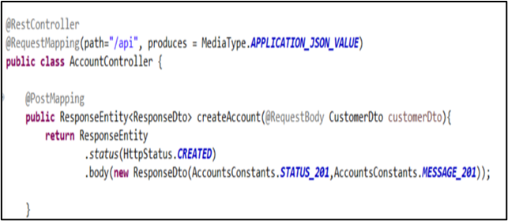
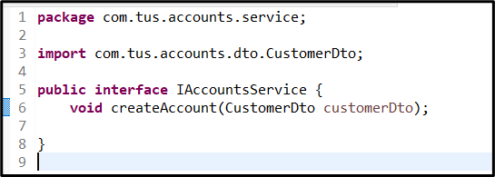
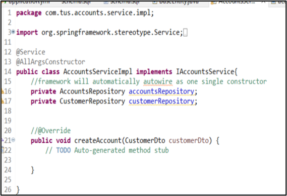
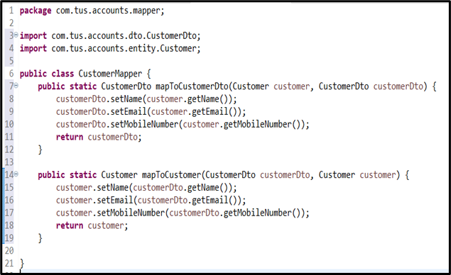
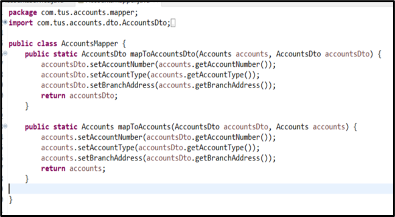
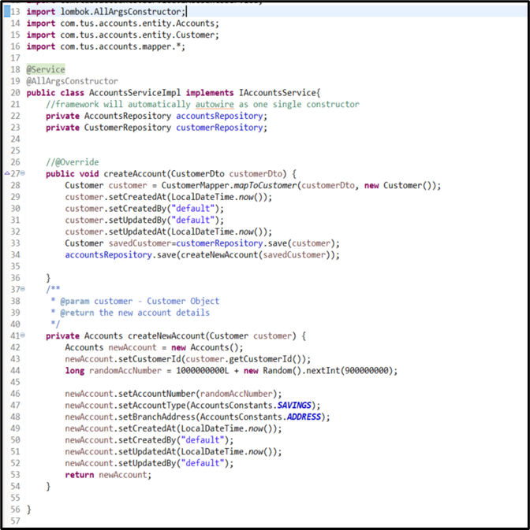
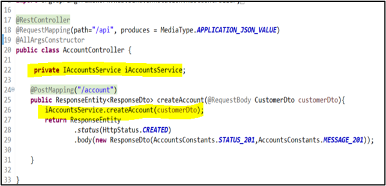
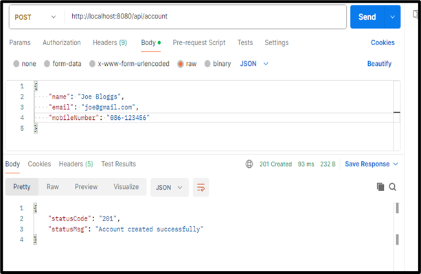

# RESTful API Lab 3

## Lab#3 Building a Rest API to support the creation of a new account and customer details.
In this lab we are creating the API that will allow the creation of a new account and customer.

---

Note: If you have problems with Lombok  
<https://stackoverflow.com/questions/35842751/lombok-not-working-with-sts>

---

### 1.	Add class AccountsConstants provided to a new package com.tus.accounts.constants. This class will store error messages.
 

### 2.	Update the AccountController class for the PostMapping as shown. You can add /accounts to the PostMapping path
 

### 3.	Add a packages service and serviceImpl. These will hold the interface for the Service layer and its implementation. Note: don’t need to use @Autowired in Springboot 3.

### 4.	We will now create a mapper class (code given) for AccountsMapper and CustomerMapper. This is to map data between the Entity classes and the DTO classes.
 

### 5.	Update the AccountsServiceImpl with the method for creating a new account base on a CustomerDto object.
 

### 6.	Update the controller to call the service layer
 

### 7.	Run the project and check the h2-console. The tables should be created and empty.
 

### 8.	Create a new customer from postman. You should get response code 201 and message as shown below.
 

### 9.	Check that the data has been written to the database
 

