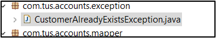
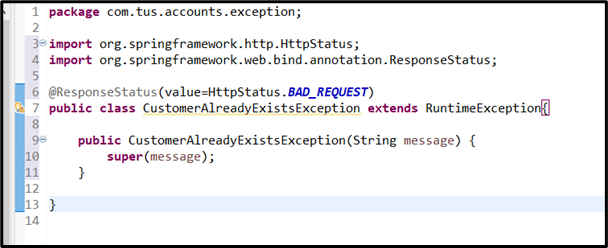
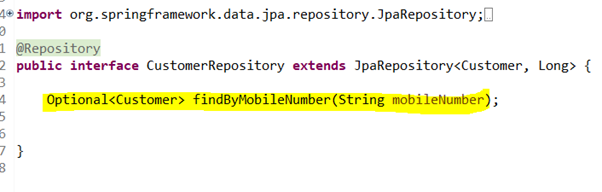
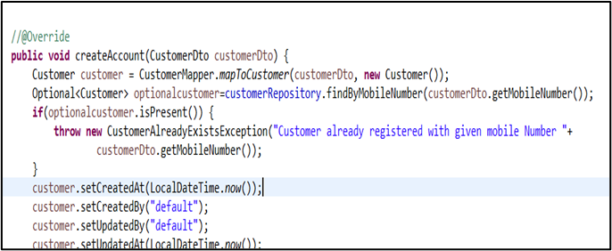
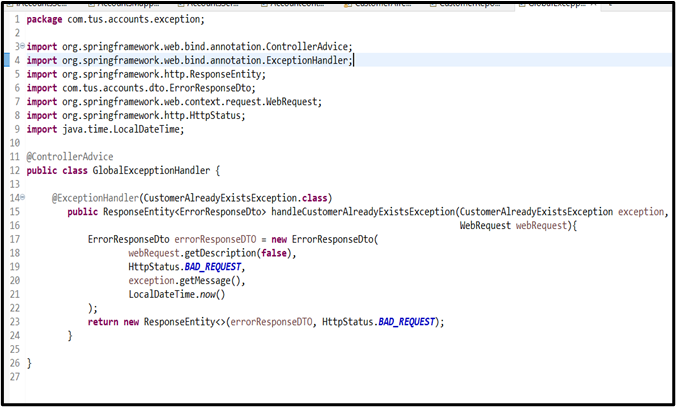
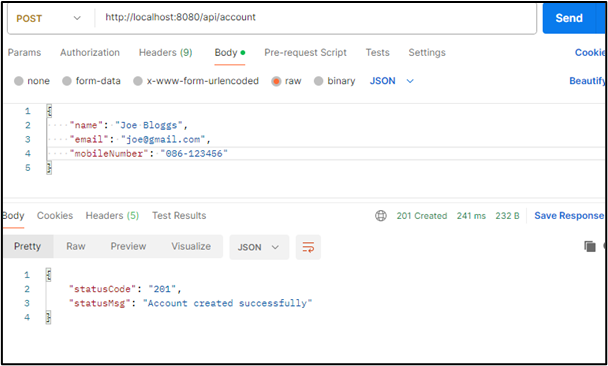
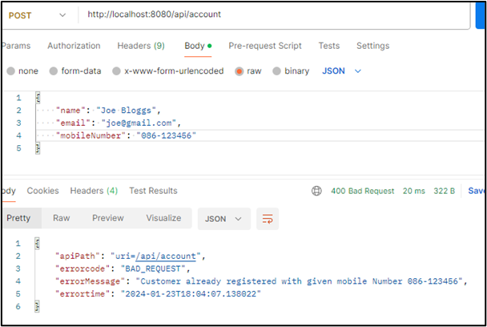

# Lab#4 Exception Handling –check if customer already exists

---

The customers mobile phone number must be unique. In this lab we will check if a customer with the given phone number already exists and we will reject the request accordingly.

1.	Add a package com.tus.accounts.exception with a class CustomerAlreadyExistsException

2.	In the CustomerRepository interface add a query to find a Customer based on the mobile number. (This may be in your file already).

3.	Now in the Service class add code that will throw the CustomerAlreadyExistsException.

4.	Add a class in the exception package called GlobalExceptionHandler. This will handle exceptions in one location rather than duplicating the handlng. It is annotated with @ControllerAdvice and will handle the exception when thrown by the controller.

5.	Test the application. Add a customer. Customer is created successfully. Then add a customer with the same mobile number again. The request is rejected with error message as shown.

