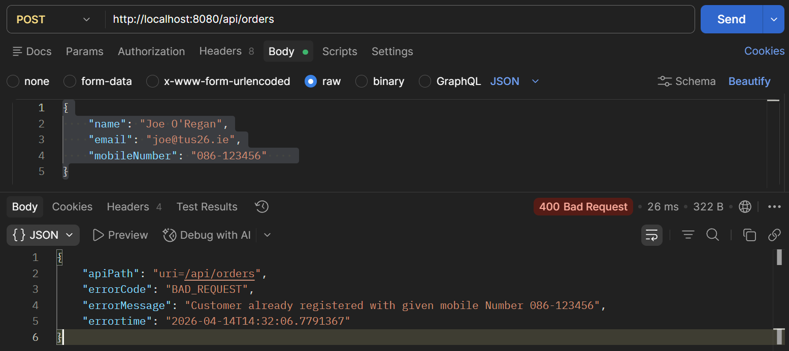

# RESTful API Lab 4

## Lab#4 Exception Handling –check if customer already exists

---

The customers mobile phone number must be unique. In this lab we will check if a customer with the given phone number already exists and we will reject the request accordingly.

### 1.	Add a package com.tus.accounts.exception with a class CustomerAlreadyExistsException


```java title="CustomerAlreadyExistsException.java" linenums="1"
package com.tus.accounts.exception;

import org.springframework.http.HttpStatus;
import org.springframework.web.bind.annotation.ResponseStatus;

@ResponseStatus(value = HttpStatus.BAD_REQUEST)
public class CustomerAlreadyExistsException extends RuntimeException {
	private static final long serialVersionUID = 1L;

	public CustomerAlreadyExistsException(String message) {
		super(message);
	}
}
```

### 2.	In the CustomerRepository interface add a query to find a Customer based on the mobile number. (This may be in your file already).

```java title="CustomerRepository.java" linenums="1"
package com.tus.accounts.repository;

import org.springframework.data.jpa.repository.JpaRepository;
import org.springframework.stereotype.Repository;
import com.tus.accounts.entity.Customer;
import java.util.Optional;

@Repository
public interface CustomerRepository extends JpaRepository<Customer, Long> {
	Optional<Customer> findByMobileNumber(String mobileNumber);
}
```

### 3.	Now in the Service class add code that will throw the CustomerAlreadyExistsException.

```java title="" linenums="1"
public void createAccount(CustomerDto customerDto) {
        Customer customer = CustomerMapper.mapToCustomer(customerDto, new Customer());
        Optional<Customer> optionalcustomer = customerRepository.findByMobileNumber(customerDto.getMobileNumber());
        if (optionalcustomer.isPresent()) {
            throw new CustomerAlreadyExistsException(
                    "Customer already registered with given mobile Number " + customerDto.getMobileNumber());
        }
        customer.setCreatedAt(LocalDateTime.now());
        customer.setCreatedBy("default");
        customer.setUpdatedBy("default");
        customer.setUpdatedAt(LocalDateTime.now());
        
        Customer savedCustomer = customerRepository.save(customer
        accountsRepository.save(createNewAccount(savedCustomer));
    }

```

### 4.	Add a class in the exception package called GlobalExceptionHandler. This will handle exceptions in one location rather than duplicating the handlng. It is annotated with @ControllerAdvice and will handle the exception when thrown by the controller.

```java title="GlobalExceptionHandler.java" linenums="1"
package com.tus.accounts.exception;

import org.springframework.web.bind.annotation.ControllerAdvice;
import org.springframework.web.bind.annotation.ExceptionHandler;
import org.springframework.http.ResponseEntity;
import com.tus.accounts.dto.ErrorResponseDto;
import org.springframework.web.context.request.WebRequest;
import org.springframework.http.HttpStatus;
import java.time.LocalDateTime;

@ControllerAdvice
public class GlobalExceptionHandler {
	@ExceptionHandler(CustomerAlreadyExistsException.class)
	public ResponseEntity<ErrorResponseDto> handleCustomerAlreadyExistsException(
			CustomerAlreadyExistsException exception, WebRequest webRequest) {
		ErrorResponseDto errorResponseDTO = new ErrorResponseDto(webRequest.getDescription(false),
				HttpStatus.BAD_REQUEST, 
                exception.getMessage(), 
                LocalDateTime.now());
		return new ResponseEntity<>(errorResponseDTO, HttpStatus.BAD_REQUEST);
	}
}
```

### 5.	Test the application. Add a customer. Customer is created successfully. Then add a customer with the same mobile number again. The request is rejected with error message as shown.


