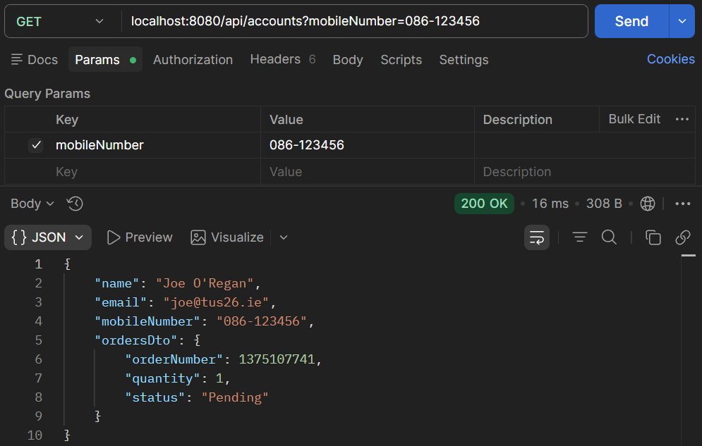
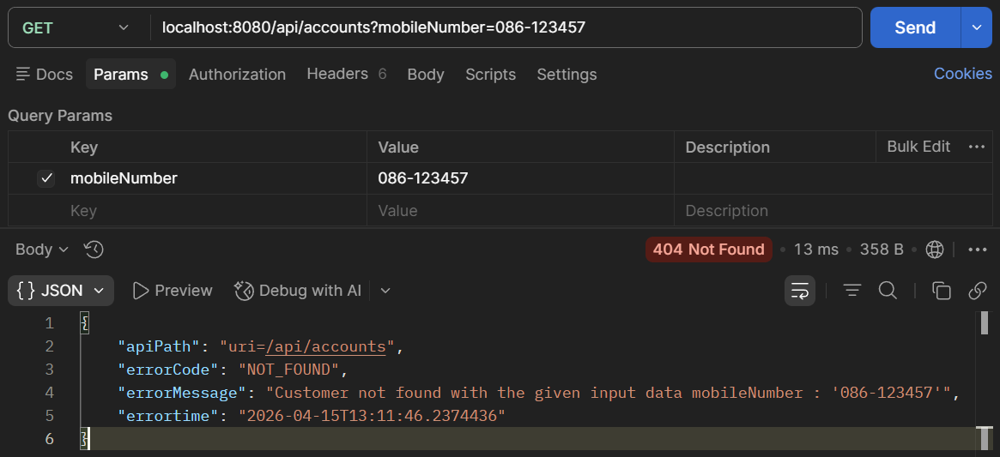

# RESTful API Lab 5

## Lab#5 Implementing a READ API that fetches the details based on mobile number.

---

In this lab we are going to fetch the customer and account details based on the customers mobile number. We will find the customer object base on the mobile number. Then we will find the account based on the customer id. The account data is returned as part of the CustomerDto object. The case where a customer does not exist is handled with exceptions.

### 1.	First we need to add a check to see if customer already exists. Add the method findByCustomerId in AccountsRepository interface.

```java title="AccountsRepository.java" linenums="1"
@Repository
public interface AccountsRepository extends JpaRepository<Accounts, Long> {

    Optional<Accounts> findByCustomerId(Long customerId);

    @Transactional
    @Modifying
    void deleteByCustomerId(Long customerId);
}
```

### 2.	Add a new ResourceNotFoundException the com.tus.accounts.exception package.

```java title="ResourceNotFoundException.java" linenums="1"
package com.tus.accounts.exception;

import org.springframework.http.HttpStatus;
import org.springframework.web.bind.annotation.ResponseStatus;

@ResponseStatus(value = HttpStatus.NOT_FOUND)
public class ResourceNotFoundException extends RuntimeException {
	private static final long serialVersionUID = 1L;

	public ResourceNotFoundException(String resourceName, String fieldName, String fieldValue) {
		super(String.format("%s not found with the given input data %s : '%s'", resourceName, fieldName, fieldValue));
	}
}
```

### 3.	Update GlobalLogicExceptionHandler to handle the exception and return an appropriate ErrorResponseDto.

```java title="GlobalLogicExceptionHandler.java" linenums="25"
@ExceptionHandler(ResourceNotFoundException.class)
public ResponseEntity<ErrorResponseDto> handleResourceNotFoundExceptoin(ResourceNotFoundException exception,
        WebRequest webRequest) {
    ErrorResponseDto errorResponseDTO = new ErrorResponseDto(
        webRequest.getDescription(false), 
        HttpStatus.NOT_FOUND,
        exception.getMessage(), 
        LocalDateTime.now()
    );
    return new ResponseEntity<>(errorResponseDTO, HttpStatus.NOT_FOUND);
}
```

### 4.	Update the CustomerDto to add a new field to keep the account information. We could create a new Dto for the combined Customer and Account information but will leave like this for now.

```java title="CustomerDto.java" linenums="1"
package com.tus.accounts.dto;

import lombok.Data;

@Data
public class CustomerDto {

	private String name;

	private String email;

	private String mobileNumber;

    private AccountsDto accountsDto;
}
```

### 5.	Add a new method to the controller class for the read API.

```java title="AccountsController.java fetchAccountDetails()" linenums="1"
@GetMapping("/account")
public ResponseEntity<CustomerDto> fetchAccountDetails(
        @RequestParam String mobileNumber) {
    CustomerDto customerDto = iAccountService.fetchAccount(mobileNumber);
    return ResponseEntity.status(HttpStatus.OK).body(customerDto);
}
```
 
### 6.	Implement the fetchAccount method by adding to the Service Interface and the implementation class. This uses Lambda expressions to throw the exception.

```java title="IAccountService.java" linenums="3"
import com.tus.accounts.dto.CustomerDto;

public interface IAccountsService {
	void createAccount(CustomerDto customerDto);
	CustomerDto fetchAccount(String mobileNumber);
}
```

```java title="AccountServiceImpl.java fetchAccount()" linenums="1"
@Override
    public CustomerDto fetchAccount(String mobileNumber) {
        Customer customer = customerRepository.findByMobileNumber(mobileNumber).orElseThrow(
            () -> new ResourceNotFoundException("Customer", "mobileNumber", mobileNumber)
        );
        Accounts accounts = accountsRepository.findByCustomerId(customer.getCustomerId()).orElseThrow(
            () -> new ResourceNotFoundException("Account", "customerId", customer.getCustomerId().toString()));
        CustomerDto customerDto = CustomerMapper.mapToCustomerDto(customer, new CustomerDto());
        customerDto.setAccountsDto(AccountsMapper.mapToAccountsDto(accounts, new AccountsDto()));
        return customerDto;
    }
```

### 7.	Test the Application. Add a customer and then fetch the details as shown. Then use a different phone number and check that the 404 response with appropriate error message is found. 



    Figure 1. Test customer found.



    Figure 2. Test customer not found.