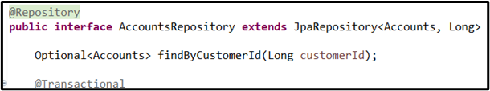
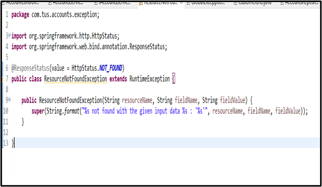
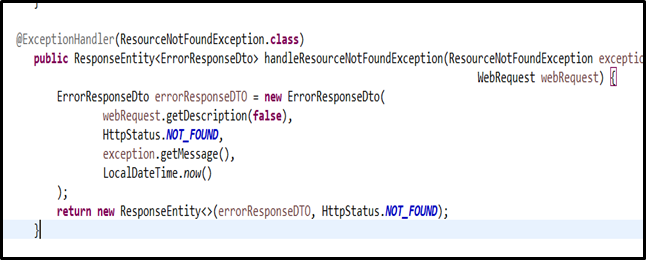
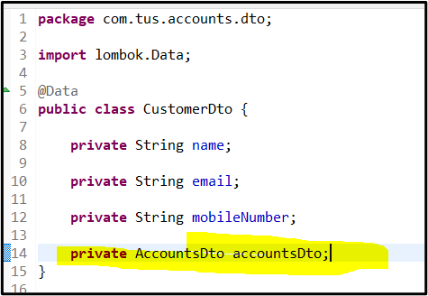
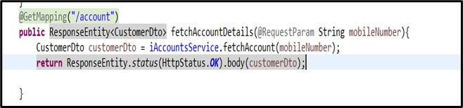
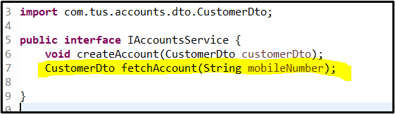
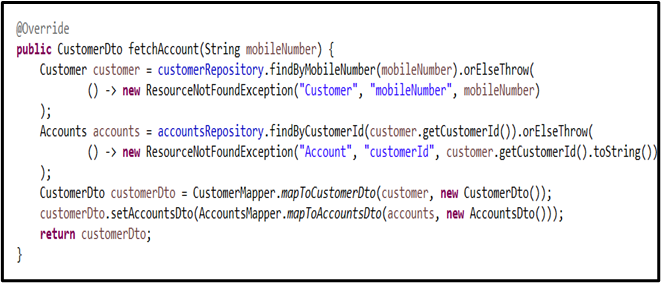
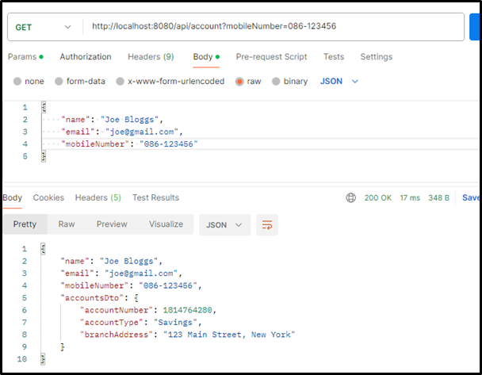
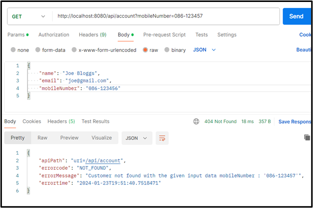

# RESTful API Lab 5

## Lab#5 Implementing a READ API that fetches the details based on mobile number.

---

In this lab we are going to fetch the customer and account details based on the customers mobile number. We will find the customer object base on the mobile number. Then we will find the account based on the customer id. The account data is returned as part of the CustomerDto object. The case where a customer does not exist is handled with exceptions.

### 1.	First we need to add a check to see if customer already exists. Add the method findByCustomerId in AccountsRepository interface.

### 2.	Add a new ResourceNotFoundException the com.tus.accounts.exception package.

### 3.	Update GlobalLogicExceptionHandler to handle the exception and return an appropriate ErrorResponseDto.

### 4.	Update the CustomerDto to add a new field to keep the account information. We could create a new Dto for the combined Customer and Account information but will leave like this for now.

### 5.	Add a new method to the controller class for the read API.

 
### 6.	Implement the fetchAccount method by adding to the Service Interface and the implementation class. This uses Lambda expressions to throw the exception.

### 7.	Test the Application. Add a customer and then fetch the details as shown. Then use a different phone number and check that the 404 response with appropriate error message is found. 

