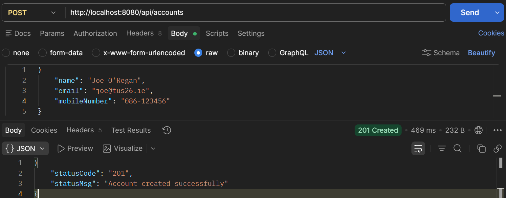
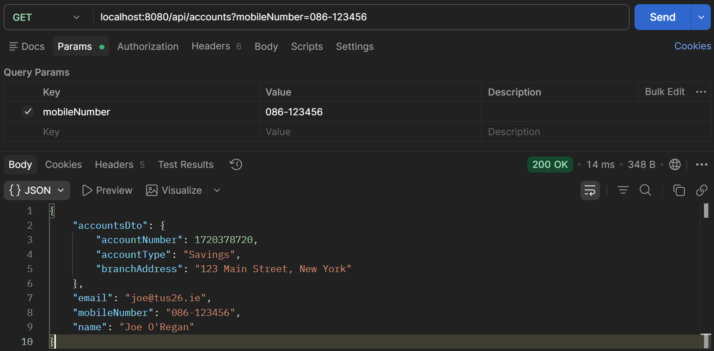
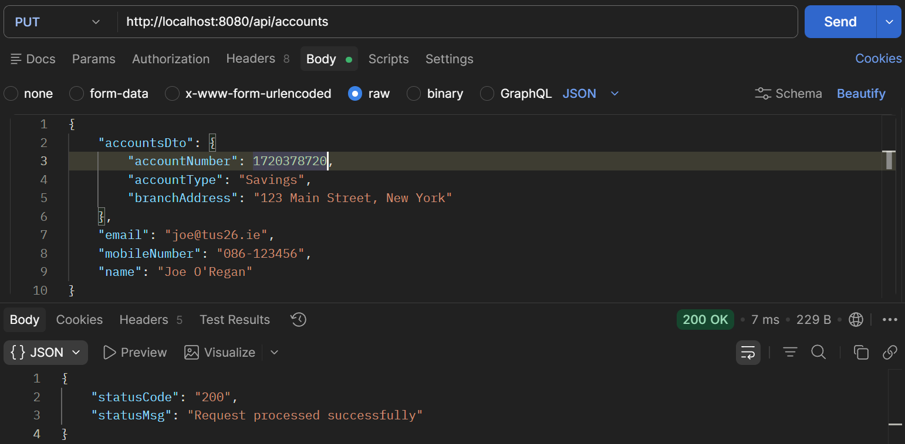
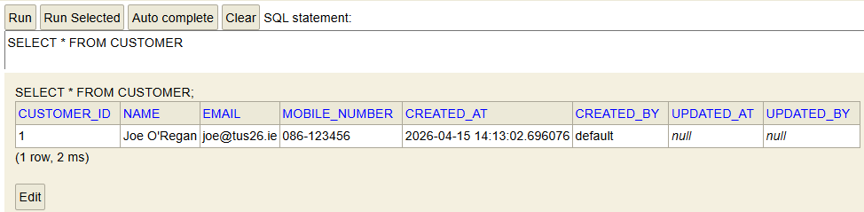
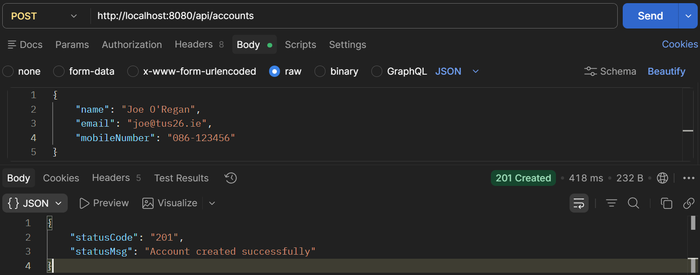
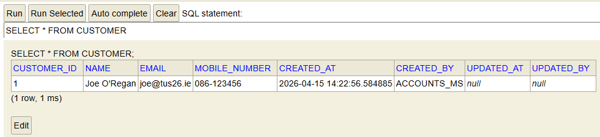
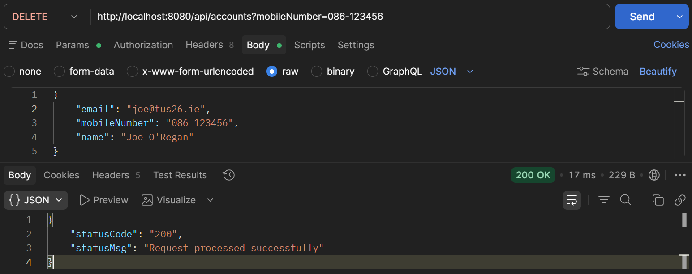
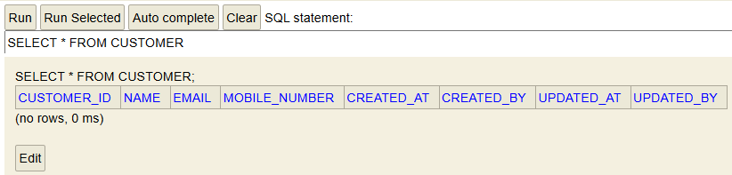

# RESTful API Lab 6

## Steps and Files Used

### [Part 1 Update API](#part-1-update-api_1)
[Step 1: updateAccount](#1-updateaccount)  
- service/IAccountService.java   
[Step 2: Implement updateAccount](#2-implement-updateaccount)  
- service/impl/AccountServiceImpl.java  
[Step 3: Controller PUT Endpoint](#3-controller-put)  
- controller/AccountsController.java  
[Step 4: Constants](#4-constants)  
- constants/AccountsConstants.java  
[Step 5: Test the API](#5-test-the-api)  
- Test using Postman and H2 database

### [Part 2 Adding the DELETE API](#part2-adding-the-delete-api)
[Step 1: deleteAccount](#1-deleteaccount)  
- service/IAccountsService.java  
[Step 2: Implement deleteAccount](#2-implement-deleteaccount)  
- service/impl/AccountServiceImpl.java  
- repository/AccountsRepository.java  
[Step 3: Controller Delete Endpoint](#3-controller-delete-endpoint)  
- controller/AccountsController.java  
[Step 4: Test the API](#4-test-the-api)  
- Test using Postman and H2 database  

---

## Lab#6 RESTfulAPI for Updating and Deleting customer accounts.
---
In this lab we will complete the RESTful API CRUD actions by adding the Update and Delete parts. 

### Part 1 Update API
**Note**:- All data can be updated except the accountNumber

#### 1.	updateAccount

Update the service interface with the updateAccount method.

```java title="" linenums="1"
package com.tus.accounts.service;

import com.tus.accounts.dto.CustomerDto;

public interface IAccountsService {
	void createAccount(CustomerDto customerDto);
	CustomerDto fetchAccount(String mobileNumber);
	boolean updateAccount(CustomerDto customerDto);
}
```

#### 2.	Implement updateAccount

Implement the updateAccount method. The ResourceNotFoundException is thrown if the account is not found or the customer is not found.

```java title="AccountsService.java updateAccount()" linenums="1"
@Override
    public boolean updateAccount(CustomerDto customerDto) {
        boolean isUpdated = false;
        AccountsDto accountsDto = customerDto.getAccountsDto();
        if (accountsDto != null) {
            Accounts accounts = accountsRepository.findById(accountsDto.getAccountNumber())
                    .orElseThrow(() -> new ResourceNotFoundException("Account", "AccountNumber",
                    accountsDto.getAccountNumber().toString()));
            AccountsMapper.mapToAccounts(accountsDto, accounts);
            accounts = accountsRepository.save(accounts);

            Long customerId = accounts.getCustomerId();
            Customer customer = customerRepository.findById(customerId)
                    .orElseThrow(() -> new ResourceNotFoundException("Customer", "CustomerId", customerId.toString()));
            CustomerMapper.mapToCustomer(customerDto, customer);
            customerRepository.save(customer);
            isUpdated = true;
        }
        return isUpdated;
    }
```

#### 3.	Controller PUT

Update the controller with the end point for updating. For now we are returning internal server error if something goes wrong. Check that the codes are in the AccountsConstants.

```java title="AccountsController.java updateAccountDetails()" linenums="1"
@PutMapping("/accounts")
public ResponseEntity<ResponseDto> updateAccountDetails(@RequestBody CustomerDto customerDto) {
    boolean isUpdated = iAccountsService.updateAccount(customerDto);
    if (isUpdated) {
        return ResponseEntity
            .status(HttpStatus.OK)
            .body(new ResponseDto(AccountsConstants.STATUS_200, AccountsConstants.MESSAGE_200));
    } else {
        return ResponseEntity
            .status(HttpStatus.INTERNAL_SERVER_ERROR)
            .body(new ResponseDto(AccountsConstants.STATUS_500, AccountsConstants.MESSAGE_500));
    }
}
```

#### 4.	Constants

Add the constants if necessary.

```java title="AccountsConstants.java" linenums="1"
public final class AccountsConstants {

	/*
	 * private AccountsConstants() { // restrict instantiation }
	 */
	public static final String SAVINGS = "Savings";
	public static final String ADDRESS = "123 Main Street, New York";
	public static final String STATUS_201 = "201";
	public static final String MESSAGE_201 = "Account created successfully";
	public static final String STATUS_200 = "200";
	public static final String MESSAGE_200 = "Request processed successfully";
	public static final String STATUS_417 = "417";
	public static final String MESSAGE_417_UPDATE = "Update operation failed. Please try again or contact Dev team";
	public static final String MESSAGE_417_DELETE = "Delete operation failed. Please try again or contact Dev team";
	public static final String STATUS_500 = "500";
	public static final String MESSAGE_500 = "An error occurred. Please try again or contact Dev team";
}
```

#### 5.	Test the API

Test the API. First add a customer account. Then fetch the data based on the mobile number. Now use the PUT method and update some of the attributes. Check in the database that the values have been updated.



    Figure 1. Test API add Customer Account



    Figure 2. Test API Fetch Customer Data



    Figure 3. Test API Update Customer Account



    Figure 4. Test API Check Database

---

### Part#2 Adding the DELETE API

#### 1.	deleteAccount

Update the service interface with the deleteAccount method.

```java title="Update Service Interface: IAccountsService" linenums="5"
public interface IAccountsService {
	void createAccount(CustomerDto customerDto);
	CustomerDto fetchAccount(String mobileNumber);
	boolean updateAccount(CustomerDto customerDto);
	boolean deleteAccount(String mobileNumber);
}
```

#### 2.	Implement deleteAccount

Implement the deleteAccount method in the Service Implementation class. The ResourceNotFoundException is thrown if the customer is not found. The method deleteByCustomerId should be added to the AccountsRepository interface.

```java title="Implement deleteAccount: AccountsService.java deleteAccount()" linenums="1"
@Override
public boolean deleteAccount(String mobileNumber) {
    Customer customer = customerRepository.findByMobileNumber(mobileNumber)
            .orElseThrow(() -> new ResourceNotFoundException("Customer", "mobileNumber", mobileNumber));
    accountsRepository.deleteByCustomerId(customer.getCustomerId());
    customerRepository.deleteById(customer.getCustomerId());
    return true;
}
```

```java title="Add deleteByCustomerId to AccountsRepository: AccountsRepository.java deleteByCustomerId()" linenums="17"
    @Transactional
    @Modifying
    void deleteByCustomerId(Long customerId);
}
```

#### 3.	Controller Delete Endpoint

Finally update the controller to add the delete endpoint. Again internal serer error is thrown for now if the customer or account is not found.

```java title="Add Delete Endpoint: AccountsController.java deleteAccount()" linenums="1"
@DeleteMapping()
public ResponseEntity<ResponseDto> deleteAccountDetails(@RequestParam String mobileNumber) {
    boolean isDeleted = iAccountsService.deleteAccount(mobileNumber);
    if (isDeleted) {
        return ResponseEntity
            .status(HttpStatus.OK)
            .body(new ResponseDto(AccountsConstants.STATUS_200, AccountsConstants.MESSAGE_200));
    } else {
        return ResponseEntity
            .status(HttpStatus.INTERNAL_SERVER_ERROR)
            .body(new ResponseDto(AccountsConstants.STATUS_500, AccountsConstants.MESSAGE_500));
    }
}
```

#### 4.	Test the API

Finally test the API. Add a customer. Fetch the details and check the database. Now use the DELETE method to delete the customer and their account. Check the database again and it should be empty.



    Figure 5. Test API Add Customer


    Figure 6. Test API Get Customer



    Figure 7. Test API Check Database



    Figure 8. Test API Delete Customer



    Figure 9. Test API Check Database
    