# RESTful API Lab 6

## Lab#6 RESTfulAPI for Updating and Deleting customer accounts.
----------------------------------------------------------------------------------------------------------------
In this lab we will complete the RESTful API CRUD actions by adding the Update and Delete parts. 

### Part 1 Update API
Note:- All data can be updated except the accountNumber

#### 1.	Update the service interface with the updateAccount method.

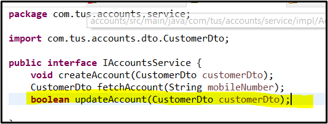

#### 2.	Implement the updateAccount method. The ResourceNotFoundException is thrown if the account is not found or the customer is not found.

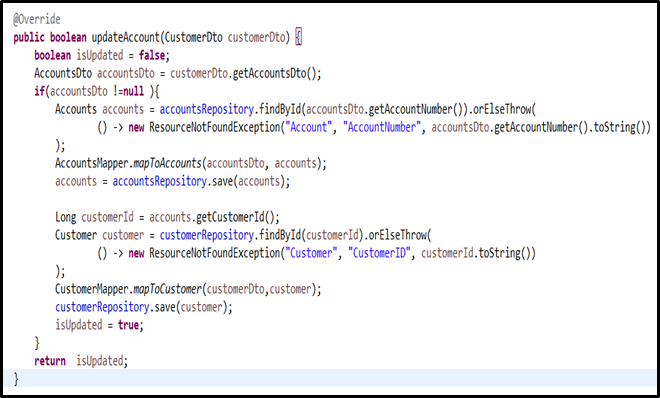

#### 3.	Update the controller with the end point for updating. For now we are returning internal server error if something goes wrong. Check that the codes are in the AccountsConstants.

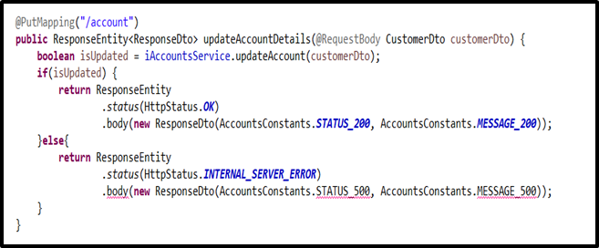

#### 4.	Add the constants if necessary.

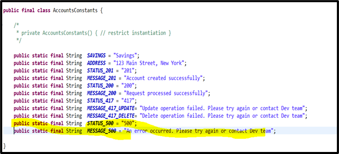

#### 5.	Test the API. First add a customer account. Then fetch the data based on the mobile number. Now use the PUT method and update some of the attributes. Check in the database that the values have been updated.

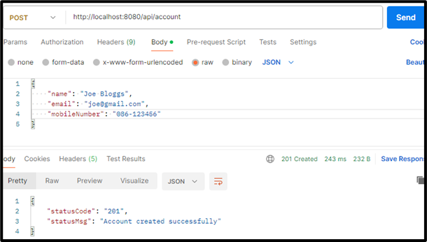

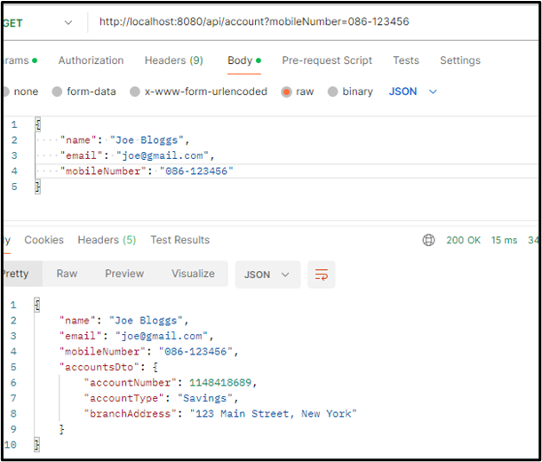

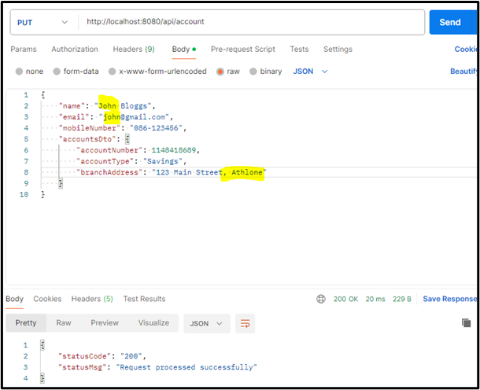

### Part#2 Adding the DELETE API

#### 1.	Update the service interface with the deleteAccount method.

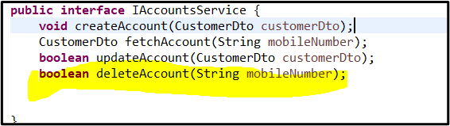

#### 2.	Implement the deleteAccount method in the Service Implementation class. The ResourceNotFoundException is thrown if the customer is not found. The method deleteByCustomerId should be added to the AccountsRepository interface.

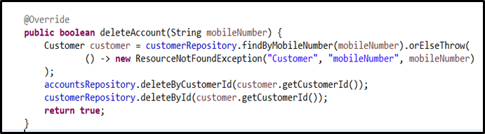

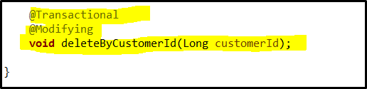

#### 3.	Finally update the controller to add the delete endpoint. Again internal serer error is thrown for now if the customer or account is not found.

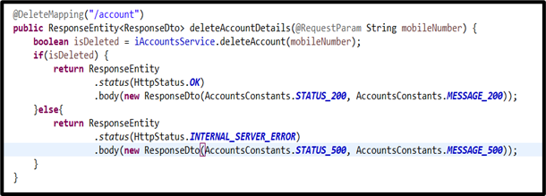

#### 4.	Finally test the API. Add a customer. Fetch the details and check the database. Now use the DELETE method to delete the customer and their account. Check the database again and it should be empty.

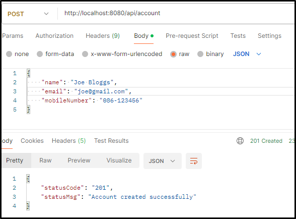

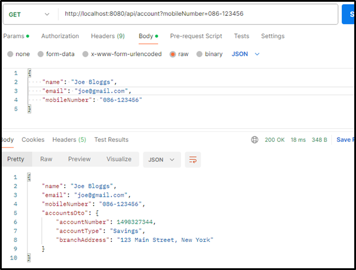

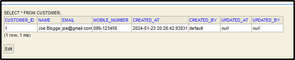

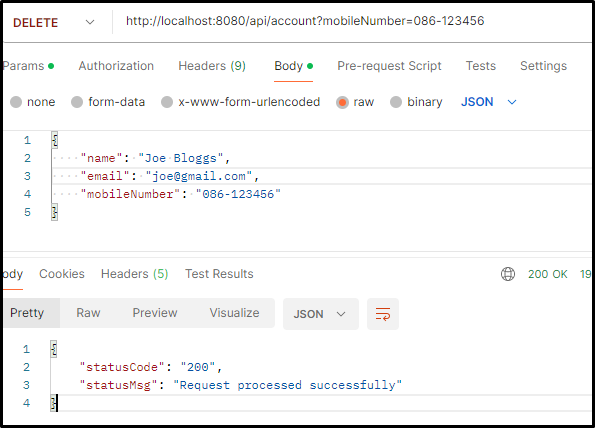

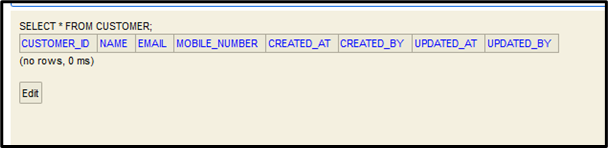