# RESTful API Lab 7

## Lab#7 Exceptions , Data Validations and Audit Columns

--- 

In this lab we will complete the RESTful API CRUD actions by adding the Update and Delete parts. 

### Part 1 GlobalExceptionHandler

Currently we are only handling two exceptions here. We add a new method that handles all types of exceptions. (e,g runtime expections). To test this exception, delete the @AllArgsConstructor from the AccountController class.With only the default constructor,autowiring will not happen and the the AccountsService will be null.

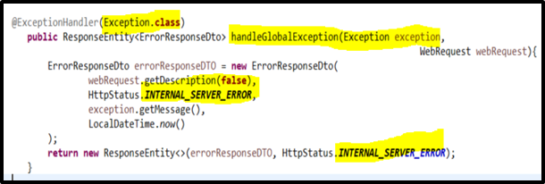

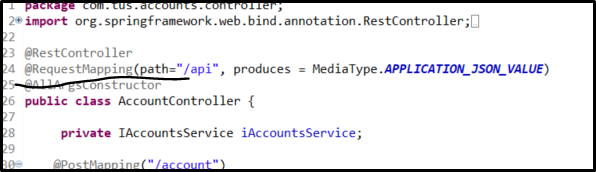

Test using the exception.

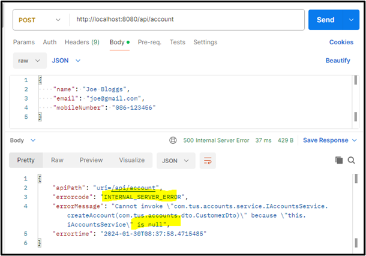

Put the @AllArgsConstructor back in.

### Part#2 Validating the input data

1.	We need to validate the data we are receiving from the user. Make sure the relevant dependency is in the pom.xml .

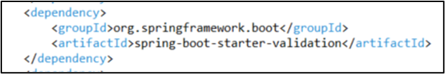

2.	Now go to the Dto classes – Customer Dto and add validations

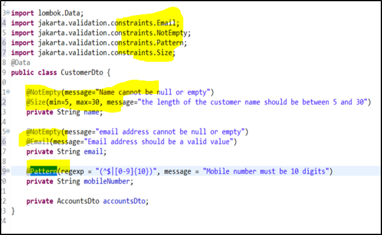

3.	Similarly add validations in the AccountsDto

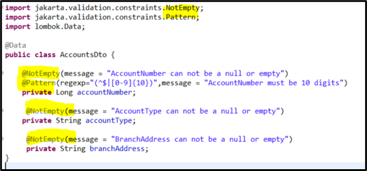

This data is received in the AccountController class. Add the @Validated annotation.

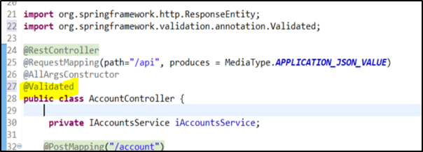

Add the @Valid annotation for the PST and PUT mappings

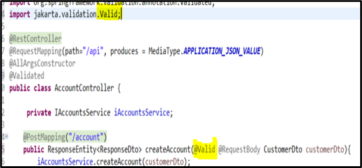

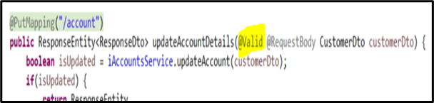

For the GET mapping we can validation the mobilenumber using the @Pattern
@Pattern(regexp = "(^$|[0-9]{10})", message = "Mobile number must be 10 digits")
And the same for the DELETE method

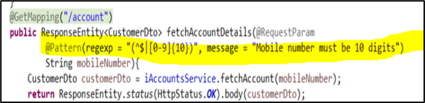

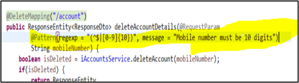

Now in the GlobalExceptionHandler we need to update the class so that is extends the ResponseEntityExceptionHandler and add a method handleMethodArgumentNotValid so that it knows how to return the error to the client.

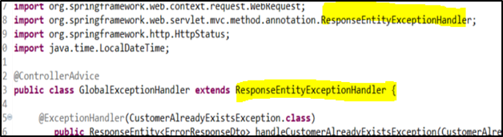

Add the method handleMethodArgumentNotValid method. This will give process all validations. The map will hold all the validation errors that occurred in the input data.

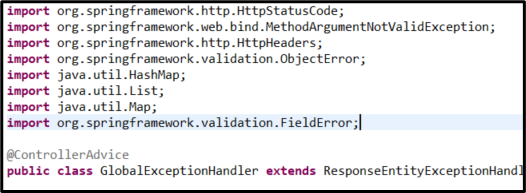

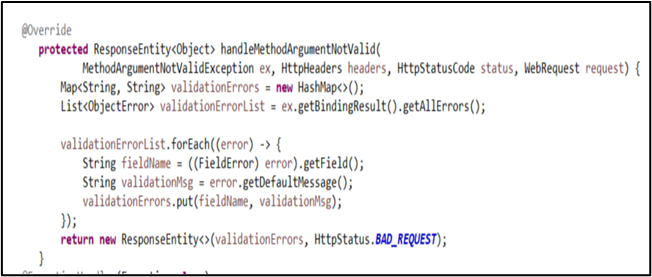

To test, go to Postman, remove @ from email, put mobile number as 9 or less digits and make name one character.

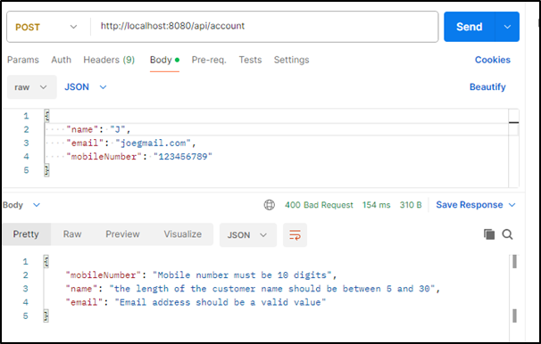

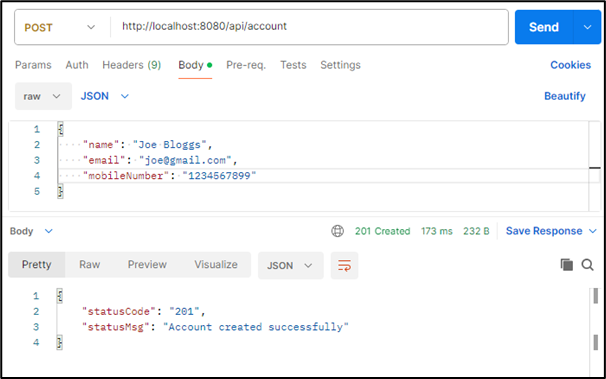

Test the validation on the GET mapping

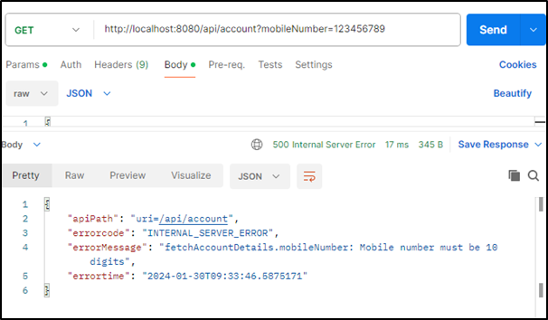

### Part#3 Completing the audit metadata.

These metadata columns can be updated automatically by Spring Data JPA
The metadata columns are defined in the BaseEntity class. Add the annotations shown.

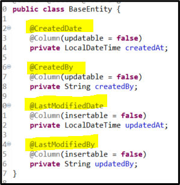

To add the logic about the user, add a new package and class

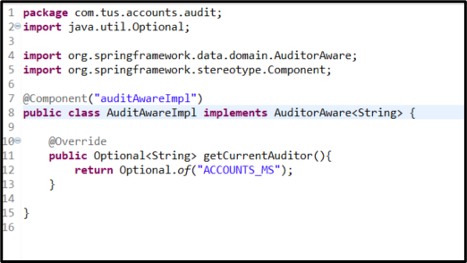

Now in the BaseEntity, make sure the two annotations are there

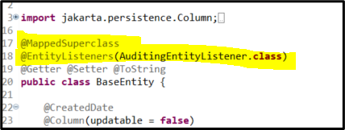

Also in the main class AccountsApplication add the annotation to enable JpaAuditing.

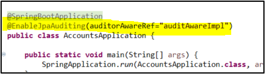

Now delete the code where we were manually creating the fields.

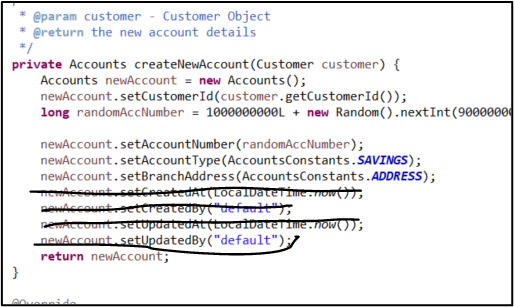

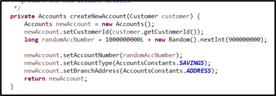

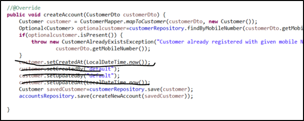

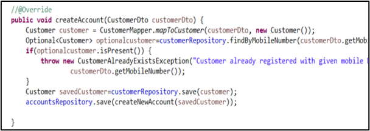

Go to Postman and test

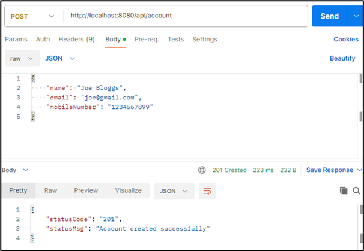

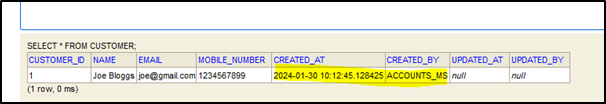

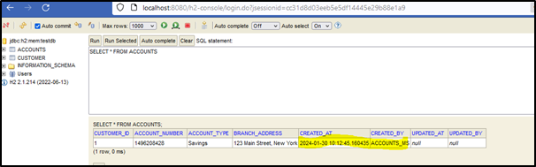

Check the update mapping

First fetch the data

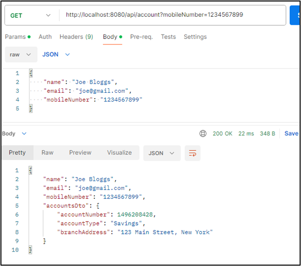

Now update a field e.g. Address

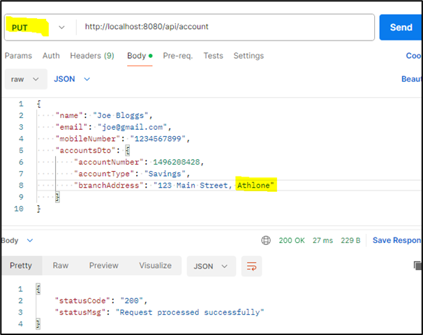
 
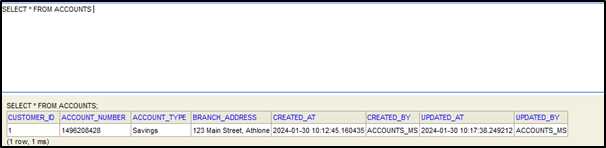