# RESTful API Lab 7

## Steps and Files

### [Part#1 GlobalExceptionHandler](#part-1-globalexceptionhandler)
[1. Handle All Exceptions](#handle-all-exceptions)  
- GlobalExceptionHandler  
- AccountController  
[2. Test Using the Exception](#test-using-the-exception)  
### [Part#2 Validating the input data](#part2-validating-the-input-data_1)
[1. Dependencies](#dependencies)  
- pom.xml  
[2. CustomerDto validations](#customerdto-validations)  
- dto/CustomerDto.java  
[3. AccountsDto validations](#accountsdto-validations)  
- dto/AccountsDto.java   
[4. @Validated](#validated)  
- controller/AccountController.java  
[5. @Valid](#valid)  
- controller/AccountsController.java  
[6. @Pattern](#pattern)  
- controller/AccountController.java  
[7. GlobalExceptionHandler extends ResponseEntityExceptionHandler](#globalexceptionhandler-extends-responseentityexceptionhandler)  
- exception/GlobalExceptionHandler.java   
[8. GlobalExceptionHandler handleMethodArgumentNotValid](#globalexceptionhandler-handlemethodargumentnotvalid)  
- exception/GlobalExceptionHandler.java  
[9. Test email and mobile number](#test-email-and-mobile-number)  
### [Part#3 Completing the audit metadata](#part3-completing-the-audit-metadata_1)
[1. BaseEntity Annotation](#baseentity-annotation)  
[2. AuditAwareImpl](#auditawareimpl)  
[3. BaseEntity Annotations](#baseentity-annotations)  
[4. JpaAuditing Annotation](#jpaauditing-annotation)  
[5. Delete Manually Created Fields](#delete-manually-created-fields)  
[6. Test in Postman](#test-in-postman)  

---

## Lab#7 Exceptions , Data Validations and Audit Columns

--- 

In this lab we will complete the RESTful API CRUD actions by adding the Update and Delete parts. 

### Part 1 GlobalExceptionHandler

#### Handle All Exceptions

Currently we are only handling two exceptions here. We add a new method that handles all types of exceptions. (e,g runtime expections). To test this exception, delete the @AllArgsConstructor from the AccountController class.With only the default constructor,autowiring will not happen and the the AccountsService will be null.

```java title="GlobalExceptionHandler.java handleGlobalException()" linenums="15"
	@ExceptionHandler(Exception.class)
	public ResponseEntity<ErrorResponseDto> handleGlobalException(Exception exception, WebRequest webRequest) {
		ErrorResponseDto errorResponseDTO = new ErrorResponseDto(
            webRequest.getDescription(false),
			HttpStatus.INTERNAL_SERVER_ERROR, 
            exception.getMessage(), 
            LocalDateTime.now());
		return new ResponseEntity<>(errorResponseDTO, HttpStatus.INTERNAL_SERVER_ERROR);
	}
```

```java title="Remove @AllArgsConstructor Annotation to Test: AccountController.java" linenums="23"
@RestController
@RequestMapping(path = "/api/accounts", produces = MediaType.APPLICATION_JSON_VALUE)
//@AllArgsConstructor
@Validated
public class AccountController {

    private IAccountsService iAccountsService;
```

#### Test Using the Exception

Test using the exception.

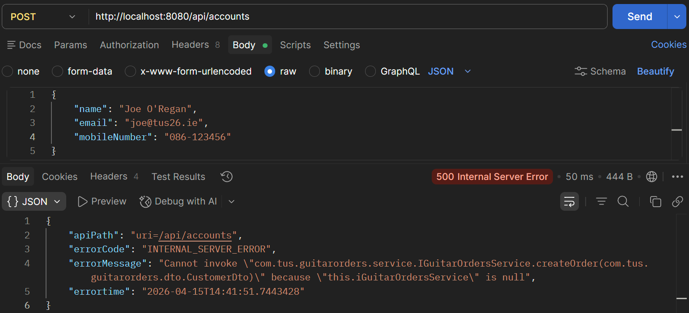

    Figure 1. Test Exception in Postman.  

---

**Note**:- Put the @AllArgsConstructor back in.

---

### Part#2 Validating the input data

#### Dependencies

1.	We need to validate the data we are receiving from the user. Make sure the relevant dependency is in the pom.xml .

```xml title="Validate Data: pom.xml"
<dependency>
    <groupId>org.springframework.boot</groupId>
    <artifactId>spring-boot-starter-validation</artifactId>
</dependency>
```

#### CustomerDto validations

2.	Now go to the Dto classes – Customer Dto and add validations

```java title="Customer DTO add validations: CustomerDto.java" linenums="1"
package com.tus.accounts.dto;

import jakarta.validation.Valid;
import jakarta.validation.constraints.Email;
import jakarta.validation.constraints.NotEmpty;
import jakarta.validation.constraints.Pattern;
import jakarta.validation.constraints.Size;
import lombok.Data;

@Data
public class CustomerDto {

	@NotEmpty(message = "Name cannot be null or empty")
	@Size(min = 5, max = 30, message = "the length of the customer name should be between 5 and 30")
	private String name;

	@NotEmpty(message = "email address cannot be null or empty")
	@Email(message = "Email adderess should be a valid value")
	private String email;

	@Pattern(regexp = "(^$|[0-9]{10})", message = "Mobile number must be 10 digits")
	private String mobileNumber;

	@Valid
	private AccountsDto accountsDto;
}
```

#### AccountsDto validations

3.	Similarly add validations in the AccountsDto

```java title="Accounts DTO add validations: AccountsDto.java" linenums="1"
package com.tus.accounts.dto;

import jakarta.validation.constraints.Max;
import jakarta.validation.constraints.Min;
import jakarta.validation.constraints.NotEmpty;
import jakarta.validation.constraints.NotNull;
import lombok.Data;

@Data
public class AccountsDto {
	@NotNull(message = "AccountNumber cannot be null")
	@Min(value = 1000000000L, message = "AccountNumber must be 10 digits")
	@Max(value = 9999999999L, message = "AccountNumber must be 10 digits")
	private Long accountNumber;

	@NotEmpty(message = "AccountType cannot be null or empty")
	private String accountType;

	@NotEmpty(message = "BranchAddress cannot be null or empty")
	private String branchAddress;
}
```

#### @Validated

This data is received in the AccountController class. Add the @Validated annotation.

```java title="@Validated Annotation: AccountsController.java" linenums="22"
import org.springframework.validation.annotation.Validated;

@RestController
@RequestMapping(path = "/api", produces = MediaType.APPLICATION_JSON_VALUE)
@AllArgsConstructor
@Validated
public class AccountController {

    private IAccountsService iAccountsService;
```

#### @Valid

Add the @Valid annotation for the POST and PUT mappings

```java title="@Valid Annotation for POST: AccountsController.java"
import jakarta.validation.Valid;

@RestController
@RequestMapping(path = "/api", produces = MediaType.APPLICATION_JSON_VALUE)
@AllArgsConstructor
@Validated
public class AccountController {

    private IAccountsService iAccountsService;

    @PostMapping("/accounts")
    public ResponseEntity<ResponseDto> createAccount(@Valid @RequestBody CustomerDto customerDto) {
        iAccountsService.createAccount(customerDto);
```

```java title="@Valid Annotation for PUT: AccountsController.java"
@PutMapping("/accounts")
public ResponseEntity<ResponseDto> updateAccountDetails(@Valid @RequestBody CustomerDto customerDto) {
    boolean isUpdated = iAccountsService.updateAccount(customerDto);
    if (isUpdated) {
```

#### @Pattern

For the GET mapping we can validation the mobilenumber using the @Pattern
@Pattern(regexp = "(^$|[0-9]{10})", message = "Mobile number must be 10 digits")
And the same for the DELETE method

```java title="GET @Pattern: AccountController.java"
@GetMapping()
    public ResponseEntity<CustomerDto> fetchAccountDetails(
            @RequestParam @Pattern(regexp = "(^$|[0-9]{10})", message = "Mobile number must be 10 digits") String mobileNumber) {
        CustomerDto customerDto = iAccountsService.fetchAccount(mobileNumber);
        return ResponseEntity.status(HttpStatus.OK).body(customerDto);
    }
```

```java title="DELETE @Pattern: AccountController.java"
@DeleteMapping()
public ResponseEntity<ResponseDto> deleteAccountDetails(@RequestParam 
        @Pattern(regexp = "(^$|[0-9]{10})", message = "Mobile number must be 10 digits") String mobileNumber) {
    boolean isDeleted = iAccountsService.deleteAccount(mobileNumber);
    if (isDeleted) {
```

#### GlobalExceptionHandler extends ResponseEntityExceptionHandler

Now in the GlobalExceptionHandler we need to update the class so that is extends the ResponseEntityExceptionHandler and add a method handleMethodArgumentNotValid so that it knows how to return the error to the client.

```java title="GlobalExceptionHandler extends ResponseEntityExceptionHandler"
import org.springframework.web.servlet.mvc.method.annotation.ResponseEntityExceptionHandler;
import org.springframework.http.HttpStatus;
import com.tus.accounts.dto.ErrorResponseDto;

@ControllerAdvice
public class GlobalExceptionHandler extends ResponseEntityExceptionHandler {
	@ExceptionHandler(Exception.class)
	public ResponseEntity<ErrorResponseDto> handleGlobalException(Exception exception, WebRequest webRequest) {
```

#### GlobalExceptionHandler handleMethodArgumentNotValid

Add the method handleMethodArgumentNotValid method. This will give process all validations. The map will hold all the validation errors that occurred in the input data.

```java title="Import FieldError"
import org.springframework.validation.FieldError;

@ControllerAdvice
public class GlobalExceptionHandler extends ResponseEntityExceptionHandler {
```

```java title="GlobalExceptionHandler handleMethodArgumentNotValid()"
@Override
protected ResponseEntity<Object> handleMethodArgumentNotValid(MethodArgumentNotValidException ex,
        HttpHeaders headers, HttpStatusCode status, WebRequest request) {
    Map<String, String> validationErrors = new HashMap<>();
    List<ObjectError> validationErrorList = ex.getBindingResult().getAllErrors();

    validationErrorList.forEach((error) -> {
        String fieldName = ((FieldError) error).getField();
        String validationMsg = error.getDefaultMessage();
        validationErrors.put(fieldName, validationMsg);
    });

    return new ResponseEntity<>(validationErrors, HttpStatus.BAD_REQUEST);
}
```

#### Test email and mobile number

To test, go to Postman, remove @ from email, put mobile number as 9 or less digits and make name one character.

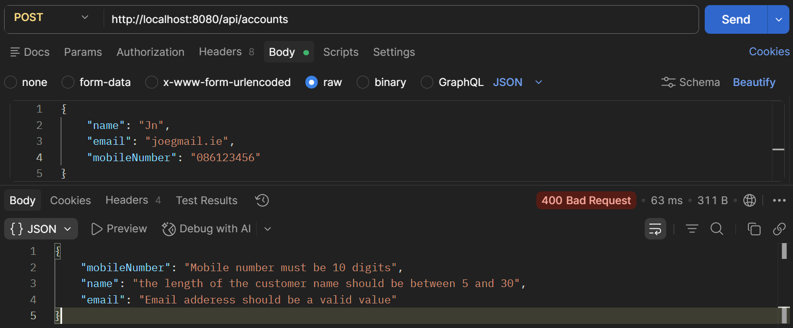

    Figure 2. Test email.

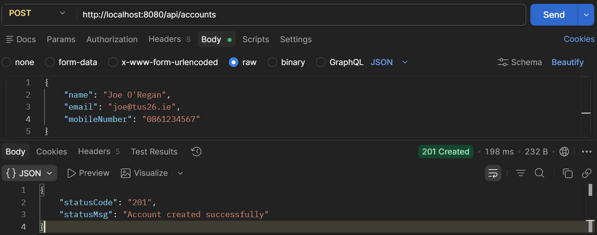

    Figure 3. Test ok.

Test the validation on the GET mapping

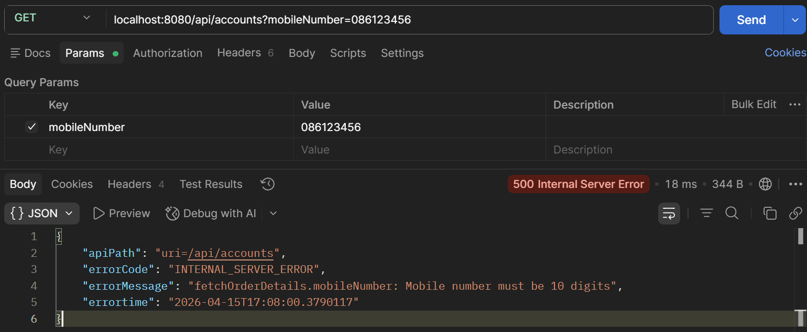

    Figure 4. Test mobile number.

---

### Part#3 Completing the audit metadata.

#### BaseEntity Annotation

These metadata columns can be updated automatically by Spring Data JPA
The metadata columns are defined in the BaseEntity class. Add the annotations shown.

```java title="BaseEntity Metadata: BaseEntity.java" linenums="20"
public class BaseEntity {

    @CreatedDate
    @Column(updatable = false)
    private LocalDateTime createdAt;

    @CreatedBy
    @Column(updatable = false)
    private String createdBy;

    @LastModifiedDate
    @Column(insertable = false)
    private LocalDateTime updatedAt;

    @LastModifiedBy
    @Column(insertable = false)
    private String updatedBy;
}
```

#### AuditAwareImpl

To add the logic about the user, add a new package and class

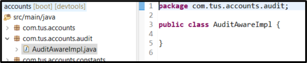

    Figure 5. AuditAwareImpl.java

```java title="AuditAwareImpl.java" linenums="1"
package com.tus.accounts.audit;

import java.util.Optional;

import org.springframework.data.domain.AuditorAware;
import org.springframework.stereotype.Component;

@Component("auditAwareImpl")
public class AuditAwareImpl implements AuditorAware<String> {

    @Override
    public Optional<String> getCurrentAuditor() {
        return Optional.of("ACCOUNTS_MS");
    }
}
```

#### BaseEntity Annotations

Now in the BaseEntity, make sure the two annotations are there

```java title="MappedSuperClass EntityListeners annotations: BaseEnity.java"
import java.time.LocalDateTime;

@MappedSuperclass
@EntityListeners(AuditingEntityListener.class)
@Getter @Setter @ToString
public class BaseEntity {

    @CreatedDate
    @Column(updatable = false)
```

#### JpaAuditing Annotation

Also in the main class AccountsApplication add the annotation to enable JpaAuditing.

```java title="Enable JPA Auditing: AccountsApplication.java" linenums="1"
package com.tus.accounts;

import org.springframework.boot.SpringApplication;
import org.springframework.boot.autoconfigure.SpringBootApplication;
import org.springframework.data.jpa.repository.config.EnableJpaAuditing;

@SpringBootApplication
@EnableJpaAuditing(auditorAwareRef = "auditAwareImpl")
public class AccountsApplication {

    public static void main(String[] args) {
        SpringApplication.run(AccountsApplication.class, args);
    }
}
```

#### Delete Manually Created Fields

Now delete the code where we were manually creating the fields.

```java title="Delete manually created fields: AccountsServiceImpl.java createNewAccount()" linenums="41"
/**
 * @param customer - Customer Object
 * @return the new account details
 */
private Accounts createNewAccount(Customer customer) {
    Accounts newAccount = new Accounts();
    newAccount.setCustomerId(customer.getCustomerId());
    long randomAccNumber = 1000000000L + new Random().nextInt(900000000);

    newAccount.setAccountNumber(randomAccNumber);
    newAccount.setAccountType(AccountsConstants.SAVINGS);
    newAccount.setBranchAddress(AccountsConstants.ADDRESS);
    newAccount.setCreatedAt(LocalDateTime.now());
    newAccount.setCreatedBy("default");
    newAccount.setUpdatedAt(LocalDateTime.now());
    newAccount.setUpdatedBy("default");
    return newAccount;
}
```

```java title="AccountsServiceImpl.java createNewAccount() - Updated" linenums="41"
/**
 * @param customer - Customer Object
 * @return the new account details
 */
private Accounts createNewAccount(Customer customer) {
    Accounts newAccount = new Accounts();
    newAccount.setCustomerId(customer.getCustomerId());
    long randomAccNumber = 1000000000L + new Random().nextInt(900000000);

    newAccount.setAccountNumber(randomAccNumber);
    newAccount.setAccountType(AccountsConstants.SAVINGS);
    newAccount.setBranchAddress(AccountsConstants.ADDRESS);
    return newAccount;
}
```

```java title="Delete manually created fields: AccountsServiceImpl.java createAccount()" linenums="31"
//@Override
public void createAccount(CustomerDto customerDto) {
    Customer customer = CustomerMapper.mapToCustomer(customerDto, new Customer());
    Optional<Customer> optionalcustomer = customerRepository.findByMobileNumber(customerDto.getMobileNumber());
    if (optionalcustomer.isPresent()) {
        throw new CustomerAlreadyExistsException(
                "Customer already registered with given mobile Number " + customerDto.getMobileNumber());
    }
    customer.setCreatedAt(LocalDateTime.now());
    customer.setCreatedBy("default");
    customer.setUpdatedAt(LocalDateTime.now());
    customer.setUpdatedBy("default");
    Customer savedCustomer = customerRepository.save(customer);
    accountsRepository.save(createNewAccount(savedCustomer));
}
```

```java title="AccountsServiceImpl.java createAccount()" linenums="30"
//@Override
public void createAccount(CustomerDto customerDto) {
    Customer customer = CustomerMapper.mapToCustomer(customerDto, new Customer());
    Optional<Customer> optionalcustomer = customerRepository.findByMobileNumber(customerDto.getMobileNumber());
    if (optionalcustomer.isPresent()) {
        throw new CustomerAlreadyExistsException(
                "Customer already registered with given mobile Number " + customerDto.getMobileNumber());
    }
    Customer savedCustomer = customerRepository.save(customer);
    accountsRepository.save(createNewAccount(savedCustomer));
}
```

#### Test in Postman

Go to Postman and test

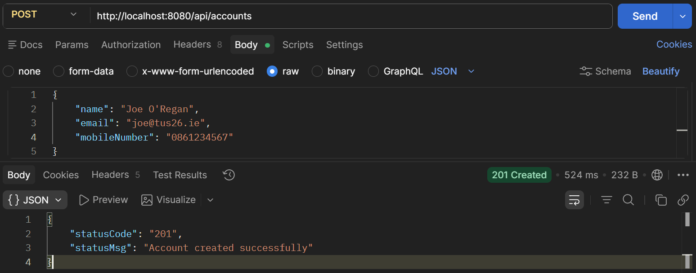

    Figure 6. Test Postman.

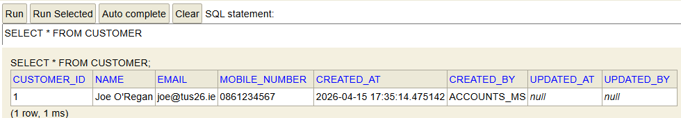

    Figure 7. H2 Console.

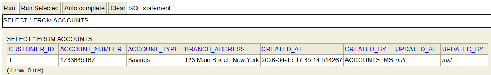

    Figure 8. H2 Console.

Check the update mapping

First fetch the data

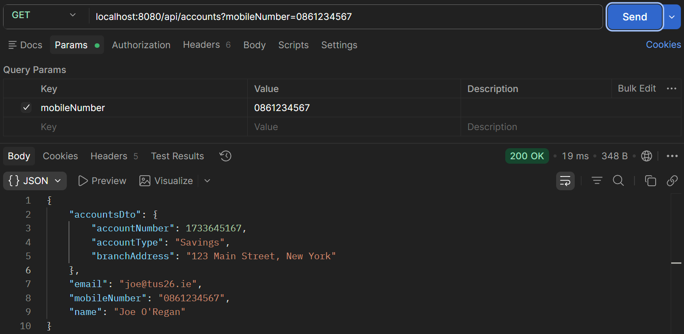

    Figure 9. Fetch account.

Now update a field e.g. Address

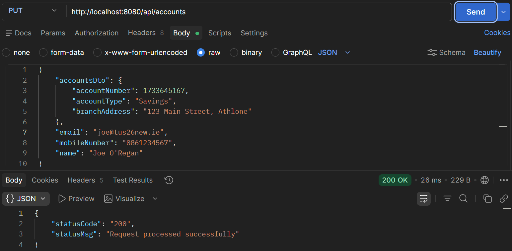

    Figure 10. PUT udpate address.
 
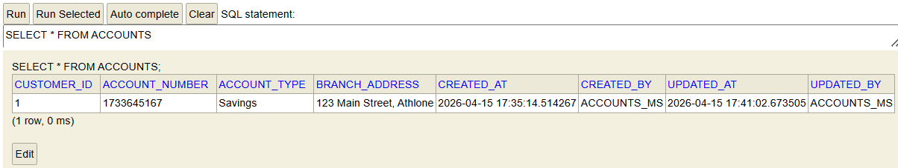

    Figure 11. Check in table.