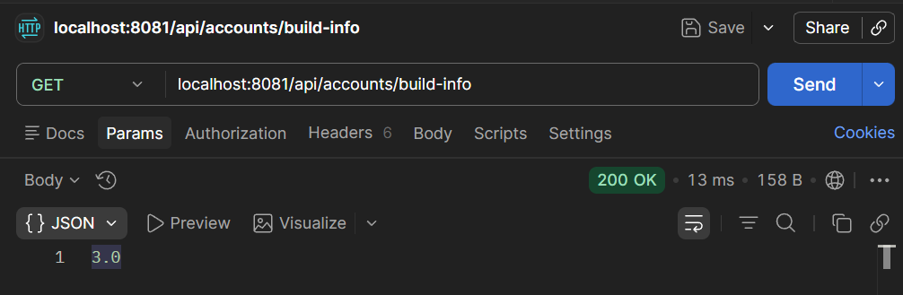

# Lab 10

## Steps and Files

1. [application.yml Build Version](#1-applicationyml-build-version)  
    - application.yml  
2. [@Value Annotation](#2-value-annotation)  
    - controller/AccountController.java  
3. [@AllArgsConstructor](#3-allargsconstructor)  
    - controller/AccountController.java  
4. [Test](#4-test)
    - Test using Postman

---

## Lab#10 Configuration with Springboot alone

---

In this lab we will read configurations using Springboot with @Value annotation in the accounts microservice. We add in a build property in the .yml file.

```markdown title="Order of precedence"
Spring Boot uses a very particular order that is  
designed to allow sensible overriding of values.  
Properties are considered tin the following order  
(with values form lower items overriding earlier ones): 

- Properties present inside files like application.properties
- OS Environmental variables
- Java System properties (System.getProperties())
- JNDI attributes from java:comp/env
- ServletContext init parameters
- ServletConfig init parameters
- Command line arguments
```

### 1. application.yml Build Version

```yaml title="Add property to the application.yml"
server:
  port: 8081
spring:
  datasource:
    url: jdbc:h2:mem:testdb
    driverClassName: org.h2.Driver
    username: sa
    password: ''
  h2:
    console:
      enabled: true
  jpa:
    database-platform: org.hibernate.dialect.H2Dialect
    hibernate:
      ddl-auto: update
    show-sql: true
build:
  version: "3.0"
```

Step 1: Add a property to the application.properties of the accounts microservice as shown above.

### 2. @Value Annotation

Step #2 Build a REST API to read the property and return to user. In the AccountController using the @Value annotation

```java title="Add property with @Value annotation in the AccountController"
@Validated
public class AccountController {

	private IAccountsService iAccountsService;

	@Value("${build.version}")
	private String buildVersion;

	@PostMapping("/account")
	public ResponseEntity<ResponseDto> createAccount(@Valid @RequestBody CustomerDto customerDto) {
		iAccountsService.createAccount(customerDto);
		return ResponseEntity.status(HttpStatus.CREATED)
				.body(new ResponseDto(AccountsConstants.STATUS_201, AccountsConstants.MESSAGE_201));
	}
```

```java title="Add rest end point to return the property value"
@GetMapping("/build-info")
	public ResponseEntity<String> getBuildInfo() {
		return ResponseEntity
        .status(HttpStatus.OK)
        .body(buildVersion);
	}
```

### 3. @AllArgsConstructor

Step #3 We also need to remove the @AllArgsConstructor and include a single argument constructor.

```java title="Changing @AllArgsConstructor to single arg constructor"
@RestController
@RequestMapping(path = "/api", produces = MediaType.APPLICATION_JSON_VALUE)
//@AllArgsConstructor
@Validated
public class AccountController {

	private IAccountsService iAccountsService;

	public AccountController(IAccountsService iAccountsService) {
		this.iAccountsService = iAccountsService;
	}

	@Value("${build.version}")
	private String buildVersion;
```

### 4. Test

Step 4: Test using Postman



    Figure 1: Test using Postman
