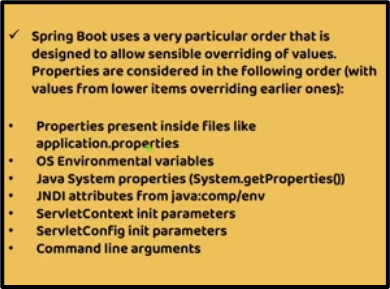
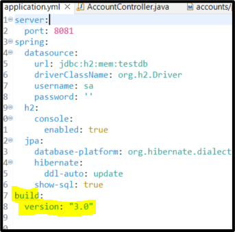
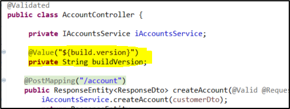
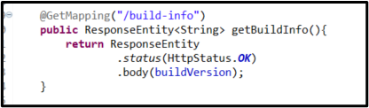
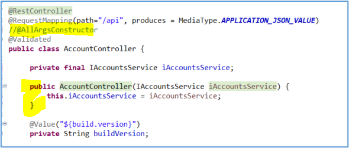
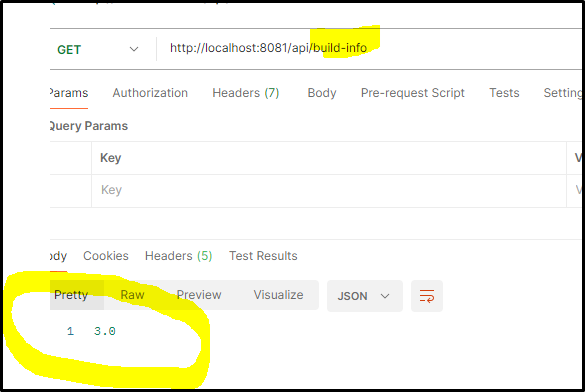

# Lab 10: Configuration with Springboot alone

## Screenshot

    Figure 0: Completed lab Postman test

---

## Lab#10 Configuration with Springboot alone

---

In this lab we will read configurations using Springboot with @Value annotation in the accounts microservice. We add in a build property in the .yml file.
 
<!-- Spring Boot uses a very particular order that is designed to allow sensible overriding of values. Properties are considered tin the following order (with values form lower items overriding earlier ones): 
- Properties present inside files like application.properties
- OS Environmental variables
- Java System properties (System.getProperties())
- JNDI attributes from java:comp/env
- ServletContext init parameters
- ServletConfig init parameters
- Command line arguments
 -->

	Figure 1: Order of precedence

    Figure 2: Add property to the application.yml

Step 1: Add a property to the application.properties of the accounts microservice as shown above.

Step #2 Build a REST API to read the property and return to user. In the AccountController using the @Value annotation

 
    Figure 3: Add property with @Value annotation in the AccountController

 
    Figure 4: Add rest end point to return the property value

Step #3 We also need to remove the @AllArgsConstructor and include a single argument constructor.

    Figure 5: Changing @AllArgsConstructor to single arg constructor

Step 4: Test using Postman

 
