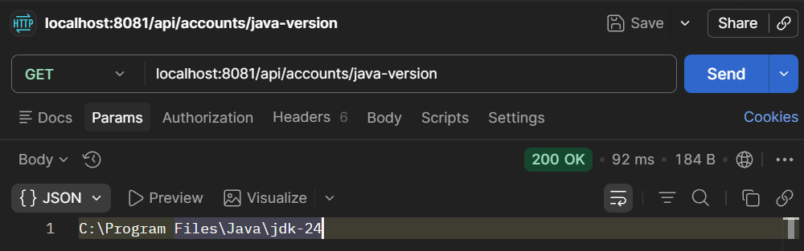

# Lab 11

## Steps and Files

1. [Environment variable](#1-environment-variable)
2. [getJavaVersion()](#2-getjavaversion)
3. [Test](#3-test)

---

## Lab#11 Configuration with Environment interface

----

In this lab we will read configurations with Environment interface in the accounts microservice e.g. JAVA_HOME

### 1. Environment variable

Step #1 Add an Environment variable to AccountController class

```java title="AccountController.java"  linenums="21"
import org.springframework.core.env.Environment;
import org.springframework.http.ResponseEntity;
import org.springframework.validation.annotation.Validated;
import jakarta.validation.Valid;

@RestController
@RequestMapping(path = "/api", produces = MediaType.APPLICATION_JSON_VALUE)
//@AllArgsConstructor
@Validated
public class AccountController {


	private IAccountsService iAccountsService;
	
	@Value("${build.version}")
	private String buildVersion;

    @Autowired
    private Environment environment;

    @Value
	public AccountController(IAccountsService iAccountsService) {
		this.iAccountsService = iAccountsService;
	}
```

### 2. getJavaVersion()

Step #2 Build a REST API to read the property and return to user. In the AccountController

```java title="getJavaVersion()"
	@GetMapping("/java-version")
	public ResponseEntity<String> getJavaVersion() {
		return ResponseEntity.status(HttpStatus.OK).body(environment.getProperty("JAVA_HOME"));
	}
```

### 3. Test

Step #3 Test using Postman

