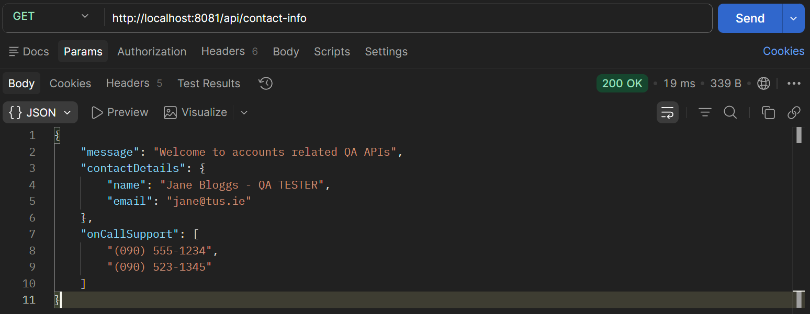

# Lab 12

## Steps and Files

1. [Contact Details Properties](#1-contact-details-properties)
    - application.yml
2. [DTO Records Pojo](#2-dto-records-pojo)
    - AccountsContactInfoDto.java
3. [Add @EnableConfigurationProperties Annotation](#3-add-enableconfigurationproperties-annotation)
    - AccountsApplication.java
4. [Add Constructor Injection](#4-add-constructor-injection)
    - AccountsController.java
5. [Test](#5-test)
    - Postman GET /contact-info

---

## Lab#12 Configuration with @ConfigurationProperties

This method is useful when a number of properties need to be read.

### 1. Contact Details Properties

Step#1 Add the following properties to the application.yml file in the accounts microservice. This could represent contact details for example a support engineer.

```yaml title="application.yml" linenums="14" 
    hibernate:
      ddl-auto: update
    show-sql: true
build:
  version: "3.0"
accounts:
  message: "Welcome to accounts related local APIs"
  contactDetails:
    name: "Joe Bloggs - Developer"
    email: "joe@tus.ie"
  onCallSupport:
    - (086) 555-1234
    - (087) 523-1345
```

### 2. DTO Records Pojo
 
Step#2 Add a dto POJO using Records.

```java title="AccountsContactInfoDto() record"
package com.tus.accounts.dto;
import java.util.List;
import java.util.Map;
import org.springframework.boot.context.properties.ConfigurationProperties;

@ConfigurationProperties(prefix = "accounts")
public record AccountsContactInfoDto(String message, Map<String, String> contactDetails, List<String> onCallSupport) {

}
```

### 3. Add @EnableConfigurationProperties Annotation

Step#3 In the main class add the annotation

```java title="AccountsApplication.java"
package com.tus.accounts;

import org.springframework.boot.SpringApplication;
import org.springframework.boot.autoconfigure.SpringBootApplication;
import org.springframework.data.jpa.repository.config.EnableJpaAuditing;
import org.springframework.boot.context.properties.EnableConfigurationProperties;
import com.tus.accounts.dto.AccountsContactInfoDto;

@SpringBootApplication
@EnableJpaAuditing(auditorAwareRef = "auditAwareImpl")
@EnableConfigurationProperties(value = { AccountsContactInfoDto.class })
public class AccountsApplication {

	public static void main(String[] args) {
		SpringApplication.run(AccountsApplication.class, args);
	}
}
```

### 4. Add Constructor Injection

Step#4 Update the REST API to return the contact info.

```java title="AccountsController.java - add missing constructor injection"
    private AccountsContactInfoDto accountsContactInfoDto;

    // Inject AccountsContactInfoDto using constructor injection
    public AccountController(IAccountsService iAccountsService, AccountsContactInfoDto accountsContactInfoDto) {
        this.iAccountsService = iAccountsService;
        this.accountsContactInfoDto = accountsContactInfoDto;
    }
```
 
```java title=""
	@GetMapping("/contact-info")
	public ResponseEntity<String> getContactInfo() {
		return ResponseEntity.status(HttpStatus.OK).body(accountsContactInfoDto);
	}
```

### 5. Test

Step #5 Test using Postman

GET: `http://localhost:8081/api/contact-info`



    Figure 1. GET /contact-info