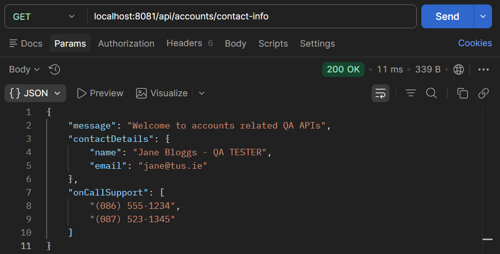

# Lab 13

## Lab#13 Springboot Profiles

Springboot profiles are useful for different environments e.g dev, qa, prod  
Step #1 Add two more .yml files named as shown in the accounts microservice. Files are given.
 

Step#2 Update the application.yml in the accounts microservice with the following spring.config properties.

```yaml title="application.yml spring.config" linenums="11"
      enabled: true
  jpa:
    database-platform: org.hibernate.dialect.H2Dialect
    hibernate:
      ddl-auto: update
    show-sql: true
  config:
    import:
      - "application_qa.yml"
      - "application_prod.yml"
build:
  version: "3.0"
accounts:
  message: "Welcome to accounts related local APIs"
```

Step#3 Run the application. You will see default profile is used by checking contact-info.


    Figure 1: Default Profile

 
Step#4 Update the application.yml to change the active profile to qa. Check the contact info again in Postman. Now you will see the information is read from the application_qa.yml
 
```yaml title="application.yml change active profile to qa" linenums="17"
  config:
    import:
      - "application_qa.yml"
      - "application_prod.yml"
  profiles:
    active:
      - "qa"
build:
  version: "3.0"
accounts:
  message: "Welcome to accounts related local APIs"
```


 
    Figure 2: QA Profile

---

Final application.yml, with profile switching

```yaml title="applicaiton.yml with profile switching"
server:
  port: 8081
spring:
  profiles:
    active: "qa"  # Profile to use
  datasource:
    url: jdbc:h2:mem:testdb
    driverClassName: org.h2.Driver
    username: sa
    password: ''
  h2:
    console:
      enabled: true
  jpa:
    database-platform: org.hibernate.dialect.H2Dialect
    hibernate:
      ddl-auto: update
    show-sql: true
build:
  version: "3.0"
# default profile (fall back)
accounts:
  message: "Welcome to accounts related local APIs"
  contactDetails:
    name: "Joe Bloggs - Developer"
    email: "joe@tus.ie"
  onCallSupport:
    - (086) 555-1234
    - (087) 523-1345

# qa profile
--- 
spring:
  config:
    activate:
      on-profile: "qa"
    import: "application_qa.yml"

# prod profile 
---
spring:
  config:
    activate:
      on-profile: "prod"
    import: "application_prod.yml"
```


