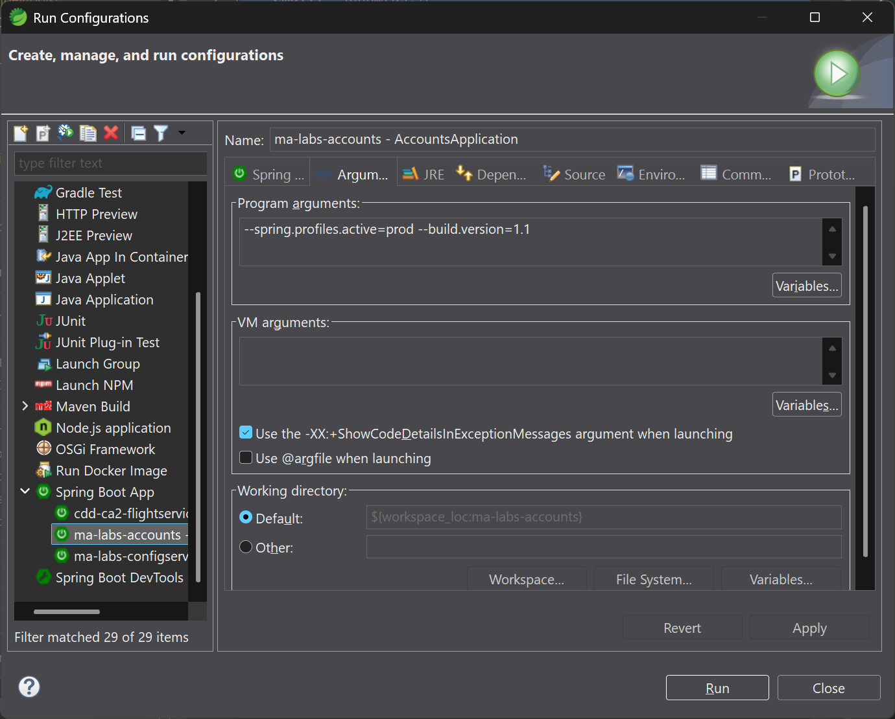
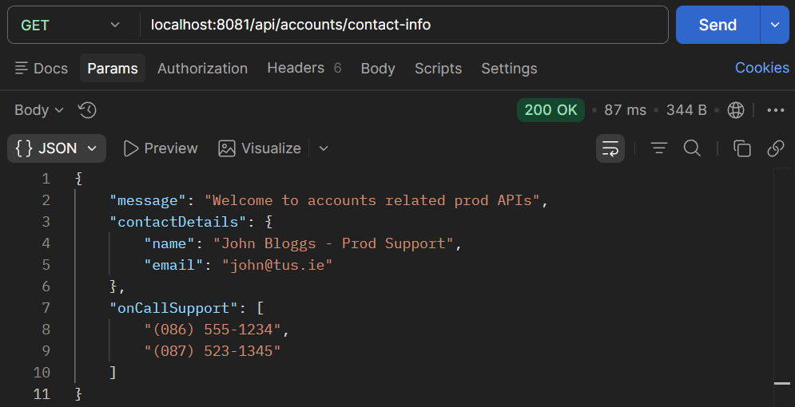
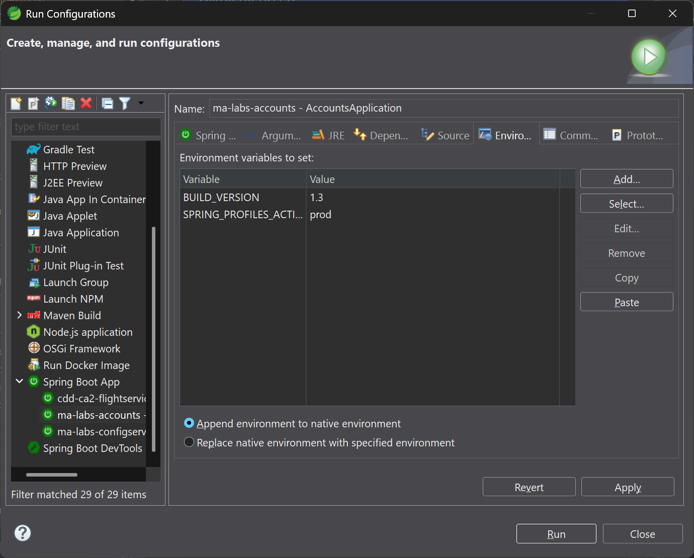
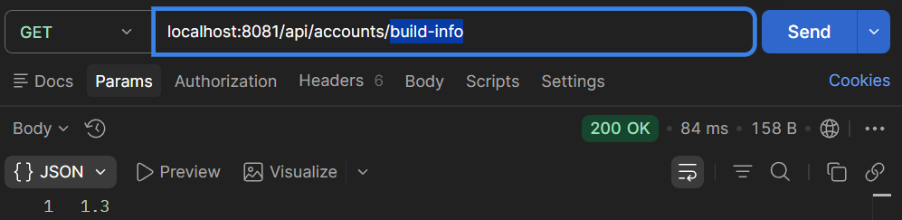
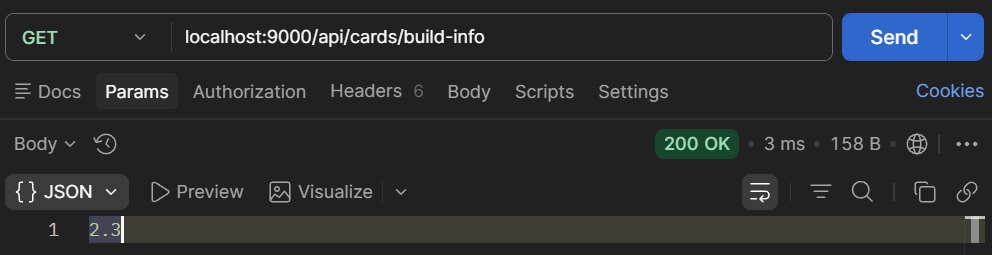
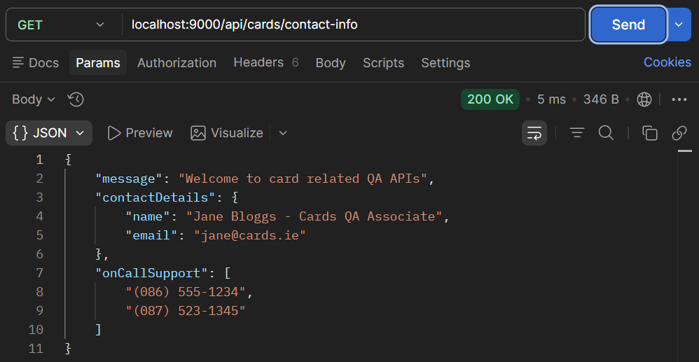
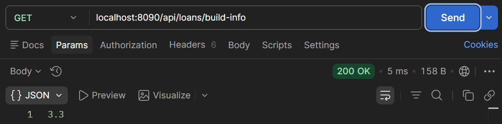
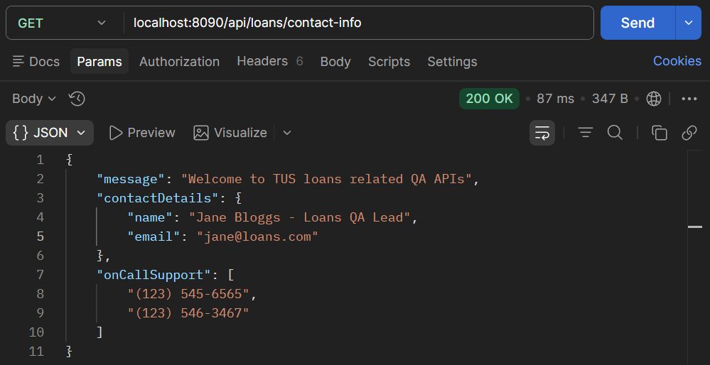

# Lab 14

## Steps and Files

1. [Run Configuration](#1-run-configuration)
2. [Profile Switching](#2-profile-switching)
    - application_prod.yml
3. [IDE Environment Variables](#3-ide-environment-variables)
4. [Cards](#cards)
    - CardsApplication.java
    - CardController.java
    - CardsContactInfoDto.java
    - application.yml
    - application_prod.yml
    - application_qa.yml
5. [Loans](#loans)
    - LoansApplication.java
    - LoanController.java
    - LoansContactInfoDto.java
    - application.yml
    - application_prod.yml
    - application_qa.yml

---

## Lab#14 Activating Springboot Profiles
Springboot profiles are useful for different environments e.g dev, qa, prod. The profile can be selected at startup

### 1. Run Configuration

Step# 1 To do this from IDE, Right-Click on AccountsApplication and select Run As > Run Configurations

`R.C > Run As > Run Configuration > Arguments Tab`

Add in the arguments tab `--spring.profiles.active=prod --build.version=1.1` and Run



    Figure 1. Pass arguments at run-time

### 2. Profile Switching

Step #2 Test that the application has started with the production profile
 
```yaml title="application_prod.yml"
accounts:
  message: "Welcome to accounts related prod APIs"
  contactDetails:
    name: "John Bloggs - Prod Support"
    email: "john@tus.ie"
  onCallSupport:
    - (086) 555-1234
    - (087) 523-1345
```



    Figure 2. GET localhost:9000/api/cards/contact-info


    Figure 3. GET localhost:9000/api/cards/build-info

### 3. IDE Environment Variables 

Or using environment variables from IDE
 
**Note**: First clear the Arguments > Program arguments - these override Environment Variables



    Figure 4. Environment Variables



    Figure 5. GET /build-info

Now implement similar changes in the loans and cards microservice

---

### Cards

#### Java

```java title="CardsApplication.java" linenums="10"
@SpringBootApplication
@EnableJpaAuditing(auditorAwareRef = "auditAwareImpl")
@EnableConfigurationProperties(value = {CardsContactInfoDto.class})
public class CardsApplication {

    public static void main(String[] args) {
        SpringApplication.run(CardsApplication.class, args);
    }
}
```

```java title="CardController.java" linenums="35"
    private CardsContactInfoDto cardsContactInfoDto;

    public CardController(ICardsService iCardsService, CardsContactInfoDto cardsContactInfoDto) {
        this.iCardsService = iCardsService;
        this.cardsContactInfoDto = cardsContactInfoDto;
    }

    @Value("${build.version}")
    private String buildVersion;

    @Autowired
    private Environment environment;

    @GetMapping("/java-version")
    public ResponseEntity<String> getJavaVersion() {
        return ResponseEntity.status(HttpStatus.OK).body(environment.getProperty("JAVA_HOME"));
    }

    @GetMapping("/build-info")
    public ResponseEntity<String> getBuildInfo() {
        return ResponseEntity.status(HttpStatus.OK).body(buildVersion);
    }

    @GetMapping("/contact-info")
    public ResponseEntity<CardsContactInfoDto> getContactInfo() {
        return ResponseEntity.status(HttpStatus.OK).body(cardsContactInfoDto);
    }
```

```java title="CardsContactInfoDto.java" linenums="8"
@ConfigurationProperties(prefix = "cards")
public record CardsContactInfoDto(
    String message, Map<String, String> contactDetails, List<String> onCallSupport) {

}"
```

#### YAML

```yaml title="application.yml (line 22 must match CardsContactInfoDto line 8)" linenums="1"
server:
  port: 9000
spring:
  profiles:
    active: "qa"  # Profile to use
  datasource:
    url: jdbc:h2:mem:testdb
    driverClassName: org.h2.Driver
    username: sa
    password: ''
  h2:
    console:
      enabled: true
  jpa:
    database-platform: org.hibernate.dialect.H2Dialect
    hibernate:
      ddl-auto: update
    show-sql: true
build:
  version: "2.1"
# default profile (fall back)
cards:
  message: "Welcome to cards related local APIs"
  contactDetails:
    name: "Joe Bloggs - Cards Developer"
    email: "joe@cards.ie"
  onCallSupport:
    - (086) 555-1234
    - (087) 523-1345

# qa profile
--- 
spring:
  config:
    activate:
      on-profile: "qa"
    import: "application_qa.yml"

# prod profile 
---
spring:
  config:
    activate:
      on-profile: "prod"
    import: "application_prod.yml"
```

```yaml title="application_prod.yml (line 3 must match CardsContactInfoDto line 8)" linenums="1"
build:
  version: "2.2"
cards:
  message: "Welcome to card related prod APIs"
  contactDetails:
    name: "John Bloggs - Cards Prod Lead"
    email: "john@cards.ie"
  onCallSupport:
    - (086) 555-1234
    - (087) 523-1345
```

```yaml title="application_qa.yml (line 3 must match CardsContactInfoDto line 8)" linenums="1"
build:
  version: "2.3"
cards:
  message: "Welcome to card related QA APIs"
  contactDetails:
    name: "Jane Bloggs - Cards QA Associate"
    email: "jane@cards.ie"
  onCallSupport:
    - (086) 555-1234
    - (087) 523-1345
```

#### Postman



    Figure 6. GET /cards/build-info



    Figure 7. GET /cards/contact-info
 

---

### Loans

#### Java

```java title="LoansApplication.java" linenums="10"
@SpringBootApplication
@EnableJpaAuditing(auditorAwareRef = "auditAwareImpl")
@EnableConfigurationProperties(value = {LoansContactInfoDto.class})
public class LoansApplication {
    public static void main(String[] args) {
        SpringApplication.run(LoansApplication.class, args);
    }
}
```

```java title="LoanController.java" linenums="35"
    private LoansContactInfoDto loansContactInfoDto;

    public LoanController(ILoansService iLoansService, LoansContactInfoDto loansContactInfoDto) {
        this.iLoansService = iLoansService;
        this.loansContactInfoDto = loansContactInfoDto;
    }

    @Value("${build.version}")
    private String buildVersion;

    @Autowired
    private Environment environment;

    @GetMapping("/java-version")
    public ResponseEntity<String> getJavaVersion() {
        return ResponseEntity.status(HttpStatus.OK).body(environment.getProperty("JAVA_HOME"));
    }

    @GetMapping("/build-info")
    public ResponseEntity<String> getBuildInfo() {
        return ResponseEntity.status(HttpStatus.OK).body(buildVersion);
    }

    @GetMapping("/contact-info")
    public ResponseEntity<LoansContactInfoDto> getContactInfo() {
        return ResponseEntity.status(HttpStatus.OK).body(loansContactInfoDto);
    }
```

```java title="LoansContactInfoDto.java" linenums="8"
@ConfigurationProperties(prefix = "loans") // must match yaml
public record LoansContactInfoDto(String message, Map<String, String> contactDetails, List<String> onCallSupport) {

}

```

#### YAML

```yaml title="application.yml (line 22 must match LoansContactInfoDto line 8)" linenums="1"
server:
  port: 8090
spring:
  profiles:
    active: "qa"  # Profile to use
  datasource:
    url: jdbc:h2:mem:testdb
    driverClassName: org.h2.Driver
    username: sa
    password: ''
  h2:
    console:
      enabled: true
  jpa:
    database-platform: org.hibernate.dialect.H2Dialect
    hibernate:
      ddl-auto: update
    show-sql: true
build:
  version: "3.1"
# default profile (fall back)
loans:
  message: "Welcome to loans related local APIs"
  contactDetails:
    name: "Joe Bloggs - Loan Developer"
    email: "joe@loans.ie"
  onCallSupport:
    - (086) 555-1234
    - (087) 523-1345

# qa profile
--- 
spring:
  config:
    activate:
      on-profile: "qa"
    import: "application_qa.yml"

# prod profile 
---
spring:
  config:
    activate:
      on-profile: "prod"
    import: "application_prod.yml"
```

```yaml title="application_prod.yml (line 3 must match LoansContactInfoDto line 8)" linenums="1"
build:
  version: "3.2"
loans:
  message: "Welcome to TUS loans related Prod APIs"
  contactDetails:
    name: "John Bloggs - Loan Prod Support"
    email: "john@loans.com"
  onCallSupport:
    - (123) 555-1234
    - (123) 523-1345
```

```yaml title="application_qa.yml (line 3 must match LoansContactInfoDto line 8)" linenums="1"
build:
  version: "3.3"
loans:
  message: "Welcome to TUS loans related QA APIs"
  contactDetails:
    name: "Jane Bloggs - Loans QA Lead"
    email: "jane@loans.com"
  onCallSupport:
    - (123) 545-6565
    - (123) 546-3467
```

#### Postman



    Figure 6. GET localhost:8090/api/loans/build-info



    Figure 7. GET localhost:8090/api/loans/contact-info
 
