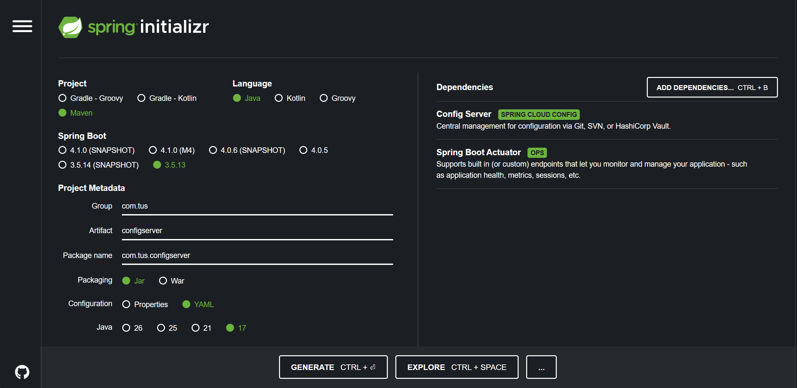
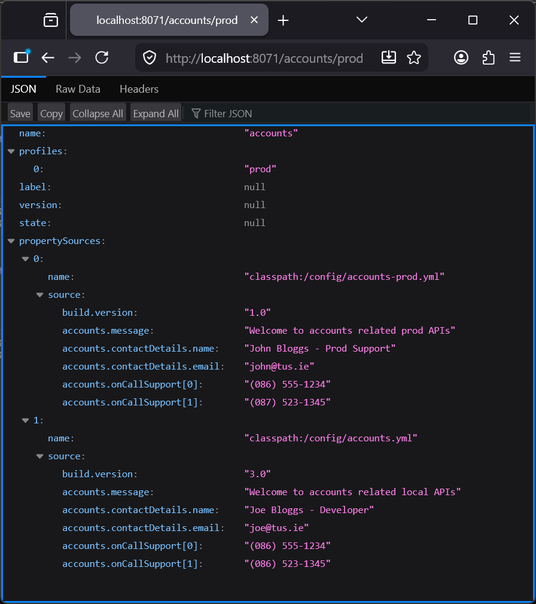
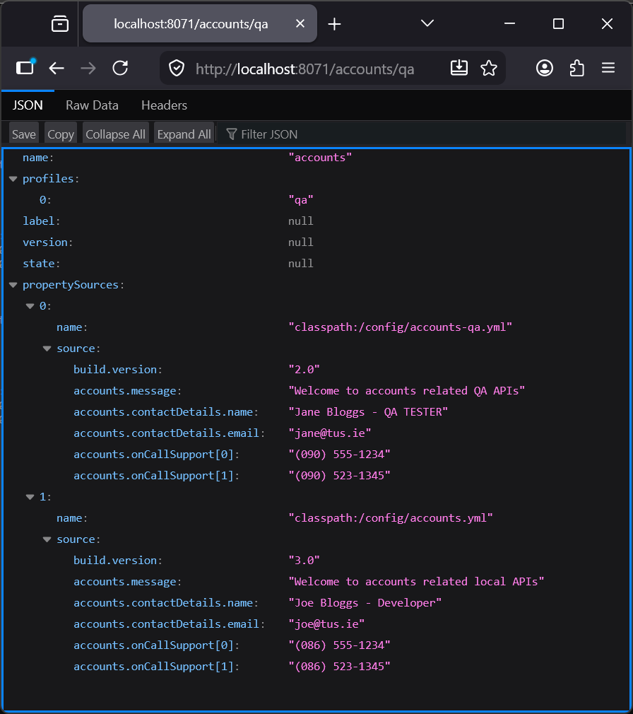
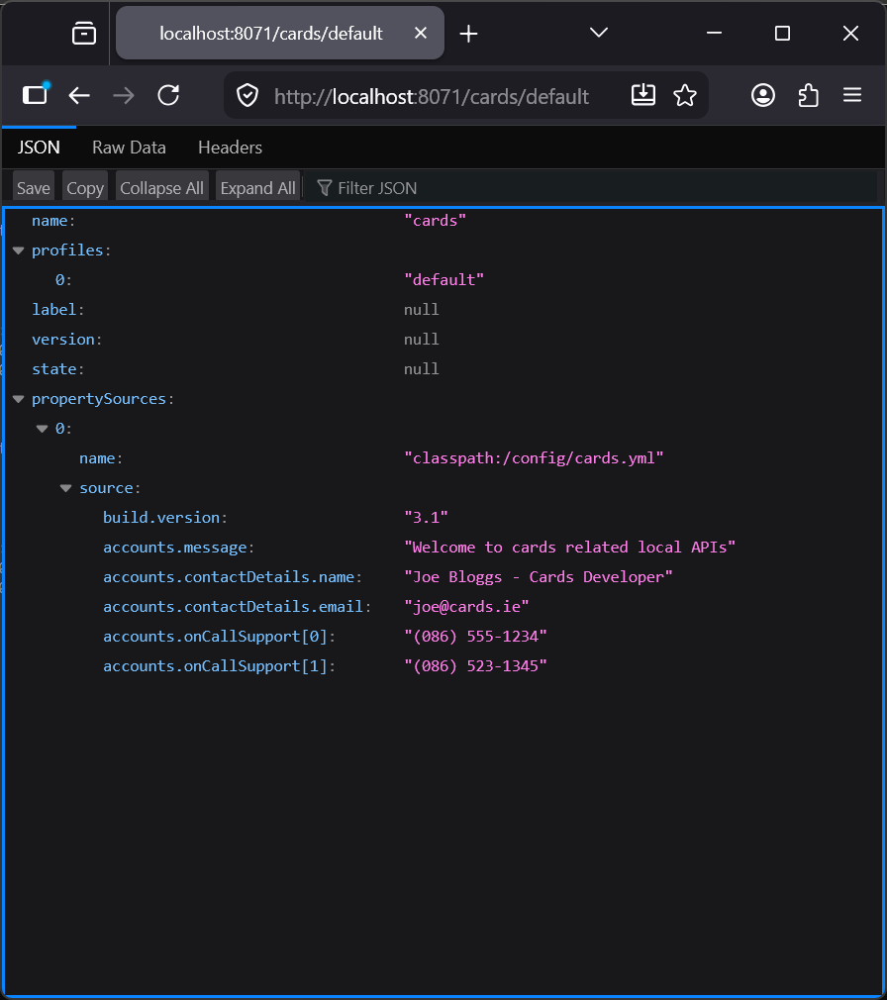

# Lab 15

## Lab#15 Getting started with SpringCloud Config

Some parameters can be read with Springboot alone. However for anymore than trivial cases a Spring Cloud Config server is required. Using Spring Cloud Config, parameters can be read from the classpath, the file system or a git repo.

In this lab we will be reading configurations from classpath location.

### Step#1  Create a new project with artefact name “configserver”. Add configserver and actuator as dependencies.
 


    Figure 1. New Project

### Step#2 Add the @EnableConfigServer annotation to the Application class.

```java title="ConfigserverApplication.java" linenums="1"
package com.tus.configserver;

import org.springframework.boot.SpringApplication;
import org.springframework.boot.autoconfigure.SpringBootApplication;
import org.springframework.cloud.config.server.EnableConfigServer;

@SpringBootApplication
@EnableConfigServer
public class ConfigserverApplication {

	public static void main(String[] args) {
		SpringApplication.run(ConfigserverApplication.class, args);
	}

}
```

### Step#3 Update the application.properties for the configserver.

```yaml title="application.yaml" linenums="1"
spring:
  application:
    name: configserver
  profiles:
    active: native
  cloud:
    config:
      server:
        native:
          search-locations: classpath:/config

server:
  port: 8071
```

---

### Step#4 Add .yml files for all the microservices to the configserver, named as shown in a folder called config.

#### Accounts YAML

```yaml title="accounts.yml" linenums="1"
build:
  version: "3.0"
accounts:
  message: "Welcome to accounts related local APIs"
  contactDetails:
    name: "Joe Bloggs - Developer"
    email: "joe@tus.ie"
  onCallSupport:
    - (086) 555-1234
    - (086) 523-1345
```
  
```yaml title="accounts-qa.yml" linenums="1"
build:
  version: "2.0"
accounts:
  message: "Welcome to accounts related QA APIs"
  contactDetails:
    name: "Jane Bloggs - QA TESTER"
    email: "jane@tus.ie"
  onCallSupport:
    - (090) 555-1234
    - (090) 523-1345
```

```yaml title="accounts-prod.yml" linenums="1"
build:
  version: "1.0"
accounts:
  message: "Welcome to accounts related prod APIs"
  contactDetails:
    name: "John Bloggs - Prod Support"
    email: "john@tus.ie"
  onCallSupport:
    - (086) 555-1234
    - (087) 523-1345
```
 
#### Cards YAML

```yaml title="cards.yml" linenums="1"
build:
  version: "3.1"
accounts:
  message: "Welcome to cards related local APIs"
  contactDetails:
    name: "Joe Bloggs - Cards Developer"
    email: "joe@cards.ie"
  onCallSupport:
    - (086) 555-1234
    - (086) 523-1345
```

```yaml title="cards-qa.yml" linenums="1"
build:
  version: "2.1"
cards:
  message: "Welcome to TUS cards related QA APIs"
  contactDetails:
    name: "John Murphy - Product Owner"
    email: "john@cards.ie"
  onCallSupport:
    - (086) 656-8709
    - (087) 342-0956
```

```yaml title="cards-prod.yml" linenums="1"
build:
  version: "1.1"
cards:
  message: "Welcome to TUS cards related prod APIs"
  contactDetails:
    name: "John Murphy - Product Owner"
    email: "john@tus.ie"
  onCallSupport:
    - (086) 656-8709
    - (087) 342-0956
```
 
#### Loans YAML

```yaml title="loans.yml" linenums="1"
build:
  version: "3.2"
accounts:
  message: "Welcome to loans related local APIs"
  contactDetails:
    name: "Anna Bloggs - Loans Developer"
    email: "anna@loans.ie"
  onCallSupport:
    - (452) 456-2176
    - (452) 764-8934
```

```yaml title="loans-qa.yml" linenums="1"
build:
  version: "2.2"
cards:
  message: "Welcome to TUS loans related QA APIs"
  contactDetails:
    name: "John Murphy - Loans Owner"
    email: "john@loans.ie"
  onCallSupport:
    - (086) 656-8709
    - (087) 342-0956
```

```yaml title="loans-prod.yml" linenums="1"
build:
  version: "1.2"
cards:
  message: "Welcome to TUS loans related prod APIs"
  contactDetails:
    name: "John Murphy - Loans Owner"
    email: "john@loans.ie"
  onCallSupport:
    - (086) 656-8709
    - (087) 342-0956
```

These .yml files only contain the profile specific attributes.  

---

### Step#5 Run the server and test. 

**Note**: the default values are also returned
 
#### Accounts

`http://localhost:8071/accounts/prod`



    Figure 2. GET http://localhost:8071/accounts/prod

`http://localhost:8071/accounts/qa`



    Figure 3. GET http://localhost:8071/accounts/qa

#### Cards

`http://localhost:8071/cards/prod`


    Figure 4. GET http://localhost:8071/cards/prod

`http://localhost:8071/cards/default`



    Figure 5. GET http://localhost:8071/cards/default

#### Loans

`http://localhost:8071/loans/prod`


    Figure 6. GET http://localhost:8071/loans/prod


 

 


 


