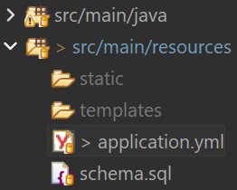
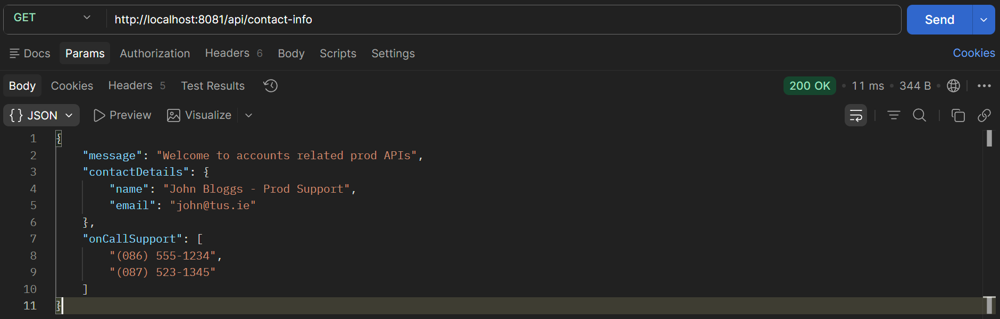
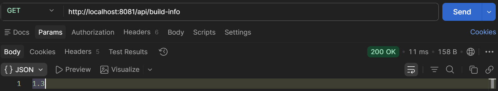
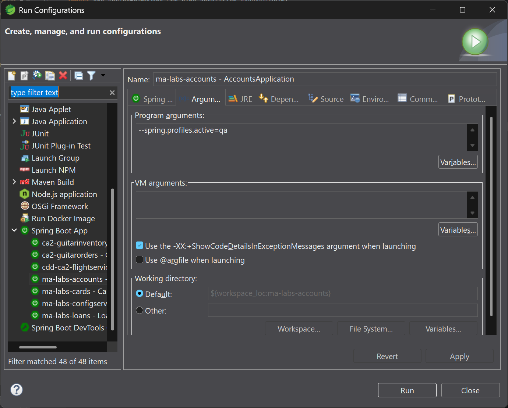
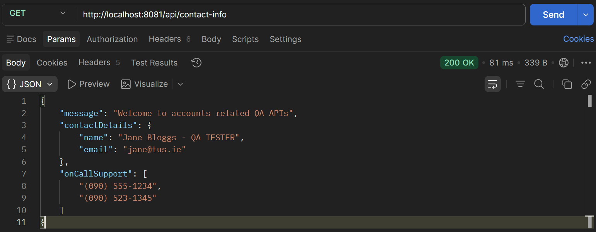
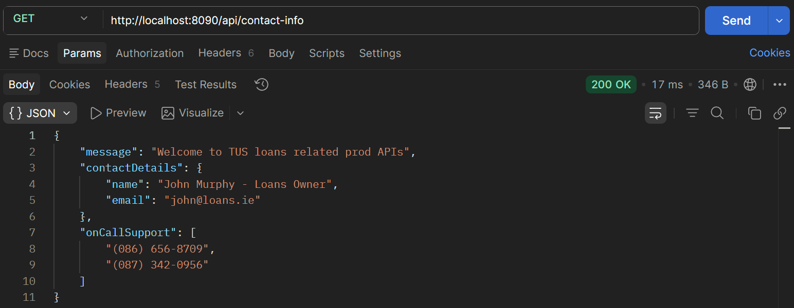
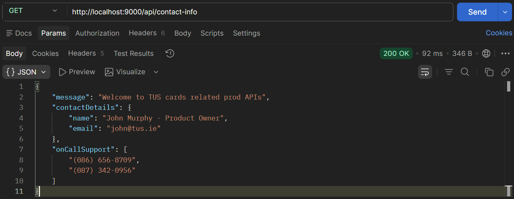

# Lab 16

## Steps and Files

1. [Delete YAML](#1-delete-yaml)
    - application_prod.yml
    - application_qa.yml
1. [Delete Properties](#2-delete-properties)
    - application.yml
1. [Add Application Name and Active Profile Properties](#3-add-application-name-and-active-profile-properties)
    - application.yml
1. [Spring Cloud Client Dependency](#4-spring-cloud-client-dependency)
    - pom.xml
1. [Config Server Details](#5-config-server-details)
    - application.yml
1. [Start Config Server and Accounts Microservice]()()
1. [Start with a Different Profile]()
1. [Change Other Microservices]()

---

## Lab#16 Modifying the microservices to use the SpringCloud Config server
In this lab we will be modify the accounts microservice to read from the values from the configserver.

### 1. Delete YAML

Step#1 In the accounts microservice, delete the application_prod.yml and the application_qa.yml files. 



    Figure 1. Delete application_prod.yml and application_qa.yml files.

### 2. Delete Properties

Step#2 Also delete everything to do with properties from the application.yml leaving only as shown below.

```yaml title="application.yml delete properties" linenums="1"
server:
  port: 8080
spring:
  datasource:
    url: jdbc:h2:mem:testdb
    driverClassName: org.h2.Driver
    username: sa
    password: ''
  h2:
    console:
      enabled: true
  jpa:
    database-platform: org.hibernate.dialect.H2Dialect
    hibernate:
      ddl-auto: update
    show-sql: true
```

### 3. Add Application Name and Active Profile Properties

Step#3 Add properties for application name and active profile

```yaml title="application.yml add application name and active profile" linenums="1"
server:
  port: 8080
spring:
  application:
    name: "accounts"
  profiles:
    active: "prod"
  datasource:
    url: jdbc:h2:mem:testdb
    driverClassName: org.h2.Driver
    username: sa
    password: ''
```

### 4. Spring Cloud Client Dependency

Step#4 Add the spring cloud client dependency in the pom file for accounts microservice

```xml title="pom.xml add spring cloud client dependency" linenums="29"
<properties>
		<java.version>17</java.version>
		<spring-cloud.version>2022.0.5</spring-cloud.version>
	</properties>
	<dependencies>
		<dependency>
			<groupId>org.springframework.cloud</groupId>
			<artifactId>spring-cloud-starter-config</artifactId>
		</dependency>
```
 
This can be copied from config server

```xml title="pom.xml add spring cloud client dependency" linenums="101"
		</dependency>
	</dependencies>
	<dependencyManagement>
		<dependencies>
			<dependency>
				<groupId>org.springframework.cloud</groupId>
				<artifactId>spring-cloud-dependencies</artifactId>
				<version>${spring-cloud.version}</version>
				<type>pom</type>
				<scope>import</scope>
			</dependency>
		</dependencies>
	</dependencyManagement>

	<build>
		<plugins>
```
 
### 5. Config Server Details

Step#5 Now also add details of the config server to the application.yml (child of spring)
 
```yaml title="application.yml add config server details" linenums="1"
server:
  port: 8081
spring:
  cloud:
    compatibility-verifier:
      enabled: false # disable version check
  application:
    name: "accounts"
  profiles:
    active: "prod"
  datasource:
    url: jdbc:h2:mem:testdb
    driverClassName: org.h2.Driver
    username: sa
    password: ''
  h2:
    console:
      enabled: true
  jpa:
    database-platform: org.hibernate.dialect.H2Dialect
    hibernate:
      ddl-auto: update
    show-sql: true
  config:
   import: "configserver:http://localhost:8071/" # config server port 8071
```

### 6. Start Config Server and Accounts Microservice

Step#6 Start the config server and the accounts microservice. Test using Postman.

Postman: GET `http://localhost:8081/api/contact-info`



    Figure 2. Test /config-info endpoint using Postman.



    Figure 3. Test /build-info endpoint using Postman.

### 7. Start with a Different Profile
 
Step#7 Starting with a different profile. Change the Run As Configuration. Restart the accounts microservice.

```bash title="Program arguments"
--spring.profiles.active=qa
```



    Figure 4. Run As Configuration: QA



    Figure 5. Postman GET /contact-info

### 8. Change Other Microservices

Step#8 Make similar changes in the cards and loans microservices.



    Figure 6. GET loans /contact-info



    Figure 7. GET cards /contact-info