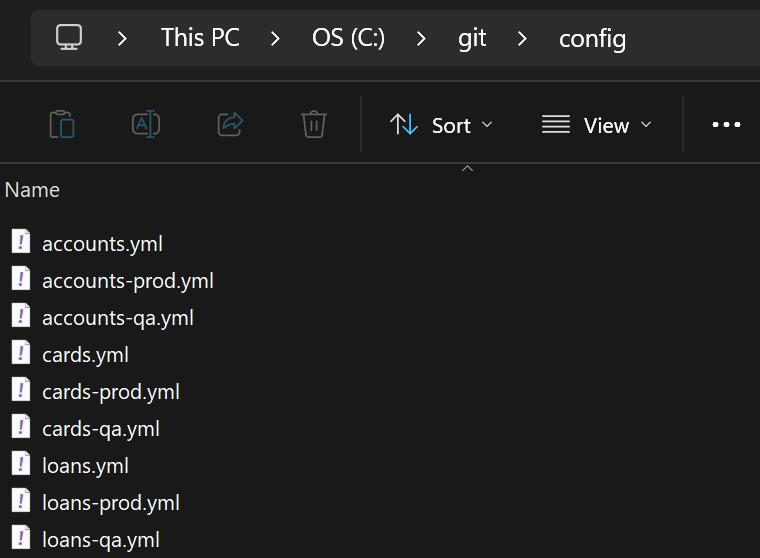
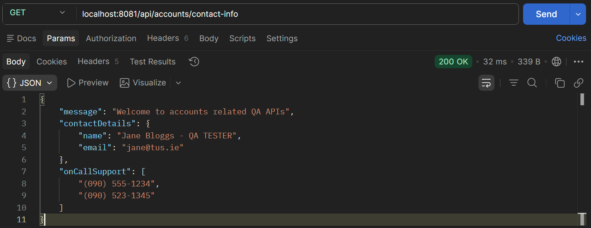
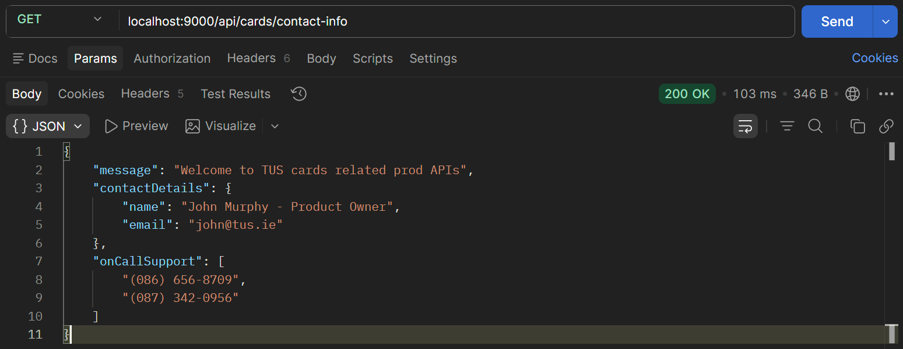
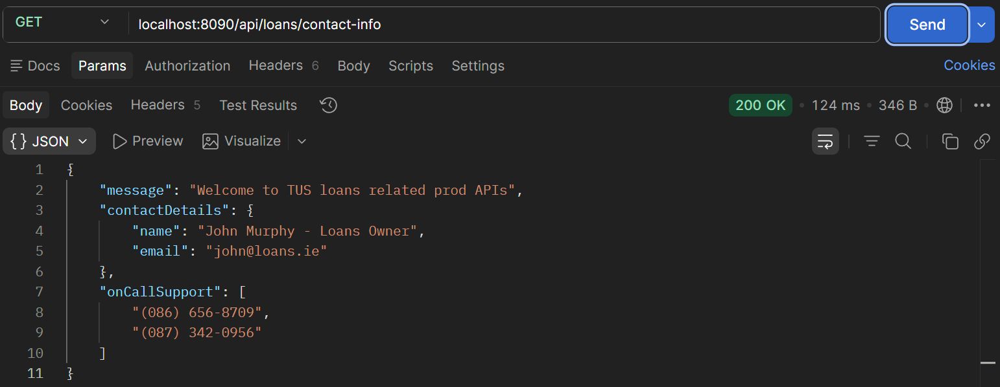

# Lab 17

## Steps and Files

1. [Place YAML Files on C: Drive](#1-place-yaml-files-on-c-drive)
    - accounts.yml
    - accounts-qa.yml
    - accounts-prod.yml
    - cards.yml
    - cards-qa.yml
    - cards-prod.yml
    - loans.yml
    - loans-qa.yml
    - loans-prod.yml
2. [Update application.yml Search Location](#2-update-applicationyml-search-location)
    - application.yml
3. [Restart and Test](#3-restart-and-test)

---

## Lab#17 Reading the data from the file system

### 1. Place YAML Files on C: Drive

In this lab we will be modify config server to read from the file system instead of the class path.
Step#1 Take all the .yml configuration files and place them in a folder (e.g. on the C: drive)
 


### 2. Update application.yml Search Location

Step#2 Change the search location in the application.properties for the config server.
 
```yaml title="application.yml search-location" linenums="1"
spring:
  application:
    name: configserver
  profiles:
    active: native
  cloud:
    config:
      server:
        native:
          # search-locations: classpath:/config
          search-locations: "file:///C://git//config"

server:
  port: 8071
```

### 3. Restart and Test

Step#4 Restart the config server and the microservices and test using Postman



    Figure 2. Get accounts/contact-info



    Figure 3. Get cards/contact-info



    Figure 4. Get loans/contact-info