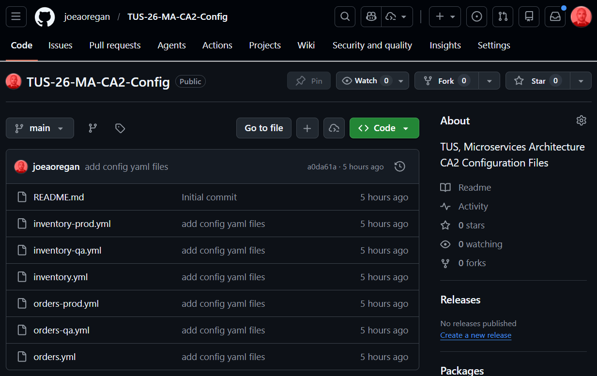
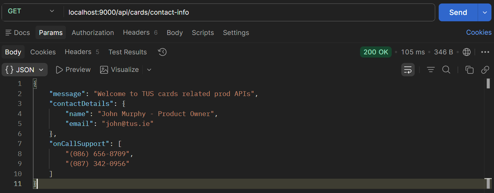
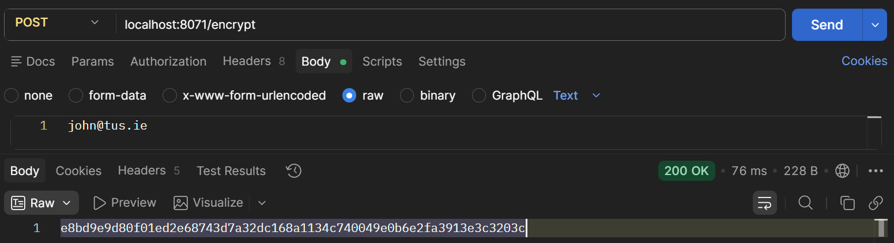
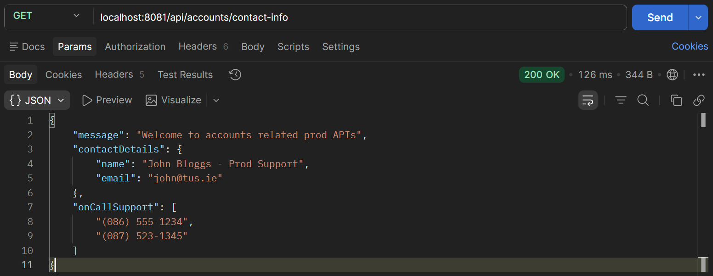
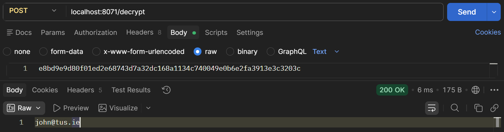

# Lab 18

## Steps and Files

1. [Create Repo](#1-create-repo)
    - accounts.yml
    - accounts-qa.yml
    - accounts-prod.yml
    - cards.yml
    - cards-qa.yml
    - cards-prod.yml
    - loans.yml
    - loans-qa.yml
    - loans-prod.yml
2. [Modify application.yml](#2-modify-applicationyml)
    - application.yml
3. [Restart and Test](#3-restart-and-test)
    - Test cards /contact-info using Postman
4. [Add Encryption](#4-add-encryption)
    - application.yml
5. [Config Server Encrypt Endpoint](#5-config-server-encrypt-endpoint)
6. [GET /contact-info](#6-get-contact-info)
7. [Test Decrypt Endpoint](#7-test-decrypt-endpoint)

--- 

## Lab#18 Reading configurations from a github repo and encryption
This is the recommended approach to reading configuration data. A github repo can be more secure and support versioning and auditing. We also look at how to encrypt a parameter.

### 1. Create Repo

Step#1 Create a repo on Bitbucket or Github with the config files.
 


    Figure 1. GitHub Repo

### 2. Modify application.yml

Step#2: Now go to the application.yml in the configserver and make the modifications shown below.If using Bitbucket, the password is the AppPassword.
 
```yaml title="configserver application.yml" linenums="1"
spring:
  application:
    name: "configserver"
  profiles:
    # active: native
    active: git
  cloud:
    config:
      server:
        #native:
          # search-locations: classpath:/config
          # search-locations: "file:///C://git//config"
        git:
          uri: "https://github.com/joeaoregan/TUS-26-MA-CA2-Config.git" # repo url
          search-locations: "lab18/config" # specify repo folder to look in 
          username: joeaoregan
          password: ${GIT_PASSWORD}
          default-label: main
          timeout: 5
          clone-on-start: true
          force-pull: true
server:
  port: 8071
```

### 3. Restart and Test

Step #3 Now restart the config server and the microservices. Test that the properties are still fetched correctly.
 


    Figure 2. GET cards /contact-info

### 4. Add Encryption

Step#3 Adding encryption
Add an encryption key to application.yml for the config server. The key can be anything you want, but the more complex the better.

```yaml title="configserver application.yml" linenums="18"
          default-label: main
          timeout: 5
          clone-on-start: true
          force-pull: true
encrypt:
  key: ${AES_256_KEY} # Random AES-256 Key in IDE Environment Variables
server:
  port: 8071
```

### 5. Config Server Encrypt Endpoint


Step #5 Restart the config server. Invoke the encrypt endpoint to encrypt a value e.g. email. Note type is Text. And we receive an encrypted value back. Now take the encrypted value and place it in one of the configuration property files in the git repo. Note the use of “{cipher} before the encrypted value



    Figure 3. Encrypt endpoint
 
 
```yaml title="accounts-prod.yml" linenums="1"
build:
  version: "1.0"
accounts:
  message: "Welcome to accounts related prod APIs"
  contactDetails:
    name: "John Bloggs - Prod Support"
    email: "{cipher}e8bd9e9d80f01ed2e68743d7a32dc168a1134c740049e0b6e2fa3913e3c3203c"
  onCallSupport:
    - (086) 555-1234
    - (087) 523-1345
```

### 6. GET /contact-info
Step #6 Invoke the contact-info endpoint for the accounts microservice. The decrypted value will be displayed.



    Figure 4. Decrypted Value Displayed

### 7. Test Decrypt Endpoint

Step 7. Test out the decrypt endpoint that is available.



    Figure 5. Decrypt Endpoint