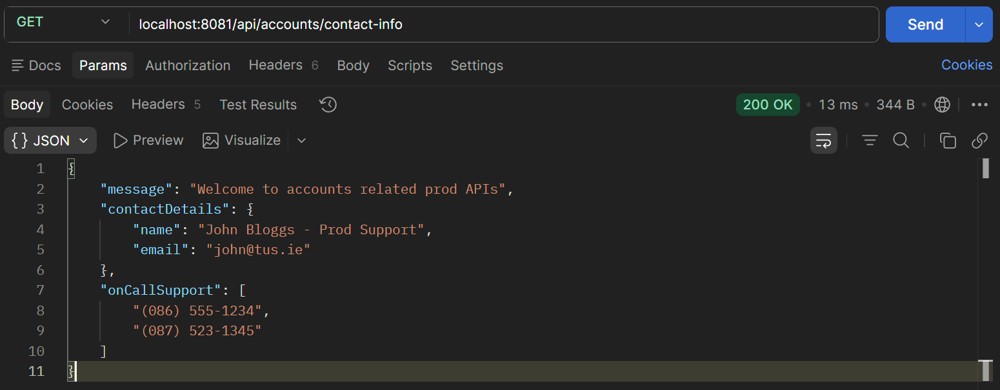
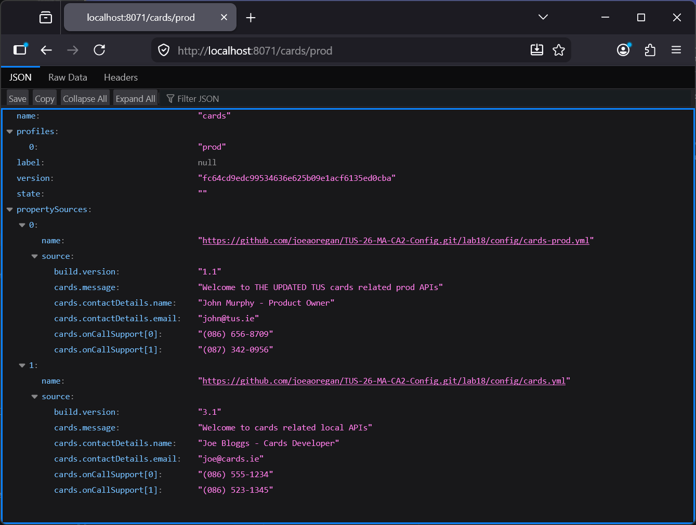
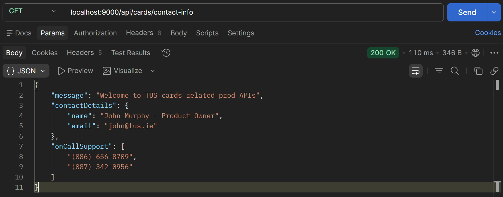
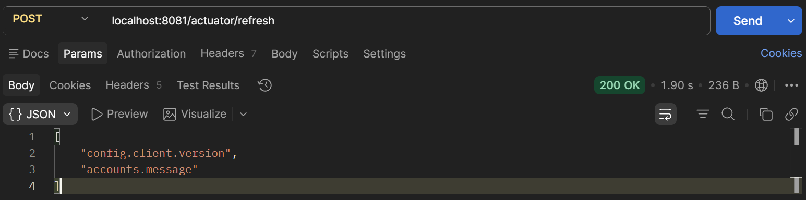
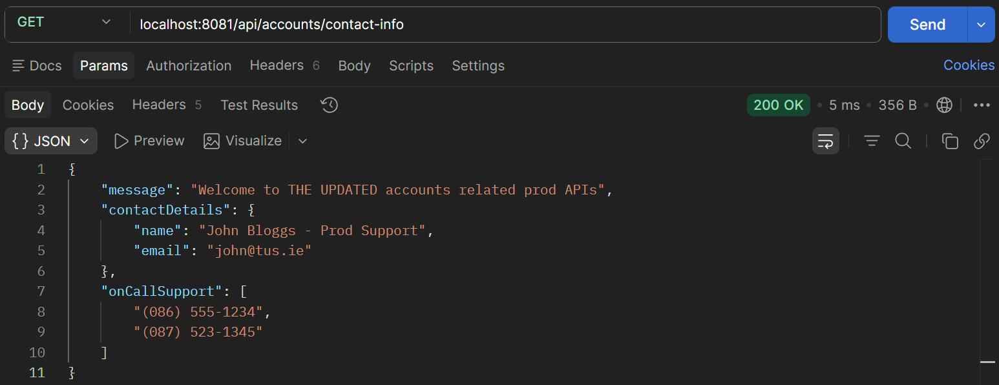
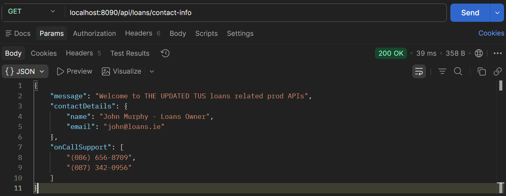

# Lab 19

## Steps and Files

1. [Actuator Dependency](#1-actuator-dependency)
    - pom.xml
2. [Change AccountsContactInfoDto Record to Class](#2-change-accountscontactinfodto-record-to-class)
    - AccountsContactInfoDto.java
3. [LoansContactInfoDto and CardsContactInfoDto](#3-loanscontactinfodto-and-cardscontactinfodto)
    - LoansContactInfoDto.java
    - CardsContactInfoDto.java
4. [Enable Actuator Endpoints](#4-enable-actuator-endpoints)
    - application.yml
5. [Change Property at Runtime](#5-change-property-at-runtime)
    - accounts-prod.yml
    - loans-prod.yml
    - cards-prod.yml
6. [Config Server Values Updated](#6-config-server-values-updated)
7. [Old Values Still in Contact Details](#7-old-values-still-in-contact-details)
8. [Actuator Refresh API](#8-actuator-refresh-api)

---

## Lab#19 Refresh configurations at runtime using actuator path

So far we have restarted the microservices to refresh properties, as the microservices only contact the config server at startup. Ideally we want to be able to refresh the properties without restarting the microservices. We do this using the actuator endpoints.

### 1. Actuator Dependency

Step#1 Firstly all the microservices need to have an actuator dependency in the pom file. This should be already there.

```xml title="pom.xml actuator dependency" linenums="25"
		<dependency>
			<groupId>org.springframework.boot</groupId>
			<artifactId>spring-boot-starter-actuator</artifactId>
		</dependency>
```

### 2. Change AccountsContactInfoDto Record to Class

Step #2 Now open the AccountsContactInfoDto class. Because this is a record class, we cannot change the property values at runtime. With the record class, all the fields are going to be final. Therefore, we need to change the AccountsContactInfoDto to a normal class with getters and setters.

```java title="AccountsContactInfoDto class" linenums="1"
package com.tus.accounts.dto;

import java.util.List;
import java.util.Map;

import org.springframework.boot.context.properties.ConfigurationProperties;

import lombok.Getter;
import lombok.Setter;

@ConfigurationProperties(prefix = "accounts")
@Setter
@Getter
public class AccountsContactInfoDto {

	private String message;
	private Map<String, String> contactDetails;
	private List<String> onCallSupport;
}
```

### 3. LoansContactInfoDto and CardsContactInfoDto

Step#3 Do the same (changing from record to class) in the LoansContactInfoDto and CardsContactInfoDto.

```java title="LoansContactInfoDto" linenums="1"
package com.tus.loans.dto;

import java.util.List;
import java.util.Map;

import org.springframework.boot.context.properties.ConfigurationProperties;

import lombok.Getter;
import lombok.Setter;

@ConfigurationProperties(prefix = "loans") // must match YAML
@Setter
@Getter
public class LoansContactInfoDto {

    private String message;
    private Map<String, String> contactDetails;
    private List<String> onCallSupport;
}
```

```java title="CardsContactInfoDto" linenums="1"
package com.tus.cards.dto;

import java.util.List;
import java.util.Map;

import org.springframework.boot.context.properties.ConfigurationProperties;

import lombok.Getter;
import lombok.Setter;

@ConfigurationProperties(prefix = "cards")
@Setter
@Getter
public class CardsContactInfoDto {

    private String message;
    private Map<String, String> contactDetails;
    private List<String> onCallSupport;
}
```
### 4. Enable Actuator Endpoints

Step#4 We then need to enable the actuator endpoints. Open the application.yml for the accounts microservice and add as shown below to enable the actuator enpoints:

```yaml title="application.yml" linenums="1"
server:
  port: 8081
spring:
  application:
    name: "accounts"
  profiles:
    active: "prod"
  datasource:
    url: jdbc:h2:mem:testdb
    driverClassName: org.h2.Driver
    username: sa
    password: ''
  h2:
    console:
      enabled: true
  jpa:
    database-platform: org.hibernate.dialect.H2Dialect
    hibernate:
      ddl-auto: update
    show-sql: true
  config:
   import: "configserver:http://localhost:8071/" # config server port 8071
  cloud:
    compatibility-verifier:
      enabled: false # disable version check
management:
  endpoints:
    web:
      exposure:
        include: "*" # Lab 19
```

This enables all actuator endpoints. Make a similar change in the loans and cards microservice. 

### 5. Change Property at Runtime

Step#5 Now start all microservices, and we can change a property at runtime.
First, check the parameters in the accounts microservice.



    Figure 1. GET accounts /contact-info

In the git repo make a change to one of the values e.g. the message in accounts-prod.yml. And commit the change.  

```yaml title="accounts-prod.yml update" linenums="1"
build:
  version: "1.0"
accounts:
  message: "Welcome to THE UPDATED accounts related prod APIs"
  contactDetails:
    name: "John Bloggs - Prod Support"
    email: "{cipher}e8bd9e9d80f01ed2e68743d7a32dc168a1134c740049e0b6e2fa3913e3c3203c"
  onCallSupport:
    - (086) 555-1234
    - (087) 523-1345
```

Make a similar change in cards-prod.yml and loans-prod.yml and commit the changes. 

### 6. Config Server Values Updated

Step#6 Check the values in the config server which now had the updated values.



    Figure 2. Check Config Server Values
 
### 7. Old Values Still in Contact Details

Step#7 Now the microservices should be able to read the latest values, but the services only communicate with the config server at startup. If I look at the properties in the microservice it still has the old values



    Figure 3. Old Cards Contact Details Values

### 8. Actuator Refresh API

Step#8 We can now go to Postman and invoke the actuator refresh API. Then check the contact-info again.
 


    Figure 4. Actuator Refresh API



    Figure 5. New Accounts Contact Details Values



    Figure 6. New Loans Contact Details Values


    Figure 7. New Cards Contact Details Values