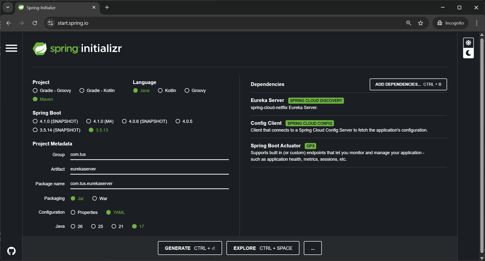
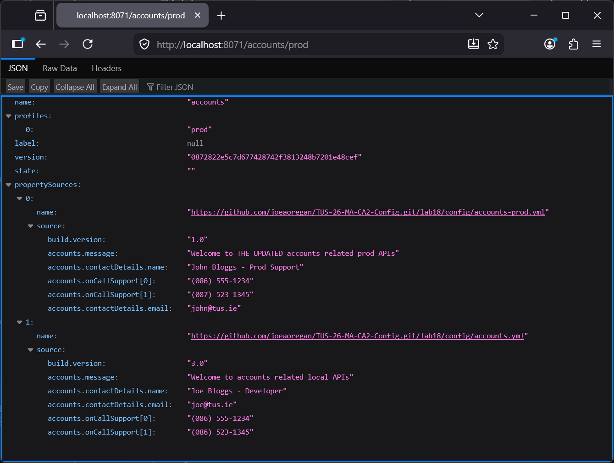
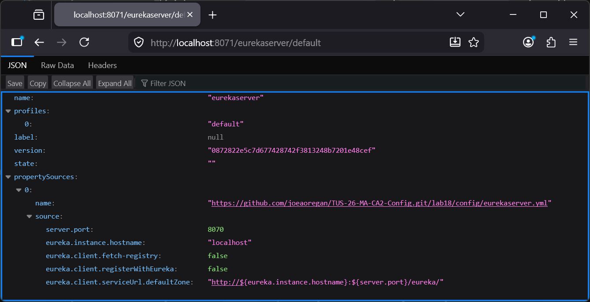
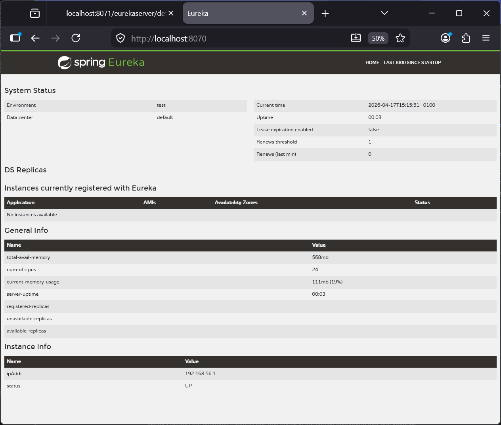
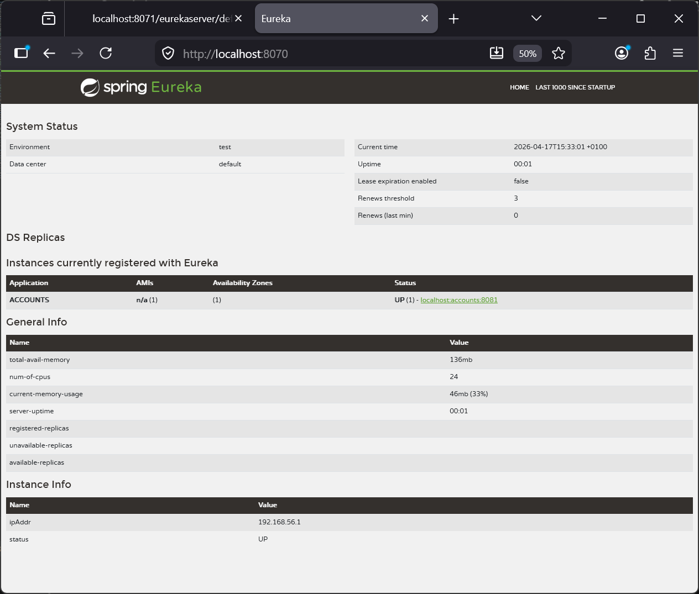
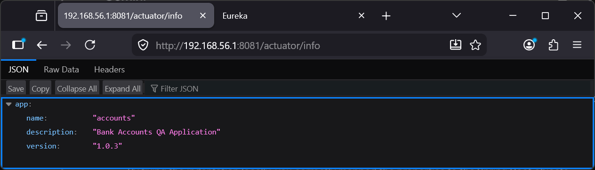
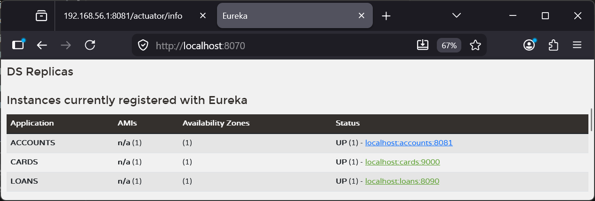

# Lab 22

## Steps and Files

1. [Eureka Server](#1-eureka-server)
2. [@EnableEurekaServer annotation](#2-enableeurekaserver-annotation)
    - EurekaserverApplication.java
3. [application.yml](#3-applicationyml)
    - application.yml
4. [eurekaserver.yml](#4-eurekaserveryml)
    - eurekaserver.yml
5. [Start Configserver and Eureka Server](#5-start-configserver-and-eureka-server)
6. [Eureka Dashboard](#6-eureka-dashboard)
7. [Register Microservices with Eureka](#7-register-microservices-with-eureka)
    - pom.xml
8. [Accounts application.yml](#8-accounts-applicationyml)
    - application.yml
9. [Eureka Dashboard, Accounts](#9-eureka-dashboard-accounts)
10. [Accounts Acuator/info endpoint](#10-accounts-acuatorinfo-endpoint)
11. [Eureka Dashboard, Loans and Cards](#11-eureka-dashboard-loans-and-cards)

---

## Lab#22 Service discovery with Eureka

Spring Cloud Netflix’s Eureka service which will act as a service discovery agent
In this lab we will setup a Eureka server and register the microservices with Eureka.

### 1. Eureka Server

Step#1 Create a new project using spring initializer. The dependencies that we need are the Eureka Server, the Config Client and the Spring Boot Actuator



    Figure 1. Eureka Server Spring Initializer

### 2. @EnableEurekaServer annotation

Step#2 Open the EurekaserverAppliccation class and add the @EnableEurekaServer annotation.

```java title="EurekaserverApplication.java EnableEurekaServer Annotation" linenums="1"

```

### 3. application.yml

Step#3 Rename the application.properties to application.yml and update as follows:

```yaml title="application.yml" linenums="1"

```

### 4. eurekaserver.yml

Step#4 In the bitbucket/github repo add a eurekaserver.yml file. The eureka server only needs one profile.

```yaml title="eurekaserver.yml" linenums="1"

```

### 5. Start Configserver and Eureka Server
 
Step#5 Start the configserver first, followed by the eureka server. Check that the properties are read correctly.



    Figure 2. Read accounts/prod properties



    Figure 3. Read eurekaserver/default properties
 
### 6. Eureka Dashboard
 
Step#6 Go to the eureka dashboard. No services currently registered with eureka



    Figure 4. Eureka Dashboard

### 7. Register Microservices with Eureka
 
Step#7 Now we will update the microservices to register themselves with eureka. First of all we have to add a dependency to the pom files for the accounts microservice.

```xml title="pom.xml" linenums="1"

```

### 8. Accounts application.yml

Step#8 Make the following changes to the application.yml for the accounts microservice.

```yaml title="application.yml" linenums="1"

```

### 9. Eureka Dashboard, Accounts
 
Step#9 Restart the accounts microservice and check in the eureka dashboard that one instance of the accounts microservice has registered.



    Figure 5. Eureka Dashboard, Accounts Registered

### 10. Accounts Acuator/info endpoint

Step#10 check on the accounts instance and the actuator/info endpoint should show the data for the microservice.



    Figure 6. actuator/info endpoint

### 11. Eureka Dashboard, Loans and Cards

Step#11 Make similar changes in the loans and cards microservices. Restart them and check eureka dashboard.
 


    Figure 7. Eureka Dashboard, Loans and Cards Registered