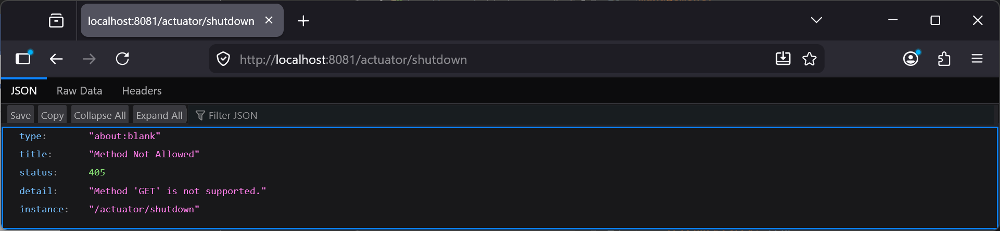
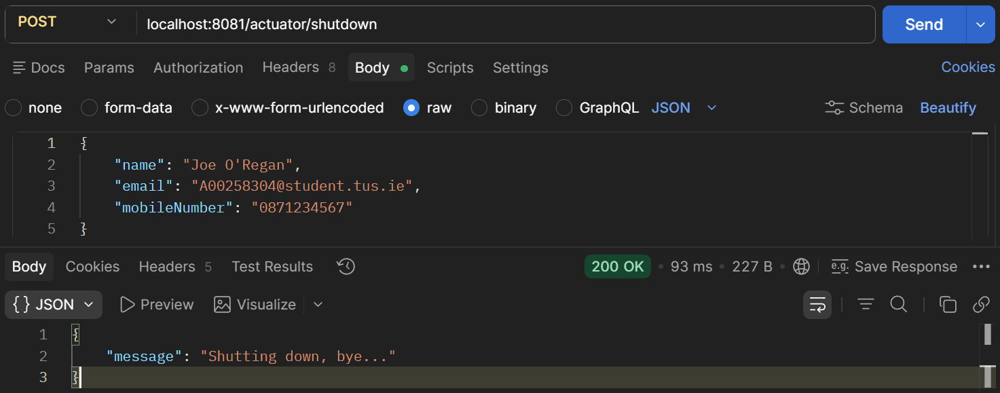
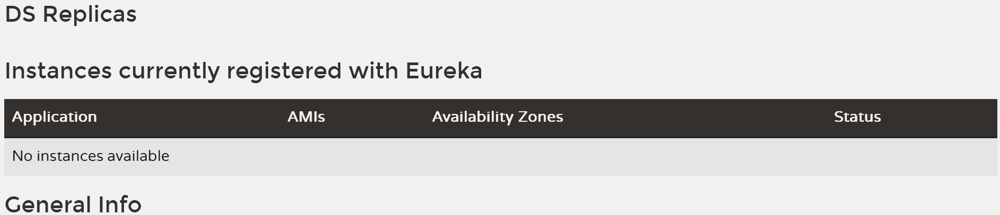
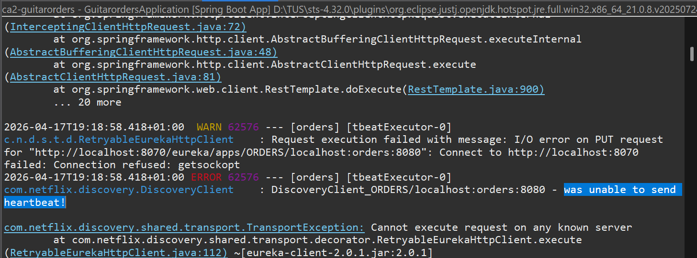

# Lab 23

## Steps and Files

1. [Actuator Shutdown Endpoint]()
2. [Envoke /actuator/shutdown Endpoint with POST Method]()
3. [Services De-Registered]()
4. [Errors when Eureka Server Stops]()

---

## Lab#23 #De-registration from Eureka and heartbeats
In this lab we will look at deregistering services when they shut down.

### 1. Actuator Shutdown Endpoint

Step#1 We have already enabled the actuator shutdown endpoint. First try to envoke the endpoint on the accounts microservice. You get an error to say that the method is not supported. It must be invoked with a POST method.

```bash title="Browser (GET) /actuator/shutdown ?"
192.168.56.1:8081/actuator/shutdown
```



    Figure 1. Actuator Shutdown can only be invoked with POST method

### 2. Envoke /actuator/shutdown Endpoint with POST Method

Step#2 Now envoke the endpoint with a POST method from Postman for all microservices

```bash title="POST /actuator/shutdown"
localhost:8081/actuator/shutdown
```



    Figure 2. Postman POST actuator/shutdown

### 3. Services De-Registered

Step#3 Check the eureka dashboard. All services will have de-registered themselves on shutdown. 



    Figure 3. Eureka Dashboard All Services De-Registered

### 4. Errors when Eureka Server Stops

Step#4 Restart the services again. Now stop the eureka server. You will error messages from the services indicating that they cannot send the heartbeat (every 30 seconds) to eureka.
 


    Figure 4. Errors when Eureka Server Stops