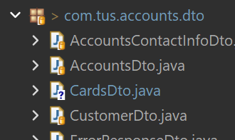
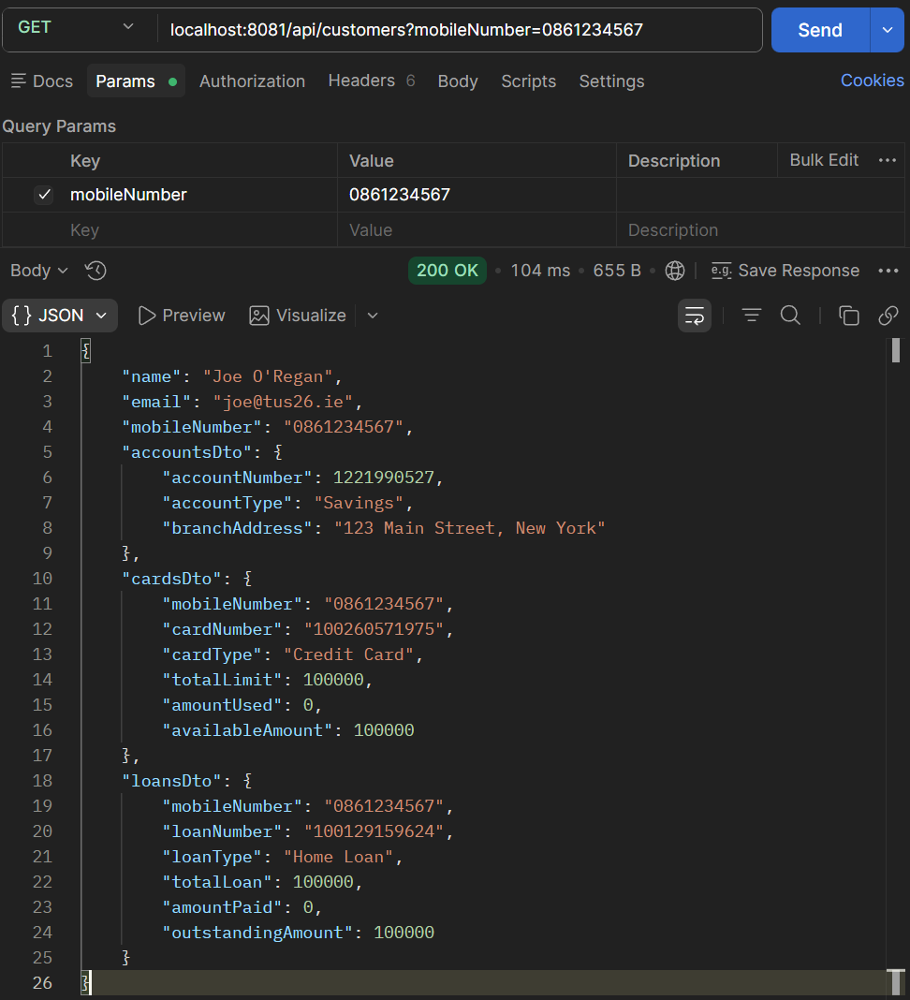

# Lab 24

## Steps and Files

1. [Feign Client Dependency]()
    - pom.xml
2. [Update AccountsApplication with @EnableFeignClients Annotation]()
    - AccountsApplication.java
3. [CardsFeignClient Interface]()
    - CardsFeignClient.java
4. [LoansFeignClient Interface]()
    - LoansFeignClient.java
5. [CustomerDetailsDto]()
    - CustomerDetailsDto.java
6. [CustomerController]()
    - CustomerController.java
7. [ICustomerService Interface]()
    - ICustomerService.java
8. [Postman: Fetch All Customer Details]()

---

## Lab#24 Feign Client code changes to invoke other microservices.

In this lab we will add a new endpoint to the accounts service that will accumulate data from the cards and loans services.

### 1. Feign Client Dependency

Step#1 Add the feign client dependency to the pom file for the accounts microservice.

```xml title="Add Feign Client Dependency to pom.xml" linenums="38"
<dependency>
    <groupId>org.springframework.cloud</groupId>
    <artifactId>spring-cloud-starter-openfeign</artifactId>
</dependency>
```

### 2. Update AccountsApplication with @EnableFeignClients Annotation

Step#2 Update the AccountsApplication class to add the @EnableFeignClients annotation.

```java title="AccountsApplication.java add @EnableFeignClients annotation"
package com.tus.accounts;

import org.springframework.boot.SpringApplication;
import org.springframework.boot.autoconfigure.SpringBootApplication;
import org.springframework.boot.context.properties.EnableConfigurationProperties; // Lab 12
import org.springframework.cloud.openfeign.EnableFeignClients; // Lab 24
import org.springframework.data.jpa.repository.config.EnableJpaAuditing; // Lab 7

import com.tus.accounts.dto.AccountsContactInfoDto; // Lab 12

@SpringBootApplication
@EnableFeignClients // Lab 24
@EnableJpaAuditing(auditorAwareRef = "auditAwareImpl") // Lab 7
@EnableConfigurationProperties(value = {AccountsContactInfoDto.class}) // Lab 12
public class AccountsApplication {

    public static void main(String[] args) {
        SpringApplication.run(AccountsApplication.class, args);
    }
}
```

### 3. CardsFeignClient Interface

Step#3 Add a new package com.tus.accounts.service.client with an interface called CardsFeignClient and copy the CardsDto from the cards microservice to the Accounts microservice.

```java title="CardsFeignClient.java interface"
package com.tus.accounts.service.client;

import org.springframework.cloud.openfeign.FeignClient;
import org.springframework.http.ResponseEntity;
import org.springframework.web.bind.annotation.GetMapping;
import org.springframework.web.bind.annotation.RequestParam;

import com.tus.accounts.dto.CardsDto;

@FeignClient("cards")
public interface CardsFeignClient {
	@GetMapping(value="/api/cards", consumes="application/json")
	public ResponseEntity<CardsDto> fetchCardDetails(@RequestParam String mobileNumber);
}
```



    Figure 1. Copy CardsDto From Cards Microservice to Accounts Microservice

### 4. LoansFeignClient Interface

Step#4 Now add another interface for the LoansFeignClient

```java title="LoansFeignClient.java interface"
package com.tus.accounts.service.client;

import org.springframework.cloud.openfeign.FeignClient;
import org.springframework.http.ResponseEntity;
import org.springframework.web.bind.annotation.GetMapping;
import org.springframework.web.bind.annotation.RequestParam;

import com.tus.accounts.dto.LoansDto;

@FeignClient("loans")
public interface LoansFeignClient {
	@GetMapping(value="/api/loans", consumes="application/json")
	public ResponseEntity<LoansDto> fetchLoanDetails(@RequestParam String mobileNumber);
}
```

### 5. CustomerDetailsDto

Step#5 Now we will use the interfaces in the accounts service to fetch data from the loans and cards services and consolidate the data and return it to the user. To hold the information, we will create a new Dto called CustomerDetailsDto that will hold all the information about the customer.

```java title="CustomerDetailsDto.java to hold customer information"
package com.tus.accounts.dto;

import jakarta.validation.constraints.Email;
import jakarta.validation.constraints.NotEmpty;
import jakarta.validation.constraints.Pattern;
import jakarta.validation.constraints.Size;
import lombok.Data;

@Data
public class CustomerDetailsDto {	
	@NotEmpty(message = "Name cannot be null or empty")
	@Size(min=5, max=30, message="the length of the customer name should be between 5 and 30")
	private String name;
	
	
	@NotEmpty(message = "email address cannot be null or empty")
	@Email(message="Email address should be a valid value")
	private String email;
	
	@Pattern(regexp = "(^$|[0-9]{10})", message = "Mobile Number must be 10 digits")
	private String mobileNumber;

	private AccountsDto accounts;
	private CardsDto cards;
	private LoansDto loans;
}
```

### 6. CustomerController

Step#6 Create a new class CustomerController with a @GetMapping in the accounts microservice.

```java title="CustomerController.java with @GetMapping" linenums="1"
package com.tus.accounts.controller;

import org.springframework.http.MediaType;
import org.springframework.http.ResponseEntity;
import org.springframework.validation.annotation.Validated;
import org.springframework.web.bind.annotation.GetMapping;
import org.springframework.web.bind.annotation.RequestMapping;
import org.springframework.web.bind.annotation.RequestParam;
import org.springframework.web.bind.annotation.RestController;

import com.tus.accounts.dto.CustomerDetailsDto;
import com.tus.accounts.service.ICustomersService;

import jakarta.validation.constraints.Pattern;

@RestController
@RequestMapping(path = "/api", produces = MediaType.APPLICATION_JSON_VALUE)
@Validated
public class CustomerController {
	private final ICustomersService iCustomerService;

	public CustomerController(ICustomersService iCustomerService) {
		this.iCustomerService = iCustomerService;
	}

	@GetMapping("/customers")
	public ResponseEntity<CustomerDetailsDto> fetchCustomerDetails(
			@RequestParam @Pattern(regexp = "(^$|[0-9]{10})", message = "Mobile Number must be 10 digits") String mobileNumber) {
		CustomerDetailsDto customerDetailsDto = iCustomerService.fetchCustomerDetails(mobileNumber);
		return ResponseEntity.ok(customerDetailsDto);
	}
}
```

### 7. ICustomerService Interface

Step#7 Create the service interface and its implementation. We need to add a mapper method mapToCustomerDetailsDto in the customerMapper class.

```java title="ICustomersService.java with fetchCustomerDetails method" linenums="1"
package com.tus.accounts.service;

import com.tus.accounts.dto.CustomerDetailsDto;

public interface ICustomersService {

	CustomerDetailsDto fetchCustomerDetails(String mobileNumber);
}
```

```java title="CustomersServiceImpl.java" linenums="1"
package com.tus.accounts.service.impl;

import org.springframework.http.ResponseEntity;
import org.springframework.stereotype.Service;

import com.tus.accounts.dto.AccountsDto;
import com.tus.accounts.dto.CardsDto;
import com.tus.accounts.dto.CustomerDetailsDto;
import com.tus.accounts.dto.LoansDto;
import com.tus.accounts.entity.Accounts;
import com.tus.accounts.entity.Customer;
import com.tus.accounts.exception.ResourceNotFoundException;
import com.tus.accounts.mapper.AccountsMapper;
import com.tus.accounts.mapper.CustomerMapper;
import com.tus.accounts.repository.AccountsRepository;
import com.tus.accounts.repository.CustomerRepository;
import com.tus.accounts.service.ICustomersService;
import com.tus.accounts.service.client.CardsFeignClient;
import com.tus.accounts.service.client.LoansFeignClient;

import lombok.AllArgsConstructor;

@Service
@AllArgsConstructor
public class CustomersServiceImpl implements ICustomersService {

	private AccountsRepository accountsRepository;
	private CustomerRepository customerRepository;
	private CardsFeignClient cardsFeignClient;
	private LoansFeignClient loansFeignClient;

	@Override
	public CustomerDetailsDto fetchCustomerDetails(String mobileNumber) {
		Customer customer = customerRepository.findByMobileNumber(mobileNumber)
				.orElseThrow(() -> new ResourceNotFoundException("Customer", "mobileNumber", mobileNumber));
		Accounts accounts = accountsRepository.findByCustomerId(customer.getCustomerId()).orElseThrow(
				() -> new ResourceNotFoundException("Account", "customerId", customer.getCustomerId().toString()));

		CustomerDetailsDto customerDetailsDto = CustomerMapper.mapToCustomerDetailsDto(customer,
				new CustomerDetailsDto());
		customerDetailsDto.setAccountsDto(AccountsMapper.mapToAccountsDto(accounts, new AccountsDto()));

		ResponseEntity<LoansDto> loansDtoResponseEntity = loansFeignClient.fetchLoanDetails(mobileNumber);
		customerDetailsDto.setLoansDto(loansDtoResponseEntity.getBody());

		ResponseEntity<CardsDto> cardsDtoResponseEntity = cardsFeignClient.fetchCardDetails(mobileNumber);
		customerDetailsDto.setCardsDto(cardsDtoResponseEntity.getBody());

		return customerDetailsDto;
	}
}
```

```java title="CustomerMapper.java mapToCustomerDetailsDto() method" linenums="22"
public static CustomerDetailsDto mapToCustomerDetailsDto(Customer customer, CustomerDetailsDto customerDetailsDto) {
		customerDetailsDto.setName(customer.getName());
		customerDetailsDto.setEmail(customer.getEmail());
		customerDetailsDto.setMobileNumber(customer.getMobileNumber());
		return customerDetailsDto;
	}
```

### 8. Postman: Fetch All Customer Details

Step #8 Make sure you have a customer, a loan and a card all created with the same mobile number. Then in Postman use the customers api to fetch all the details about the customer.
 


    Figure 2. Fetch All Customer Details Using Same Mobile Number

---

#### POST Account:  

```bash title="POST localhost:8081/api/accounts"
localhost:8081/api/accounts
```

```json title="JSON body" linenums="1"
{    
    "name": "Joe O'Regan",
    "email": "joe@tus26.ie",
    "mobileNumber": "0861234567",
    "accountsDto": {
        "accountNumber": 1234567890,
        "accountType": "Savings",
        "branchAddress": "Thurles, Co. Tipperary"
    } 
}
```

#### GET Account

```bash title="GET localhost:8081/api/accounts"
localhost:8081/api/accounts?mobileNumber=0861234567
```

#### POST Card

```bash title="POST localhost:9000/api/cards"
localhost:9000/api/cards?mobileNumber=0861234567
```

```json title="JSON body" linenums="1"
{
    "mobileNumber": "0861234567",
    "cardNumber": "123456789011",
    "cardType": "Credit Card",
    "totalLimit": 10000,
    "amountUsed": 0,
    "availableAmount": 10000
}
```

#### GET Card

```bash title="GET localhost:9000/api/cards"
localhost:9000/api/cards?mobileNumber=0861234567
```

#### POST Loan

```bash title="POST localhost:8090/api/loans"
localhost:8090/api/loans?mobileNumber=0861234567
```

```json title="JSON body" linenums="1"
{
    "mobileNumber": "0861234567",
    "loanNumber": "123456789011",
    "loanType": "Home Loan",
    "totalLoan": 20000,
    "amountPaid": 5000,
    "outstandingAmount": 15000
}
```

#### GET Loan

```bash title="GET localhost:8090/api/loans"
localhost:8090/api/loans?mobileNumber=0861234567
```

#### GET Customers

```bash title="localhost:8081/api/customers?mobileNumber=0861234567"
localhost:8081/api/customers?mobileNumber=0861234567
```