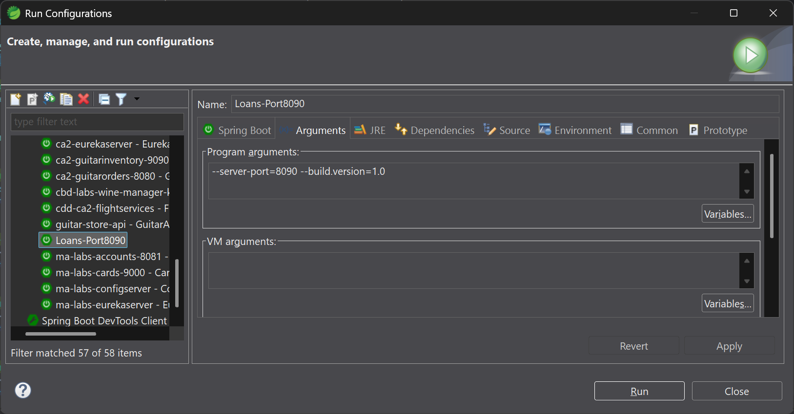
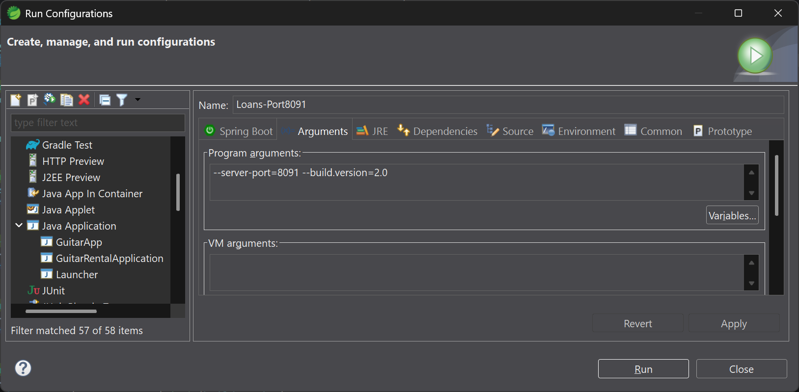
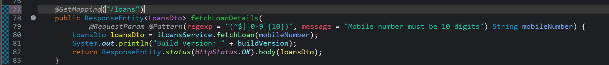

# Lab 25

## Lab#25 Load Balancing Demonstration.

In this lab we will create two instances of loans microservices and demonstrate that the accounts (via ribbon) calls each instance in a round robin fashion.

---

Step#1 Start all the services except loans (config, eureka, accounts and cards)

Step#2 Create two run or launch configurations for the loans microservice with different port numbers and different build.version. Make sure to call them different names.

    Figure 1. Loans launch configuration 1

    Figure 2. Loans launch configuration 2

Step#3 Add one line of code in the loans controller to print the build.version

    Figure 3. Print Build Version

Step#4 Run the loans service with both configurations. Both instances of the service will be registered with Eureka.
 
Step#4 Call the customers api in the accounts service a number of times.

Step#5 Check the console for the loans instances. You will see that both instances of the loans service are being called in turn.
