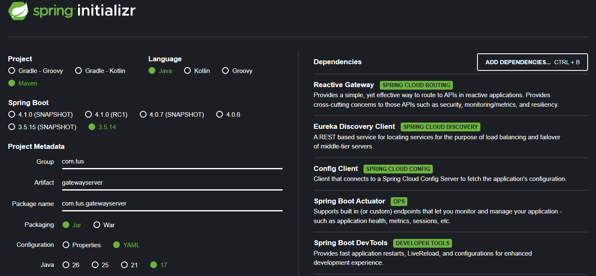
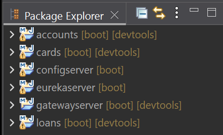
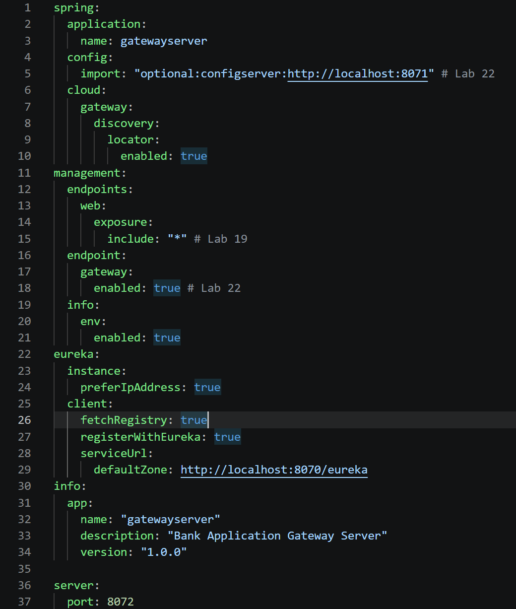
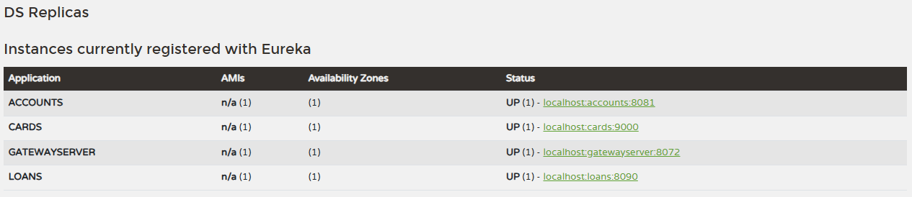
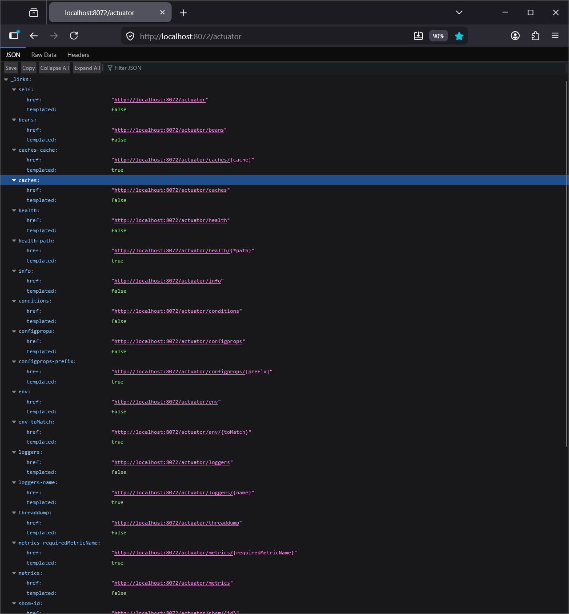
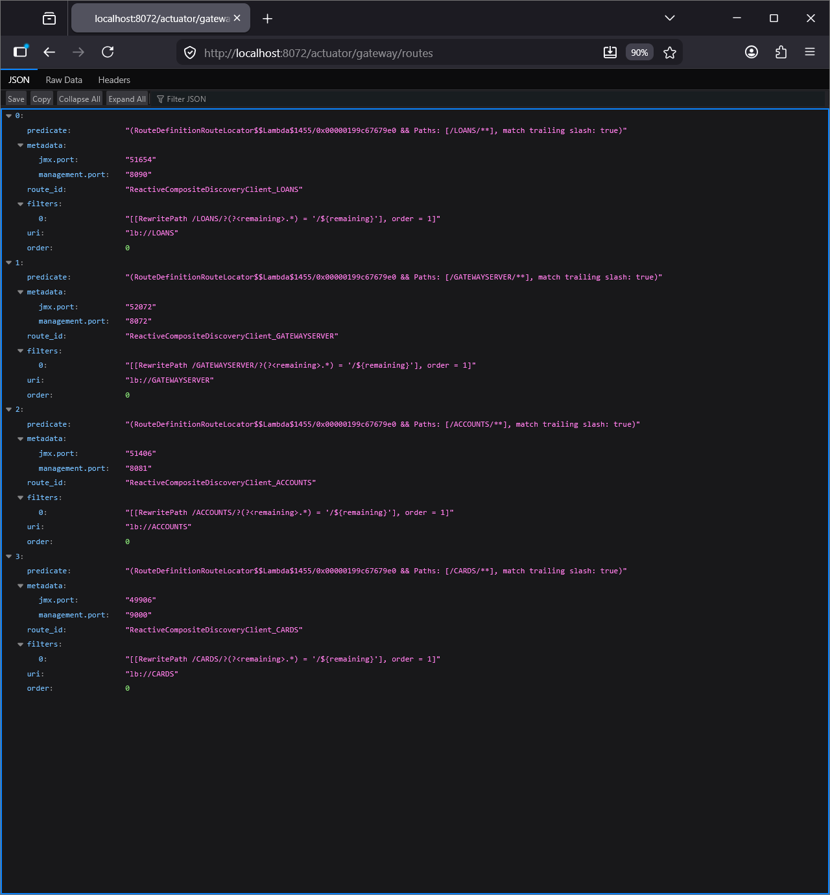
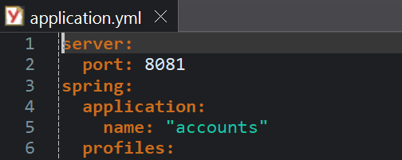
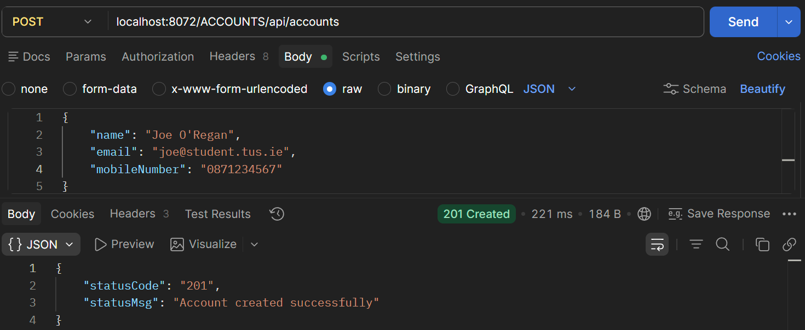
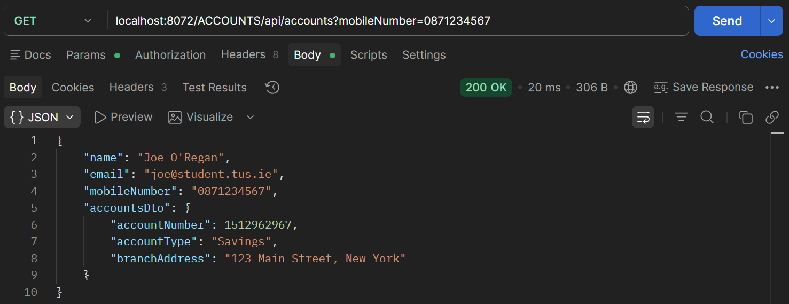
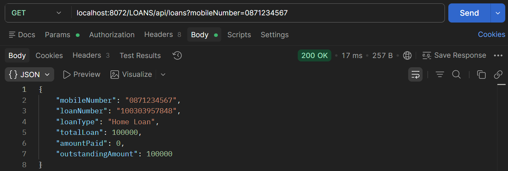

# Lab#26 Building a Gateway with Spring Cloud.

In this lab we will create a Gateway Server.

Step#1 Use Spring Initializer to create a project with dependencies as shown

    Figure 1. Spring Initialiser

    Figure 2. Gateway Server in Package Explorer

Step#2 Update the application.yml (from application.properties)

    Figure 3. application.yml

Step#3 Start the services in the following order: config, eureka, accounts/loans/cards and finally the gateway. Check Eureka.

    Figure 4. Eureka dashboard

Step#4 Check the endpoints using actuator and routes

    Figure 5. Check endpoints with Actuator and routes

    Figure 6. Gateway Routes

Step#5 Send request to the accounts application via the Gateway. Note the service name is in uppercase letters. Even though the name is lowercase in the application.yml. 

    Figure 7. Service name in Uppercase Letters

    Figure 8. Service name lowercase in application.yml

    Figure 9. POST Account

    Figure 10. GET Account

    Figure 11. GET Loan