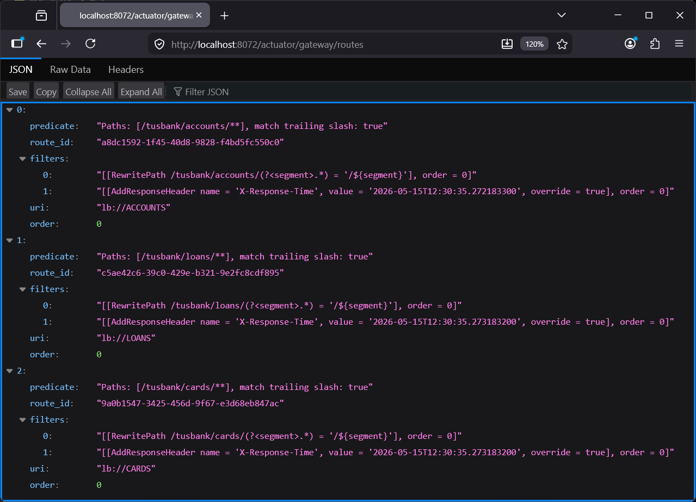
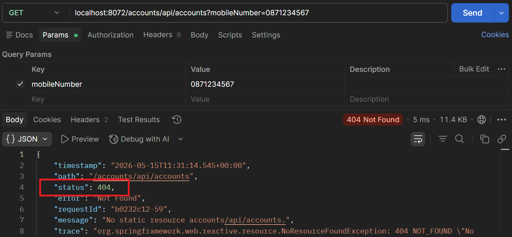
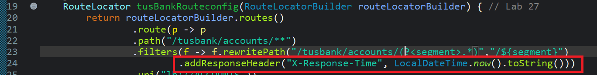
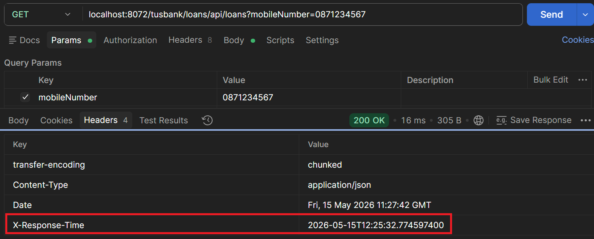

# Lab#27 Making changes inside the gateway server.

In this lab we will make some changes inside the gateway. The first one is to accept lowercase letters in the url for the service name. We will also add some custom routing.
Step#1 Update the application.yml for the gateway to add the property shown and restart the gatewayserver. This means that the gateway will accept service names in lowercase.


    Figure 1: Accept lowercase letters in the url for the service name

Step#2 Test using Postman


    Figure 2: Test lowercase letters, e.g. /loans/api/loans, Using Postman

Step#3 To demonstrate custom routing we will include “tusbank” in the url received by the gateway and map it to the appropriate url. See examples below.

```text
http://localhost:8072/tusbank/accounts/api/account  ->http://localhost:8072/accounts/api/account
http://localhost:8072/tusbank/loans/api/loans. -> http://localhost:8072/loans/api/loans.
http://localhost:8072/tusbank/cards/api/cards. -> http://localhost:8072/cards/api/cards
```

Create a Bean inside the main application class in the gatewayserver – given. This defines the routing location configurations. This invokes a filter to re-write paths. 


    Figure 3: Bean defines the routing location configurations

Step 4: Test the API so that the new url is invoked.


    Figure 4: tusbank/accounts

Step 5: Check the actuator endpoints and routes. You will see that all routes from the default configuration are available and can still be called. 


    Figure 5: actuator


    Figure 6: actuator gateway routes

Both the default and the custom routes are available.


    Figure 7: /accounts route


    Figure 8: /tusbank/loans route

Step 6: To disable all the default routes and avoid confusion, update the application.yml to set gateway.discovery.locator.enabled to false. Now we only have the 3 scenarios remaining and default behaviour is disabled.


    Figure 9: Disable all the default routes



    Figure 10: Actuator Gateway Routes



    Figure 11: Status 404

Default behaviour disabled – just using custom paths
Step 7: In the bean we have also have the code or filter to add a header in the response. Check the response headers in Postman. 



    Figure 12: Add Response Header with Filter



    Figure 13: X-Response-Time
