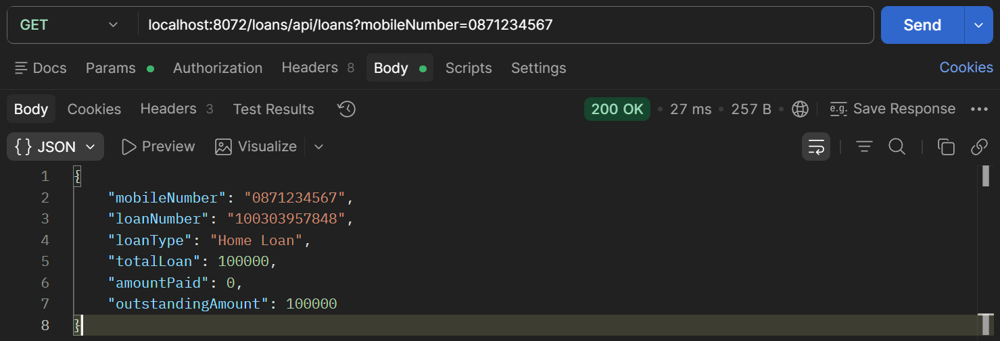
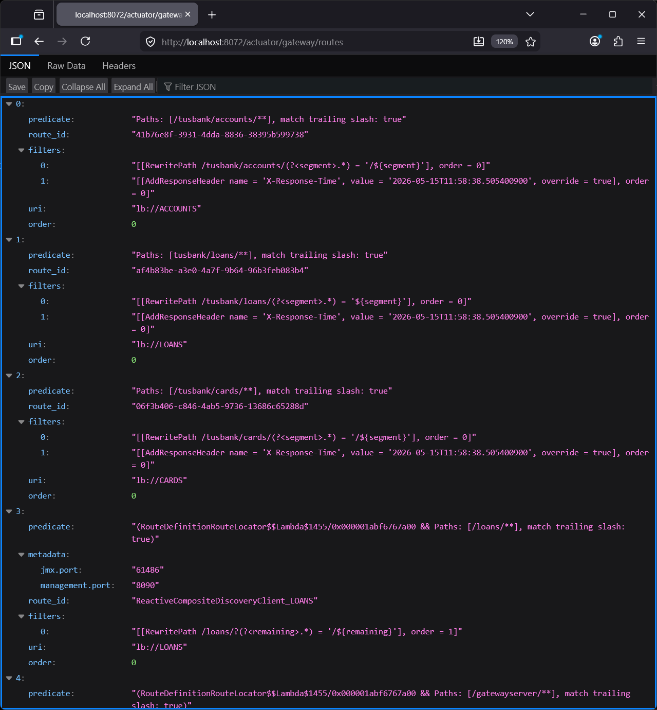
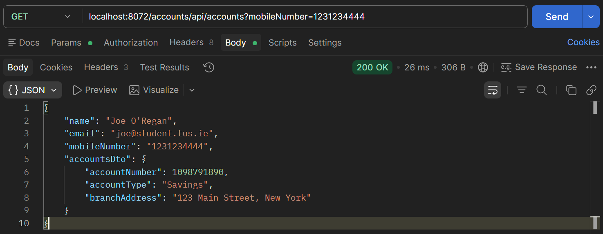
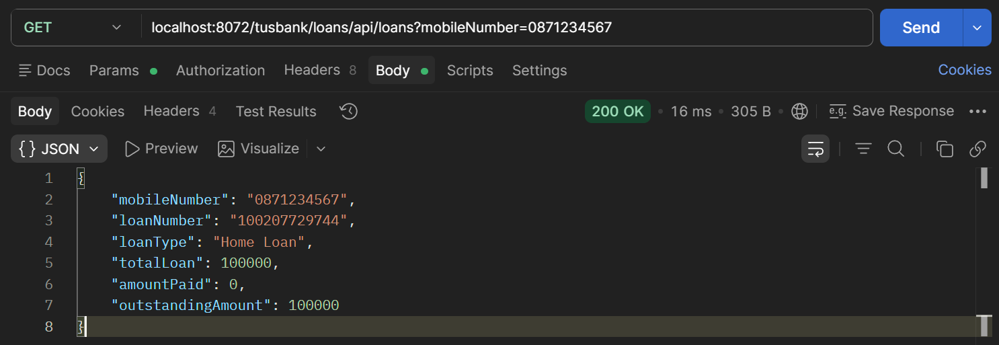
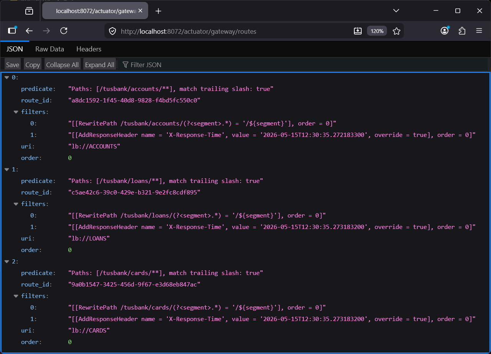
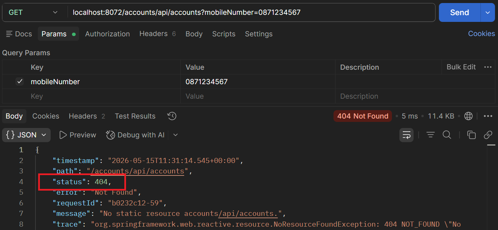
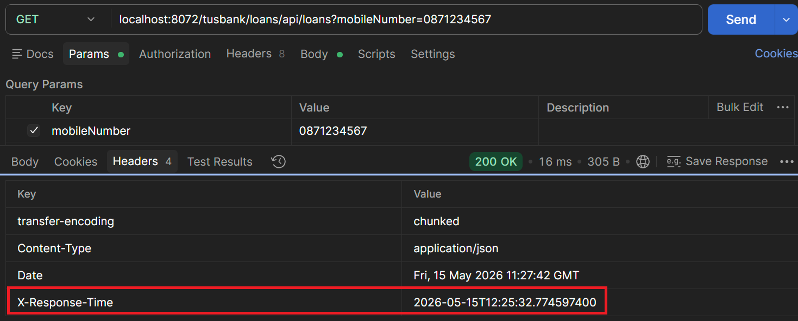

# Lab#27 Making changes inside the gateway server.

In this lab we will make some changes inside the gateway. The first one is to accept lowercase letters in the url for the service name. We will also add some custom routing.
Step#1 Update the application.yml for the gateway to add the property shown and restart the gatewayserver. This means that the gateway will accept service names in lowercase.

```yaml title="Gateway Server: application.yml" linenums="3"
    name: gatewayserver
  config:
    import: "optional:configserver:http://localhost:8071" # Lab 22
  cloud:
    gateway:
      server:
        webflux:
          discovery:
            locator:
              enabled: true
              lower-case-service-id: true # lab 27
```

Step#2 Test using Postman

POST `localhost:8072/loans/api/loans?mobileNumber=0871234567`



    Figure 1: Test lowercase letters, e.g. /loans/api/loans, Using Postman

Step#3 To demonstrate custom routing we will include “tusbank” in the url received by the gateway and map it to the appropriate url. See examples below.

```text
http://localhost:8072/tusbank/accounts/api/account  ->http://localhost:8072/accounts/api/account
http://localhost:8072/tusbank/loans/api/loans. -> http://localhost:8072/loans/api/loans.
http://localhost:8072/tusbank/cards/api/cards. -> http://localhost:8072/cards/api/cards
```

Create a Bean inside the main application class in the gatewayserver – given. This defines the routing location configurations. This invokes a filter to re-write paths. 

```java title="Gateway Server: GatewayserverApplication.java" linenums="11"
@SpringBootApplication
public class GatewayserverApplication {

    public static void main(String[] args) {
        SpringApplication.run(GatewayserverApplication.class, args);
    }

    @Bean
    RouteLocator tusBankRouteconfig(RouteLocatorBuilder routeLocatorBuilder) { // Lab 27
        return routeLocatorBuilder.routes()
                .route(p -> p
                .path("/tusbank/accounts/**")
                .filters(f -> f.rewritePath("/tusbank/accounts/(?<segment>.*)", "/${segment}")
                .addResponseHeader("X-Response-Time", LocalDateTime.now().toString()))
                .uri("lb://ACCOUNTS"))
                .route(p -> p
                .path("/tusbank/loans/**")
                .filters(f -> f.rewritePath("/tusbank/loans/(?<segment>.*)", "/${segment}")
                .addResponseHeader("X-Response-Time", LocalDateTime.now().toString()))
                .uri("lb://LOANS"))
                .route(p -> p
                .path("/tusbank/cards/**")
                .filters(f -> f.rewritePath("/tusbank/cards/(?<segment>.*)", "/${segment}")
                .addResponseHeader("X-Response-Time", LocalDateTime.now().toString()))
                .uri("lb://CARDS")).build();
    }
}
```

Step 4: Test the API so that the new url is invoked.

POST `localhost:8072/tusbank/accounts/api/accounts`

```json title="POST Account"
{
    "name": "Joe O'Regan",
    "email": "joe@student.tus.ie",
    "mobileNumber": "0871234567"    
}
```


    Figure 2: tusbank/accounts

Step 5: Check the actuator endpoints and routes. You will see that all routes from the default configuration are available and can still be called. 

`http://localhost:8072/actuator/`


    Figure 3: actuator

`http://localhost:8072/actuator/gateway/routes`



    Figure 4: actuator gateway routes

Both the default and the custom routes are available.

GET `localhost:8072/accounts/api/accounts?mobileNumber=1231234444`



    Figure 5: /accounts route

GET `localhost:8072/tusbank/loans/api/loans?mobileNumber=0871234567`



    Figure 6: /tusbank/loans route

Step 6: To disable all the default routes and avoid confusion, update the application.yml to set gateway.discovery.locator.enabled to false. Now we only have the 3 scenarios remaining and default behaviour is disabled.

```yaml title="Gateway Server: application.yml" linenums="3"
    name: gatewayserver
  config:
    import: "optional:configserver:http://localhost:8071" # Lab 22
  cloud:
    gateway:
      server:
        webflux:
          discovery:
            locator:
              enabled: false
              lower-case-service-id: true # lab 27
```

`http://localhost:8072/actuator/gateway/routes`



    Figure 7: Actuator Gateway Routes

GET `localhost:8072/tusbank/accounts/api/accounts?mobileNumber=0871234567`



    Figure 8: Status 404

Default behaviour disabled – just using custom paths
Step 7: In the bean we have also have the code or filter to add a header in the response. Check the response headers in Postman. 

```java title="Gateway Server: GatewayserverApplication.java" linenums="18"
	@Bean
	RouteLocator tusBankRouteconfig(RouteLocatorBuilder routeLocatorBuilder) { // Lab 27
		return routeLocatorBuilder.routes()
				.route(p -> p.path("/tusbank/accounts/**")
						.filters(f -> f.rewritePath("/tusbank/accounts/(?<segment>.*)", "/${segment}")
								.addResponseHeader("X-Response-Time", LocalDateTime.now().toString())) // This
						.uri("lb://ACCOUNTS"))
```

GET `localhost:8072/tusbank/loans/api/loans?mobileNumber=0871234567`



    Figure 9: X-Response-Time
