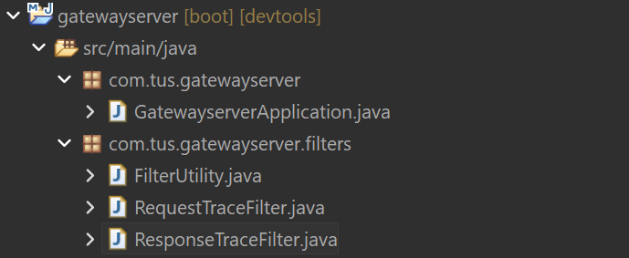
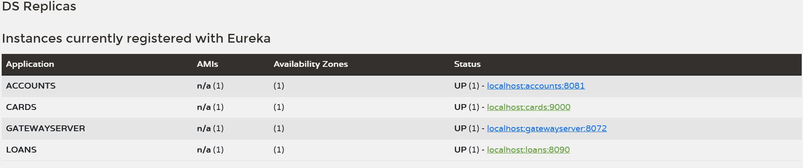
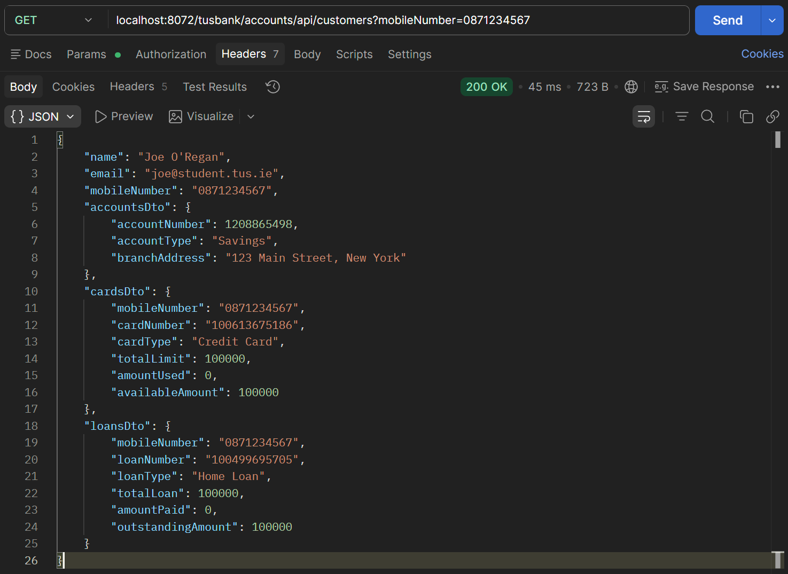
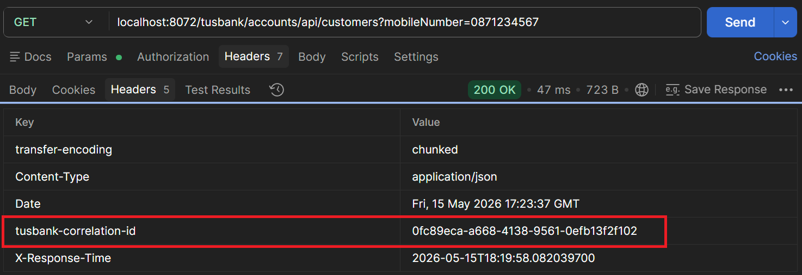
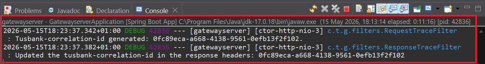
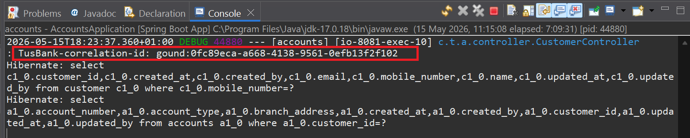
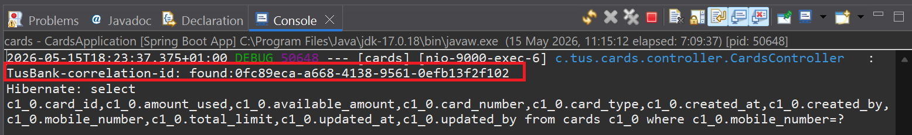
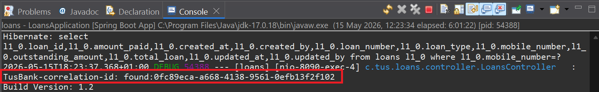

# Lab#28 Cross cutting concerns – tracing and logging

In this lab we will add custom filters in the gateway to generate a correlation id
Step#1 Create a new package with classes as shown (code given).



    Figure 1. Customer Filters

```java title="FilterUtility.java" linenums="1"
package com.tus.gatewayserver.filters;

import java.util.List;

import org.springframework.http.HttpHeaders;
import org.springframework.stereotype.Component;
import org.springframework.web.server.ServerWebExchange;

@Component
public class FilterUtility {

	public static final String CORRELATION_ID = "tusbank-correlation-id";

	public String getCorrelationId(HttpHeaders requestHeaders) {
		if (requestHeaders.get(CORRELATION_ID) != null) {
			List<String> header = requestHeaders.get(CORRELATION_ID);
			return header.stream().findFirst().get();
		} else {
			return null;
		}
	}

	public ServerWebExchange setCorrelationId(ServerWebExchange exchange, String correlationId) {
		return this.setRequestHeader(exchange, CORRELATION_ID, correlationId);
	}

	public ServerWebExchange setRequestHeader(ServerWebExchange exchange, String name, String value) {
		return exchange.mutate().request(exchange.getRequest().mutate().header(name, value).build()).build();
	}
}
```

```java title="RequestTraceFilter.java" linenums="1"
package com.tus.gatewayserver.filters;

import org.slf4j.Logger;
import org.slf4j.LoggerFactory;
import org.springframework.beans.factory.annotation.Autowired;
import org.springframework.cloud.gateway.filter.GlobalFilter;
import org.springframework.cloud.gateway.filter.GatewayFilterChain;
import org.springframework.core.annotation.Order;
import org.springframework.stereotype.Component;
import org.springframework.web.server.ServerWebExchange;
import reactor.core.publisher.Mono;

@Order(1)
@Component
public class RequestTraceFilter implements GlobalFilter {

	private static final Logger logger = LoggerFactory.getLogger(RequestTraceFilter.class);

	@Autowired
	FilterUtility filterUtility;

	@Override
	public Mono<Void> filter(ServerWebExchange exchange, GatewayFilterChain chain) {
		String correlationId = filterUtility.getCorrelationId(exchange.getRequest().getHeaders());
		if (correlationId != null) {
			logger.debug("Tusbank-correlation-id found in the incoming request: {}. ", correlationId);
		} else {
			correlationId = generateCorrelationId();
			logger.debug("Tusbank-correlation-id generated: {}.", correlationId);
		}

		exchange = filterUtility.setCorrelationId(exchange, correlationId);
		return chain.filter(exchange);
	}

	private String generateCorrelationId() {
		return java.util.UUID.randomUUID().toString();
	}
}
```

```java title="ResponseTraceFilter.java" linenums="1"
package com.tus.gatewayserver.filters;

import org.slf4j.Logger;
import org.slf4j.LoggerFactory;
import org.springframework.beans.factory.annotation.Autowired;
import org.springframework.cloud.gateway.filter.GlobalFilter;
import org.springframework.context.annotation.Configuration;
import reactor.core.publisher.Mono;

@Configuration
public class ResponseTraceFilter {

	private static final Logger logger = LoggerFactory.getLogger(ResponseTraceFilter.class);

	@Autowired
	FilterUtility filterUtility;

	@org.springframework.context.annotation.Bean
	GlobalFilter postGlobalFilter() {
		return (exchange, chain) -> {
			return chain.filter(exchange).then(Mono.fromRunnable(() -> {
				String correlationId = filterUtility.getCorrelationId(exchange.getRequest().getHeaders());
				logger.debug("Updated the tusbank-correlation-id in the response headers: {}", correlationId);
				exchange.getResponse().getHeaders().add(FilterUtility.CORRELATION_ID, correlationId);
			}));
		};
	}
}
```

Step#2 Update the .yml file for the gateway with the logging information to allow all logger statements of type DEBUG to be logged.

```yaml title="Gateway Server: application.yml" linenums="40"
server:
  port: 8072
  
logging:
  level:
    com:
      tus:
        gatewayserver: DEBUG
```

Step#3 We need to make changes inside the individual microservices (accounts, loans, cards) because the gateway is going to send a new request header with the correlationid value which the services need to receive the request header that the gateway is going to forward with the request. We can use the customercontroller (fetchCustomerDetails) to show this since it in turn invokes the cards and loans.

```java title="Accounts: CustomerController.java" linenums="1"
package com.tus.accounts.controller;

import org.slf4j.Logger;
import org.slf4j.LoggerFactory;
import org.springframework.http.MediaType;
import org.springframework.http.ResponseEntity;
import org.springframework.validation.annotation.Validated;
import org.springframework.web.bind.annotation.GetMapping;
import org.springframework.web.bind.annotation.RequestHeader;
import org.springframework.web.bind.annotation.RequestMapping;
import org.springframework.web.bind.annotation.RequestParam;
import org.springframework.web.bind.annotation.RestController;

import com.tus.accounts.dto.CustomerDetailsDto;
import com.tus.accounts.service.ICustomersService;

import jakarta.validation.constraints.Pattern;

@RestController
@RequestMapping(path = "/api", produces = MediaType.APPLICATION_JSON_VALUE)
@Validated
public class CustomerController {
	
	private static final Logger logger = LoggerFactory.getLogger(CustomerController.class);
	private final ICustomersService iCustomerService;

	public CustomerController(ICustomersService iCustomerService) {
		this.iCustomerService = iCustomerService;
	}

	@GetMapping("/customers")
	public ResponseEntity<CustomerDetailsDto> fetchCustomerDetails(
			@RequestHeader("tusbank-correlation-id") String correlationId, 
			@RequestParam @Pattern(regexp = "(^$|[0-9]{10})", message = "Mobile Number must be 10 digits") String mobileNumber) {
		logger.debug("TusBank-correlation-id: found:{}", correlationId);
		CustomerDetailsDto customerDetailsDto = iCustomerService.fetchCustomerDetails(mobileNumber, correlationId);
		return ResponseEntity.ok(customerDetailsDto);
	}
}
```

```java title="Accounts: ICustomersService.java" linenums="1"
package com.tus.accounts.service;

import com.tus.accounts.dto.CustomerDetailsDto;

public interface ICustomersService {

    CustomerDetailsDto fetchCustomerDetails(String mobileNumber, String correlationId);
}
```


```java title="Accounts: ICustomerServiceImpl.java" linenums="32"
	@Override
	public CustomerDetailsDto fetchCustomerDetails(String mobileNumber, String correlationId) {
		Customer customer = customerRepository.findByMobileNumber(mobileNumber)
				.orElseThrow(() -> new ResourceNotFoundException("Customer", "mobileNumber", mobileNumber));
		Accounts accounts = accountsRepository.findByCustomerId(customer.getCustomerId()).orElseThrow(
				() -> new ResourceNotFoundException("Account", "customerId", customer.getCustomerId().toString()));

		CustomerDetailsDto customerDetailsDto = CustomerMapper.mapToCustomerDetailsDto(customer,
				new CustomerDetailsDto());
		customerDetailsDto.setAccountsDto(AccountsMapper.mapToAccountsDto(accounts, new AccountsDto()));

		ResponseEntity<LoansDto> loansDtoResponseEntity = loansFeignClient.fetchLoanDetails(correlationId, mobileNumber);
		customerDetailsDto.setLoansDto(loansDtoResponseEntity.getBody());

		ResponseEntity<CardsDto> cardsDtoResponseEntity = cardsFeignClient.fetchCardDetails(correlationId, mobileNumber);
		customerDetailsDto.setCardsDto(cardsDtoResponseEntity.getBody());

		return customerDetailsDto;
	}
```


```java title="Accounts: CardsFeignClient.java" linenums="11"
@FeignClient("cards")
public interface CardsFeignClient {
	@GetMapping(value="/api/cards", consumes="application/json")
	public ResponseEntity<CardsDto> fetchCardDetails(@RequestHeader("tusbank-correlation-id") String correlationId,
			@RequestParam String mobileNumber);
}
```

```java title="Accounts: LoansFeignClient.java" linenums="11"
@FeignClient("loans")
public interface LoansFeignClient {
	@GetMapping(value = "/api/loans", consumes = "application/json")
	public ResponseEntity<LoansDto> fetchLoanDetails(@RequestHeader("tusbank-correlation-id") String correlationId,
			@RequestParam String mobileNumber);
}
```

```java title="Loans: LoansController.java" linenums="35"
@Validated
public class LoansController {

    private ILoansService iLoansService;

    private static final Logger logger = LoggerFactory.getLogger(LoansController.class);
```

```java title="Loans: LoansController.java" linenums="83"
	@GetMapping()
	public ResponseEntity<LoansDto> fetchLoanDetails(@RequestHeader("tusbank-correlation-id") String correlationId,
			@RequestParam @Pattern(regexp = "(^$|[0-9]{10})", message = "Mobile number must be 10 digits") String mobileNumber) {
		LoansDto loansDto = iLoansService.fetchLoan(mobileNumber);
		logger.debug("TusBank-correlation-id: found:{}", correlationId);
		System.out.println("Build Version: " + buildVersion);
		return ResponseEntity.status(HttpStatus.OK).body(loansDto);
	}
```

```java title="Cards: CardsController.java" linenums="34"
@Validated
public class CardsController {

    private ICardsService iCardsService;
    
	private static final Logger logger = LoggerFactory.getLogger(CardsController.class);
```

```java title="Cards: CardsController.java" linenums="82"
	@GetMapping()
	public ResponseEntity<CardsDto> fetchCardDetails(@RequestHeader("tusbank-correlation-id") String correlationId,
			@RequestParam @Pattern(regexp = "(^$|[0-9]{10})", message = "Mobile number must be 10 digits") String mobileNumber) {
		logger.debug("TusBank-correlation-id: found:{}", correlationId);
		CardsDto loansDto = iCardsService.fetchCard(mobileNumber);
		return ResponseEntity.status(HttpStatus.OK).body(loansDto);
	}
```

Step#4 enable logging in the accounts, loans and cards

```yaml title="Accounts: application.yml linenums="54"
logging:
  level:
    com:
      tus:
        accounts: DEBUG
```

Restart all the services followed by restarting the gateway.



    Figure 2. Eureka Server

Clear the console for cars, accounts and loans as well as the gateway.

Invoke the fetchCustomerDetails request from the Gateway.

    N.B. Make sure an account, loan and card exist with the same number

POST `localhost:8072/tusbank/accounts/api/accounts`

```json title="Sample Account"
{
    "name": "Joe O'Regan",
    "email": "joe@student.tus.ie",
    "mobileNumber": "0871234567"    
}
```

POST `localhost:8072/tusbank/cards/api/cards?mobileNumber=0871234567`

```json title="Sample Card"
{
    "mobileNumber": "0871234567",
    "cardType": "Credit Card",
    "totalLimit": 100000,
    "amountUsed": 0,
    "availableAmount": 100000
}
```

POST `localhost:8072/tusbank/loans/api/loans?mobileNumber=0871234567`

```json title="Sample Loan"
{
    "mobileNumber": "0871234567",
    "loanType": "Home Loan",
    "totalLoan": 100000,
    "amountPaid": 0,
    "outstandingAmount": 100000
}
```



    Figure 3. Response



    Figure 4. Response Header contains generated tusbank-correlation-id



    Figure 5. Gateway Server tusbank-correlation-id
    


    Figure 6. Accounts tusbank-correlation-id



    Figure 7. Cards tusbank-correlation-id



    Figure 8. Loans tusbank-correlation-id