# Lab#29 Circuit Breaker Pattern

In this lab we will implement the circuit breaker pattern in the gateway and in the accounts microservice.

Step#1 In the pom of the gateway server add the following dependency

```xml title="Gateway Server: application.yml" linenums="35"
        <dependency>
			<groupId>org.springframework.cloud</groupId>
			<artifactId>spring-cloud-starter-circuitbreaker-reactor-resilience4j</artifactId>
		</dependency>
```

Step#2 Now in the Main class of the gateway server and we can use the inbuilt circuit breaker filter. It accepts some lambda configurations. Update the application.yml to include some configuration for the crcuit breaker.

```java title="Gateway Server: GatewayserverApplication.java" linenums="18"
	@Bean
	RouteLocator tusBankRouteconfig(RouteLocatorBuilder routeLocatorBuilder) { // Lab 27
		return routeLocatorBuilder.routes()
				.route(p -> p
				.path("/tusbank/accounts/**")
				.filters(f -> f.rewritePath("/tusbank/accounts/(?<segment>.*)","/${segment}")
						.addResponseHeader("X-Response-Time", LocalDateTime.now().toString())
						.circuitBreaker(config -> config.setName("accountsCircuitBreaker"))) // lab 29
				.uri("lb://ACCOUNTS"))
```

```yml title="Gateway Server: application.yml" linenums="47"
        gatewayserver: DEBUG
        
resilience4j.circuitbreaker:
  configs:
    default:
      slidingWindowSize: 10
      permittedNumberOfCallsInHalfOpenState: 2
      failureRateThreshold: 50
      waitDurationInOpenState: 10000
```

Step#3 Now start the config server, the eureka server, and accounts microservice, followed by the gateway server. Check the eureka dashboard.

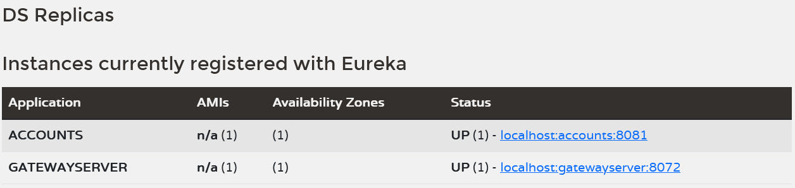

    Figure 1. Eureka Dashboard

Step#4 Open the actuator endpoint for the gateway to see all the endpoints.

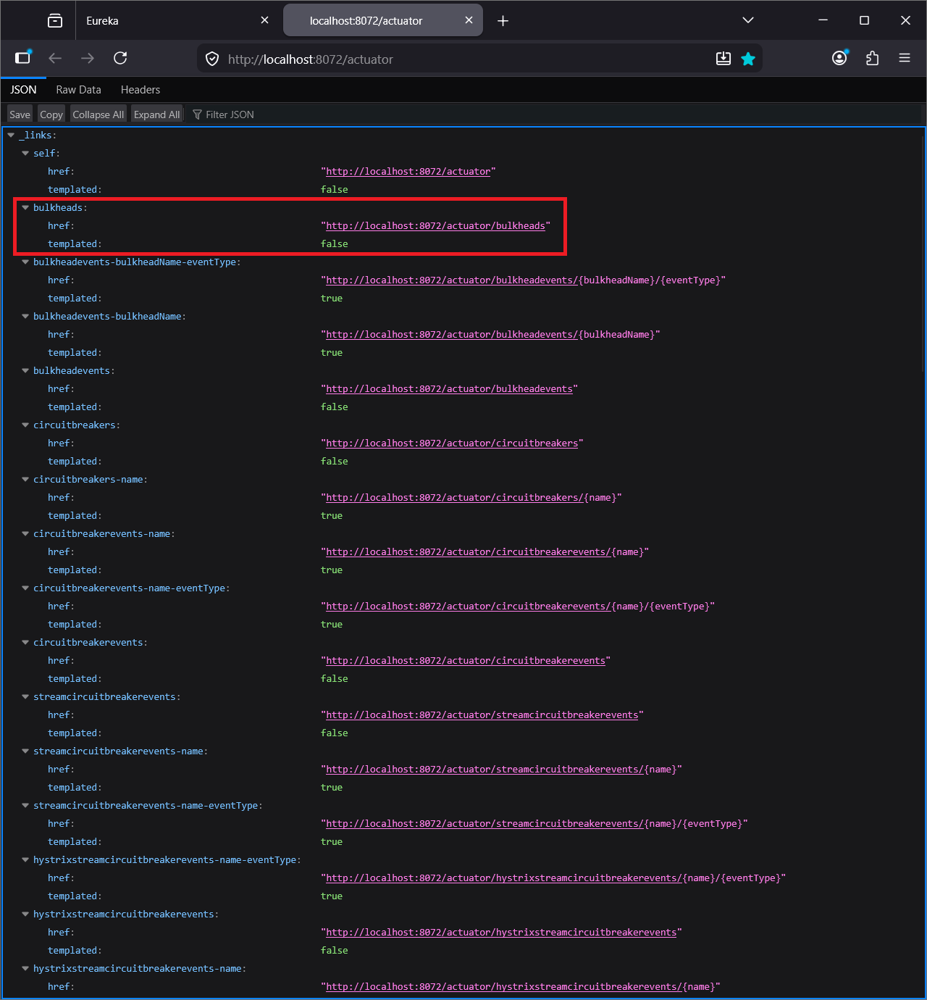

    Figure 2. Actuator Endpoints

Open the “circuitbreaker” url and you will see that circuitBreakers is empty. circuitBreaker imformation will be populated here when testing the accounts microservice.

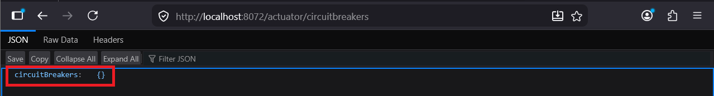

    Figure 3. Actuator Circuitbreakers

Step#5 To test the circuitbreaker we will use the info endpoint already implemented in the accounts microservice.

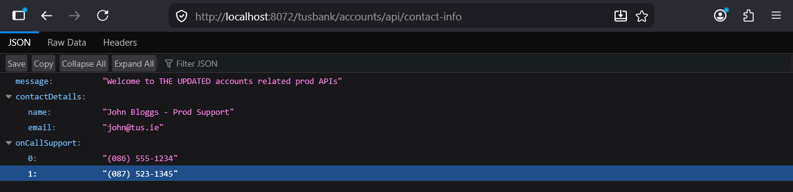

    Figure 4. Actuator Circuitbreakers

After calling the “contact-info” API, refresh the “circuitbreaker” endpoint in the gateway. You will see that the circuit breaker information has been populated.

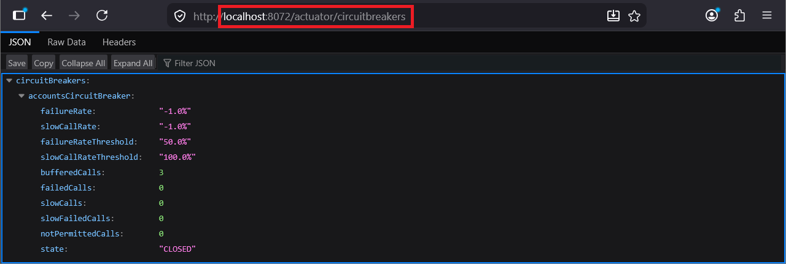

    Figure 5. Actuator Circuitbreakerevents

We can also look at the circuit breaker events.

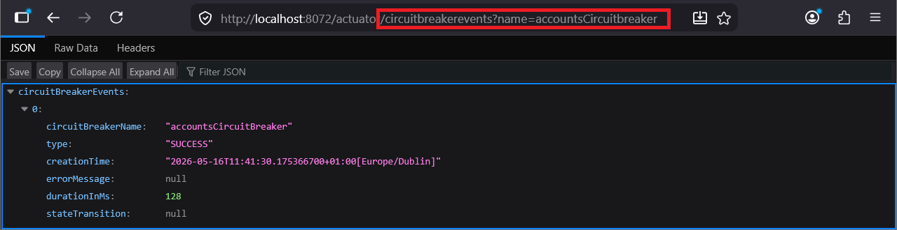

    Figure 6. Actuator Circuitbreakerevents

If you call the contact-info end-point another two times you will see that the circuit breaker events are updated with the new events.

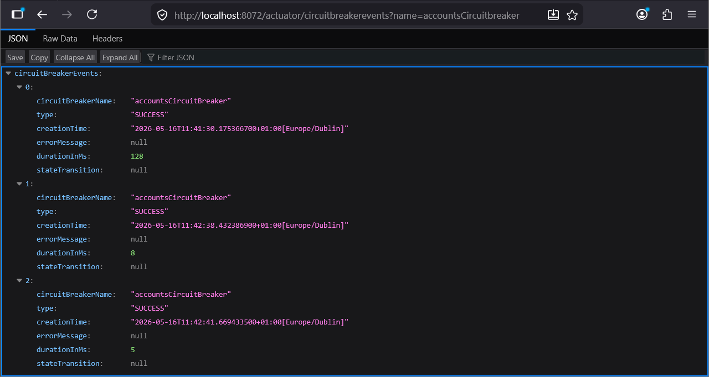

    Figure 7. Actuator Circuitbreakers

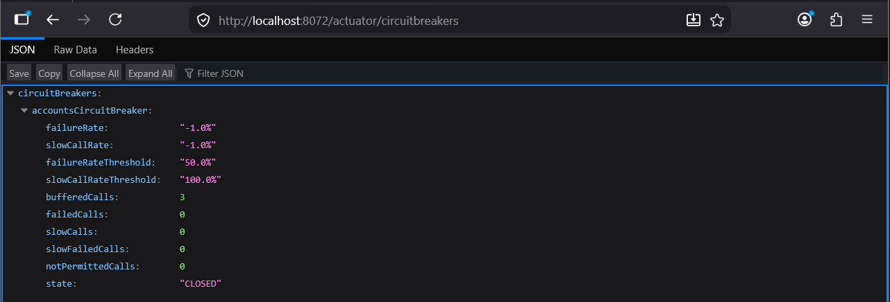

    Figure 8. AccountController Breakpoint

Step#6 To activate the circuitbreaker pattern, add a breakpoint in the AccountController so that the response will not be returned to the gateway.

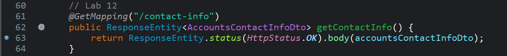

    Figure 9. Debug Accounts

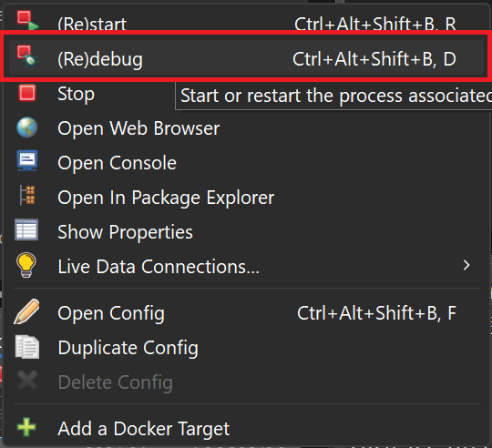

    Figure 10. Make Sure Accounts is in Debug Mode

Call the contact-info endpoint and you will get a timeout.

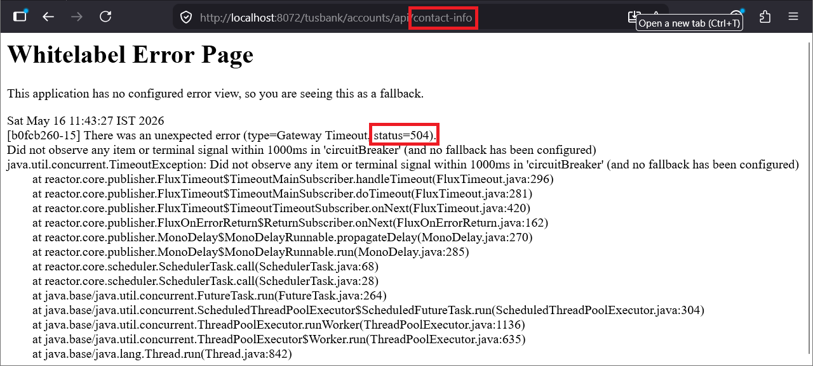

    Figure 11. Whitelabel Error Page

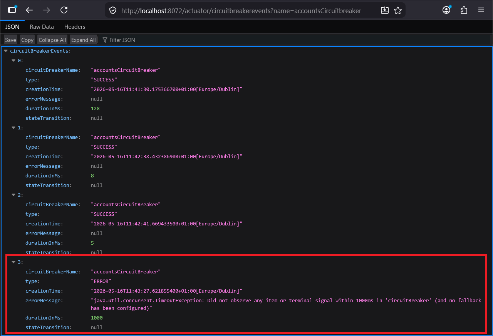

    Figure 12. Actuator Circuitbreaker Events

Circuit breaker is still CLOSED because only one of four calls has failed.

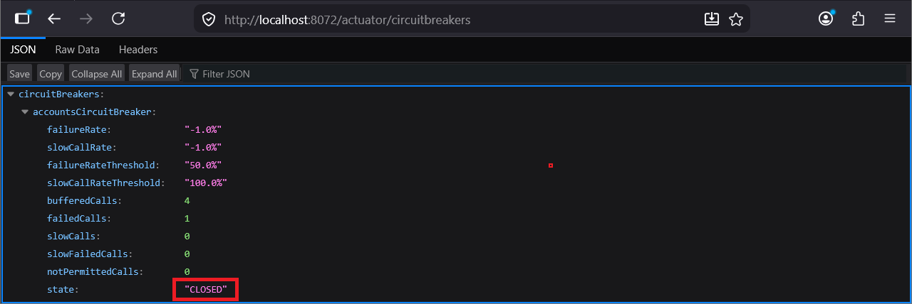

    Figure 13. Circuit Breaker Still Closed

Refresh the “contact-info” multiple times. At some point you will see the status change from 504 to 503.

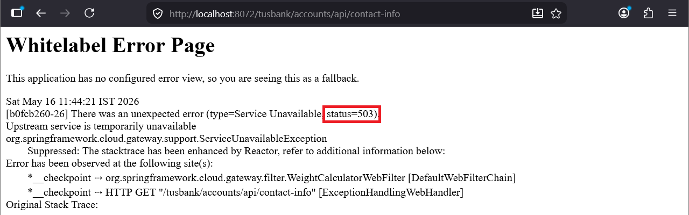

    Figure 14. Whitelabel Error Page Status 503

Now check the circuit breaker information and you will see that the status is open.

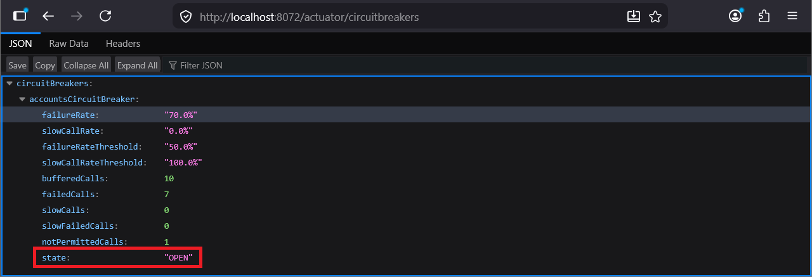

    Figure 15. Circuit Breaker Open

And the event data shows that the failure rate was exceeded.

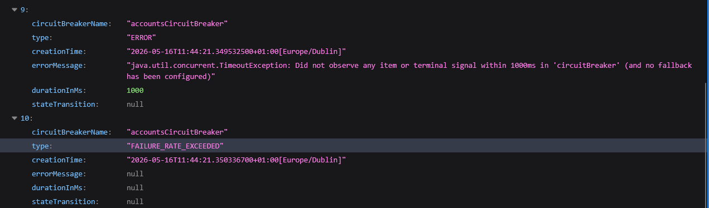

    Figure 16. Failure Rate Exceeded

Then we have a state transition from ‘CLOSED_TO_OPEN’ and further requests are not permitted which means that the gateway will not send the requests.

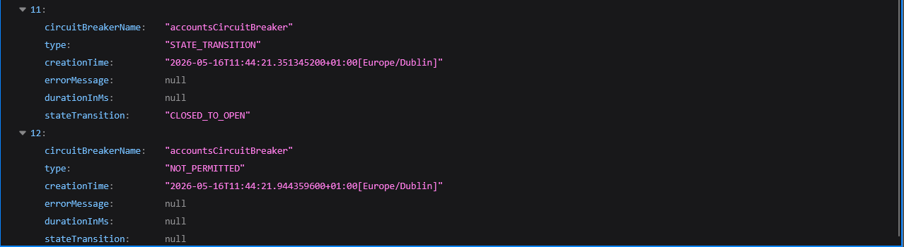

    Figure 17. Closed To Open

Step#7 After at least 10 seconds, invoke the “contact-info” end point again. The error code has changed to 504 again and there is a transition ‘OPEN_TO_HALF_OPEN’

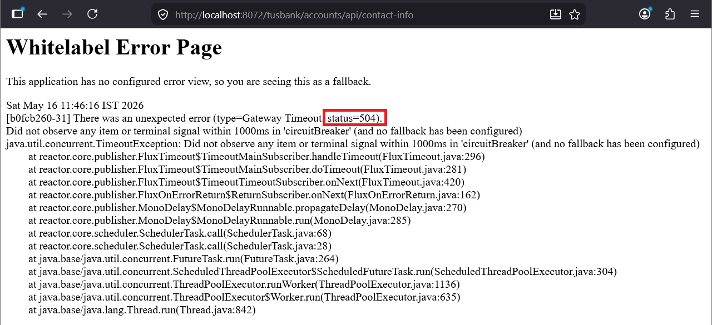

    Figure 18. White Label Error Status 504

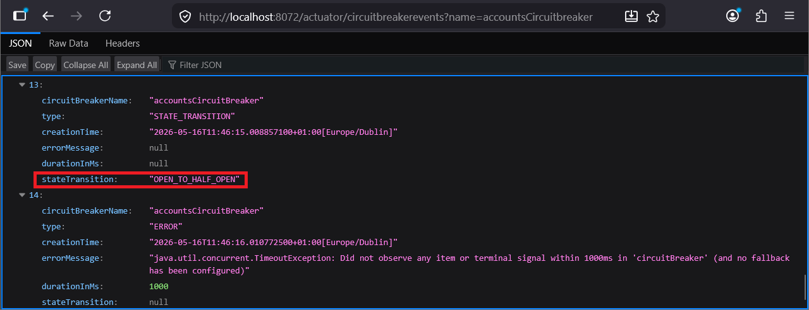

    Figure 19. Open to Half Open

Step#8 Remove the breakpoint in the code. Invoke the endpoint.

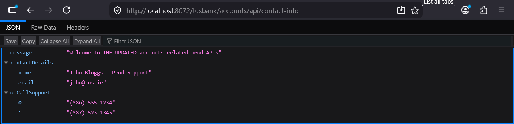

    Figure 20. Contact Info Endpoint
 
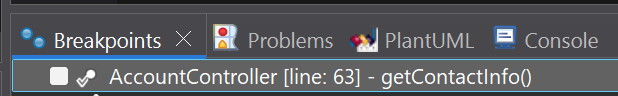

    Figure 21. Remove Breakpoint
 
You should also get a “HALF_OPEN_TO_CLOSED” transition and state of circuit breaker will be closed.

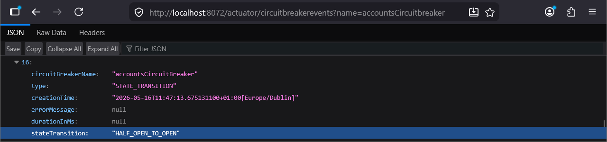

    Figure 22. Half Open to Closed
