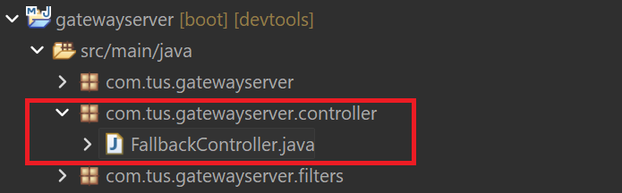
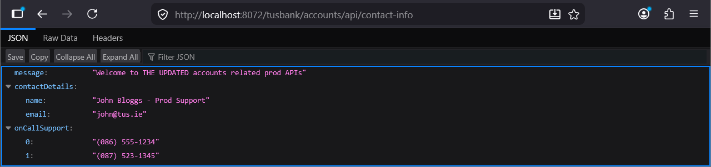
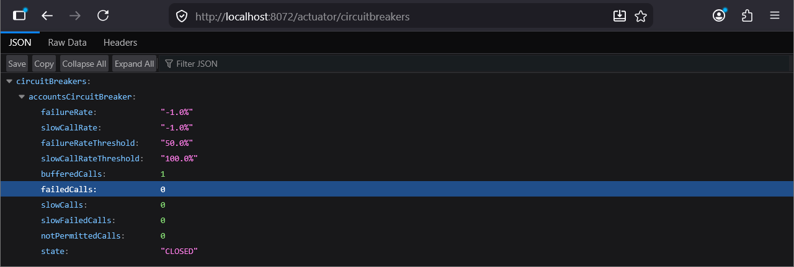
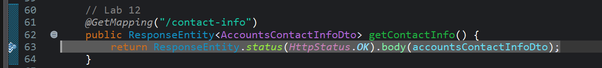
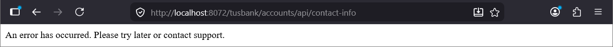

# Lab#30 Circuit Breaker With Fallback

In the previous lab, we implemented the circuit breaker but it had no fallback mechanism, so a runtime exception was thrown. Throwing exceptions to the client is not a valid approach. We need a fallback mechanism to send a message to the client.
Step#1 In the gateway application we need to create a controller class to handle the fallback.



    Figure 1. Controller package and FallbackController class

```java title="Gateway Server: FallbackController.java" linenums="1"
package com.tus.gatewayserver.controller;

import org.springframework.web.bind.annotation.RequestMapping;
import org.springframework.web.bind.annotation.RestController;

import reactor.core.publisher.Mono;

@RestController
public class FallbackController {
	@RequestMapping("/contactSupport")
	public Mono<String> contactSupport() {
		return Mono.just("An error has occurred. Please try later or contact support.");
	}
}
```

Step#2 Integrate the fallback into the circuitbreaker pattern by modifying the GatewayserverApplication class. Restart the gateway.

```java title="Gateway Server: GatewayserverApplication.java" linenums="18"
	@Bean
	RouteLocator tusBankRouteconfig(RouteLocatorBuilder routeLocatorBuilder) { // Lab 27
		return routeLocatorBuilder.routes()
				.route(p -> p.path("/tusbank/accounts/**")
						.filters(f -> f.rewritePath("/tusbank/accounts/(?<segment>.*)", "/${segment}")
								.addResponseHeader("X-Response-Time", LocalDateTime.now().toString())
								.circuitBreaker(config -> config.setName("accountsCircuitBreaker") // lab 29
								        .setFallbackUri("forward:/contactSupport"))) // lab 30
						.uri("lb://ACCOUNTS"))
```

Step#3 Call the contact-info endpoint.



    Figure 2. Call Contact Info Endpoint



    Figure 3. Actuator Circuitbreakers

Now add the breakpoint again in the AccountController class



    Figure 4. Add Breakpoint

Call the end point again and you will see the fallback was called.



    Figure 5. Fallback message