# Lab#31 Circuit Breaker With Feign client

In this lab we implement the circuit breaker inside the accounts microservice. The accounts microservice uses Feign client to invoke cards and loans microservice.  

If Spring Cloud CircuitBreaker is on the classpath and spring.cloud.openfeign.circuitbreaker.enabled=true, Feign will wrap all the methods with a circuit breaker.  

Step#1 In the pom in the accounts microservice, add the dependency and change the version of spring-cloud.

```xml title="Accounts: pom.xml (existing)" linenums="4"
	<modelVersion>4.0.0</modelVersion>
	<parent>
		<groupId>org.springframework.boot</groupId>
		<artifactId>spring-boot-starter-parent</artifactId>
		<version>3.5.13</version>
		<relativePath/> 
	</parent>
	<groupId>com.tus</groupId>
	<artifactId>ma-labs-accounts-8081</artifactId>
	<version>0.0.1-SNAPSHOT</version>

	<properties>
		<java.version>17</java.version>
		<!-- Lab 16: Spring Cloud Version -->
		<spring-cloud.version>2024.0.0</spring-cloud.version>
	</properties>
```

Note: Changed in all services for compatibility reasons

```xml title="Accounts: pom.xml" linenums="40"
	      <artifactId>spring-cloud-starter-openfeign</artifactId>
	    </dependency>
		<!-- Lab31 Circuit Breaker Pattern -->
		<dependency>
			<groupId>org.springframework.cloud</groupId>
			<artifactId>spring-cloud-starter-circuitbreaker-reactor-resilience4j</artifactId>
		</dependency>
		<dependency>
			<groupId>org.springframework.boot</groupId>
```

And in application.yml

```yml title="Accounts: application.yml" linenums="21"
  config:
   import: "configserver:http://localhost:8071/" # config server port 8071
  cloud:
    openfeign:
      circuitbreaker:
        enabled: true
```

Add in the parameters for the circuit breaker in the application.yml for the accounts service.

```yml title="Accounts: application.yml" linenums="63"
resilience4j.circuitbreaker:
  configs:
    default:
      slidingWindowSize: 10
      permittedNumberOfCallsInHalfOpenState: 2
      failureRateThreshold: 50
      waitDurationInOpenState: 10000 # 10 seconds
```

Step#2 Implementing the fallbacks. Create a new class called LoansFallback in the accounts microservice

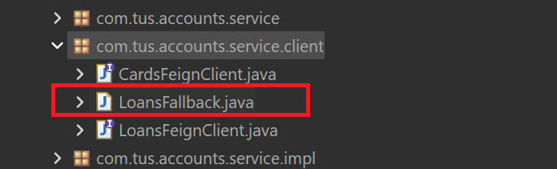

    Figure 1. Loans Fallback

```java title="Accounts: LoansFallback.java" linenums="1"
package com.tus.accounts.service.client;

import org.springframework.http.ResponseEntity;
import org.springframework.stereotype.Component;

import com.tus.accounts.dto.LoansDto;

@Component
public class LoansFallback implements LoansFeignClient {
	
	@Override
	public ResponseEntity<LoansDto> fetchLoanDetails(String correlationId, String mobileNumber) {
		return null;
	}
}
```

Step#3 Create a similar class called CardsFallback

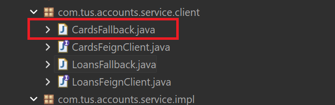

    Figure 2. Cards Fallback

```java title="Accounts: CardsFallback.java" linenums="1"
package com.tus.accounts.service.client;

import org.springframework.http.ResponseEntity;
import org.springframework.stereotype.Component;

import com.tus.accounts.dto.CardsDto;

@Component
public class CardsFallback implements CardsFeignClient {

	@Override
	public ResponseEntity<CardsDto> fetchCardDetails(String correlationId, String mobileNumber) {
		return null;
	}
}
```

Update the LoansFeignClient interface and the CardsFeignClient interface.

```java title="Accounts: LoansFaignClient.java" linenums="11"
@FeignClient(name = "loans", fallback = LoansFallback.class) // Lab 31
public interface LoansFeignClient {
	@GetMapping(value = "/api/loans", consumes = "application/json")
	public ResponseEntity<LoansDto> fetchLoanDetails(@RequestHeader("tusbank-correlation-id") String correlationId,
			@RequestParam String mobileNumber);
}
```

```java title="Accounts: CardsFeignClient.java" linenums="11"
@FeignClient(name = "cards", fallback = CardsFallback.class) // Lab 31
public interface CardsFeignClient {
	@GetMapping(value = "/api/cards", consumes = "application/json")
	public ResponseEntity<CardsDto> fetchCardDetails(@RequestHeader("tusbank-correlation-id") String correlationId,
			@RequestParam String mobileNumber);
}
```

Add the if statements in the CustomersServiceImpl class.

```java title="Accounts: CustomersServiceImpl.java" linenums="45"
		if (null != loansDtoResponseEntity) { // Lab 31
			customerDetailsDto.setLoansDto(loansDtoResponseEntity.getBody());
		}

		ResponseEntity<CardsDto> cardsDtoResponseEntity = cardsFeignClient.fetchCardDetails(correlationId,
				mobileNumber);
		if (null != cardsDtoResponseEntity) { // Lab 31
			customerDetailsDto.setCardsDto(cardsDtoResponseEntity.getBody());
		}
		return customerDetailsDto;
```

Step#3 Start all the services, config, eureka, accounts, cards and loans followed by gateway.

- Eureka Dashboard: <http://localhost:8070/>

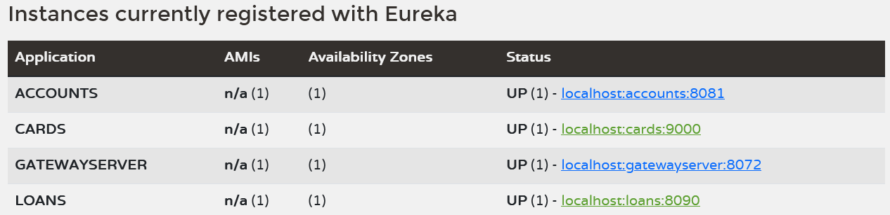

    Figure 3. Eureka Dashboard

Open the actuator of accounts microservice. First make sure that the actuator endpoints are enabled by checking the application.yml

```yml title="Accounts: application.yml" linenums="29"
management:
  endpoints:
    web:
      exposure:
        include: "*" # Lab 19, 31
        # include: info, shutdown # lab 22 info, lab 23 shutdown
  endpoint:
    shutdown:
      enabled: true
```

- Accounts Actuator Endpoints: <http://localhost:8081/actuator>

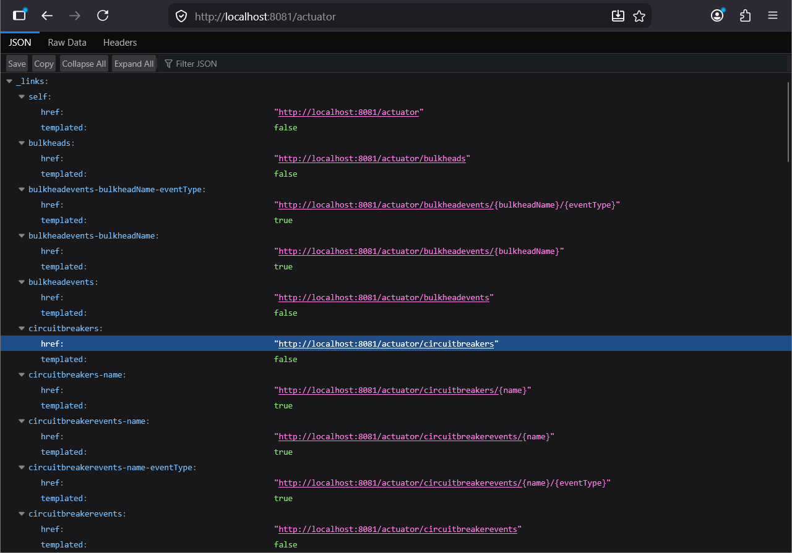

    Figure 4. Actuator Endpoints

Check the circuit breakers link. Right now there are no circuit breakers because we did not send any request yet.

- Circuit Breakers: <http://localhost:8081/actuator/circuitbreakers>

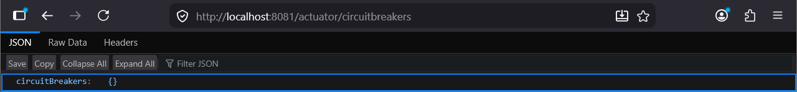

    Figure 5. Actuator Circuitbreakers

Call the fetch customer details endpoint. 

- Fetch Customer Details Endpoint: <http://localhost:8072/tusbank/accounts/api/customers?mobileNumber=1234567899>

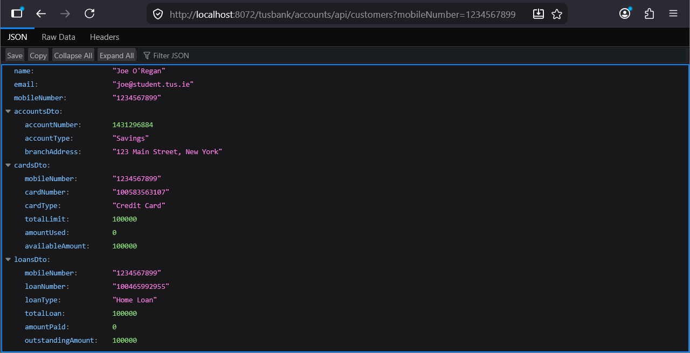

    Figure 6. Accounts Fetch Customer Details Endpoint

---

Note: account, loan and card previously created for this mobile number.  

POST `localhost:8072/tusbank/accounts/api/accounts`

```json
{
    "name": "Joe O'Regan",
    "email": "joe@student.tus.ie",
    "mobileNumber": "1234567899"    
}
```

POST `localhost:8072/tusbank/loans/api/loans?mobileNumber=1234567899`

```json
{
    "email": "joe@student.tus.ie",
    "loanType": "Home Loan",
    "totalLoan": 100000,
    "amountPaid": 0,
    "outstandingAmoutn": 100000
}
```

POST `localhost:8072/tusbank/cards/api/cards?mobileNumber=1234567899`

```json
{
    "name": "Joe O'Regan",
    "email": "joe@student.tus.ie",
    "mobileNumber": "0871234567"    
}
```

---

Now refresh the actuator end point

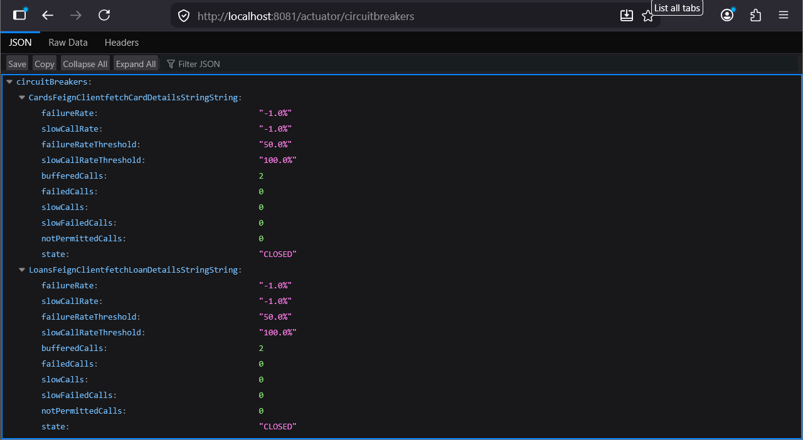

    Figure 7. Actuator Circuitbreakers

And look at the circuit breaker events.

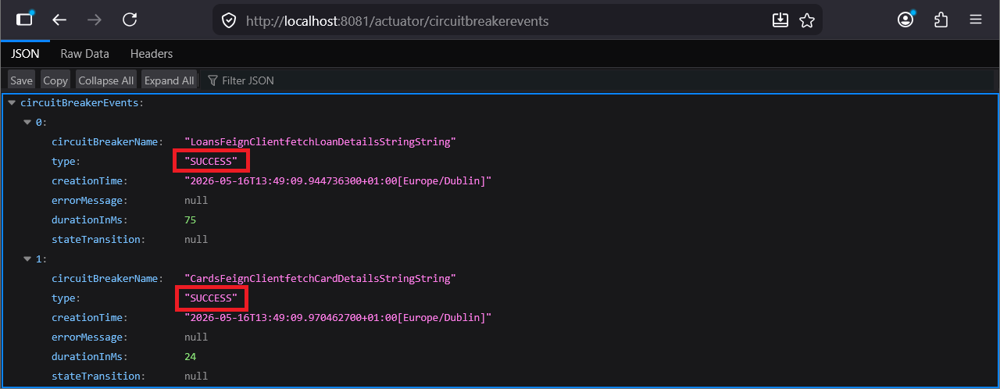

    Figure 8. Actuator Circuitbreaker Events

---

Step#4 To look at the negative situation, first stop the loans microservice from the springboot dashboard

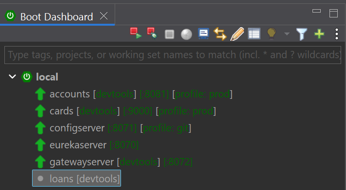

    Figure 9. Stop Loans Microservice

Call the fetch customer details endpoint again

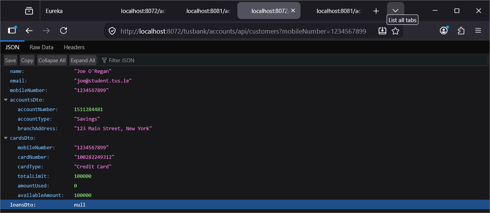

    Figure 10. Call Fetch Customer Details Endpoint

Try calling the endpoint a number of times and the circuit breaker will move to the open state.

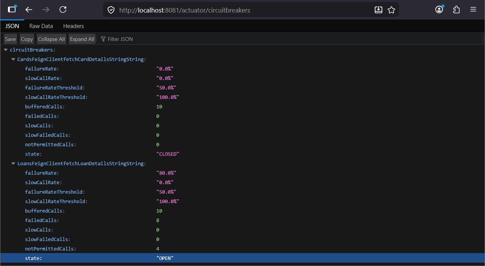

    Figure 11. Circuit Breaker Moves To Open State

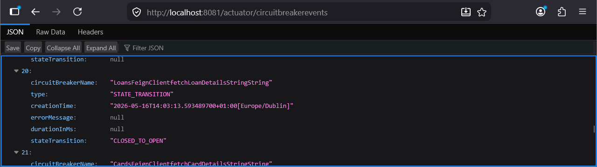

    Figure 12. Closed to Open State
