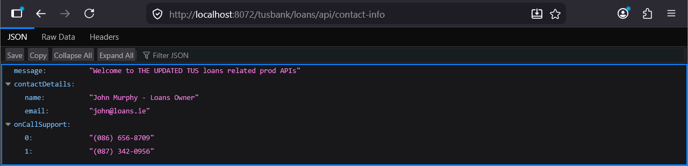
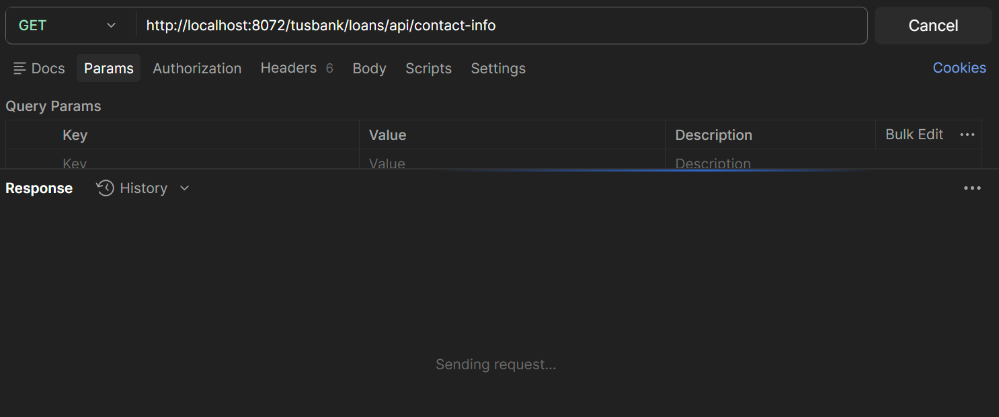
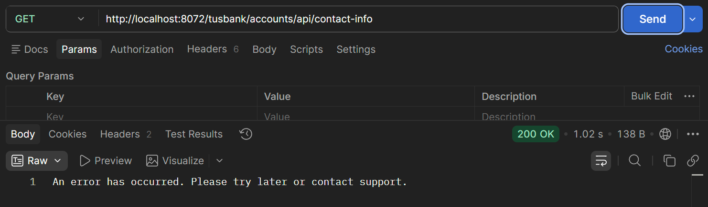
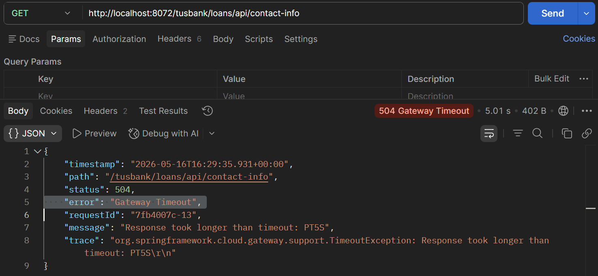

# Lab#32 Http timeouts

One of the most common problems

## Step#1 Loans Contact-Info

Invoke the contact-info endpoint on the loans microservice through the gateway and it works fine, but sometimes services may respond slowly.

- Loans Contact Info Endpoint: <http://localhost:8072/tusbank/loans/api/contact-info>



    Figure 1. Loans Contact Info Endpoint

---

## Step#2 Simulate Slow Response

To simulate a slow response, add a breakpoint in the contact-info end mapping in the LoansController class


    Figure 2. Add Breakpoint

Invoke the endpoint again through the gateway and you will see that the browser is waiting for the response.



    Figure 3. Postman contact info endpoint

Behind the scenes there is a thread waiting on the gateway for the response from the loans service and on the loans there is thread waiting for the Rest API. 


    Figure 4. Postman contact info endpoint

You can now release the breakpoint.

---

## Step#3 Repeat for Accounts

Do the same for the accounts microservice.

- Accounts Contact Info Endpoint: <http://localhost:8072/tusbank/accounts/api/contact-info>



    Figure 5. Accounts Contact Info Endpoint

This is because the circuitbreaker is configured for the accounts service in the gateway. Internally the circuit breaker has default configuration related to timeout. It will wait a maximum of 1 second and after that it will go to the fallback mechanism. But the circuit breaker pattern might not be used throughout the microservices.

We can configure timeout configurations so that services do not wait indefinitely for the response.

Set spring.cloud.gateway.httpclient properties in the gateway application.yml.

```yml title="Gateway: application.yml" linenums="6"
  cloud:
    gateway:
      server:
        webflux:
          discovery:
            locator:
              enabled: false
              lower-case-service-id: true # lab 27
          httpclient:
            connect-timeout: 1000 # lab 32
            response-timeout: 5s  # lab 32
management:
  endpoints:
    web:
```



    Figure 6. Gateway Timeout