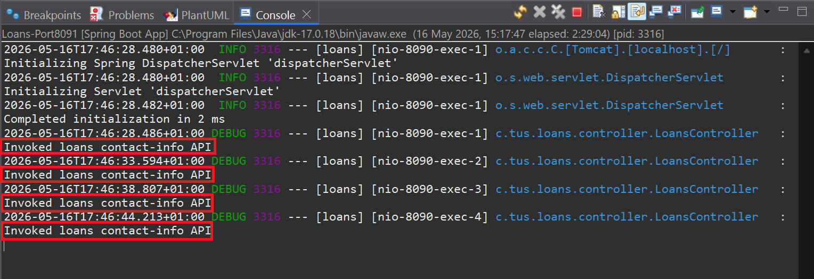
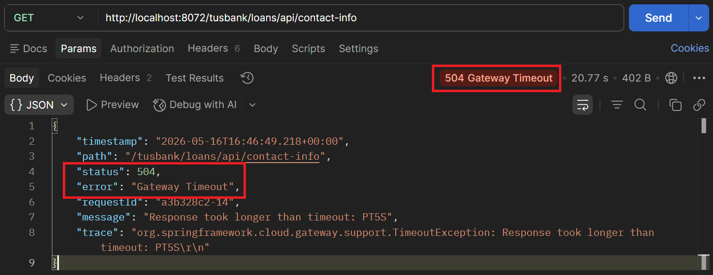

# Lab#33 Implementing the re-try pattern in the gateway.
Step#1 We will implement the re-try filter in the gateway for the loans microservice.  

```java title="Gateway: GatewayserverApplication" linenums="11"
import java.time.Duration; // Lab 33
import java.time.LocalDateTime;

import org.springframework.boot.SpringApplication;
import org.springframework.boot.autoconfigure.SpringBootApplication;
import org.springframework.cloud.gateway.route.RouteLocator;
import org.springframework.cloud.gateway.route.builder.RouteLocatorBuilder;
import org.springframework.context.annotation.Bean;
import org.springframework.http.HttpMethod; // Lab 33

@SpringBootApplication
public class GatewayserverApplication {

	public static void main(String[] args) {
		SpringApplication.run(GatewayserverApplication.class, args);
	}

	@Bean
	RouteLocator tusBankRouteconfig(RouteLocatorBuilder routeLocatorBuilder) { // Lab 27
		return routeLocatorBuilder.routes()
				.route(p -> p.path("/tusbank/accounts/**")
						.filters(f -> f.rewritePath("/tusbank/accounts/(?<segment>.*)", "/${segment}")
								.addResponseHeader("X-Response-Time", LocalDateTime.now().toString())
								.circuitBreaker(config -> config.setName("accountsCircuitBreaker") // lab 29
										.setFallbackUri("forward:/contactSupport"))) // lab 30
						.uri("lb://ACCOUNTS"))
				.route(p -> p.path("/tusbank/loans/**")
						.filters(f -> f.rewritePath("/tusbank/loans/(?<segment>.*)", "/${segment}")
								.addResponseHeader("X-Response-Time", LocalDateTime.now().toString())
								.retry(retryConfig -> retryConfig.setRetries(3).setMethods(HttpMethod.GET)
										.setBackoff(Duration.ofMillis(100), Duration.ofMillis(1000), 2, true))) // Lab 33
						.uri("lb://LOANS"))
```

Step#2 To test this we will make some changes in the loans controller by adding a logger statement. This will show how many times the request is invoked.

```java title="Loans: Controller" linenums="65"
	@GetMapping("/contact-info")
	public ResponseEntity<LoansContactInfoDto> getContactInfo() {
		logger.debug("Invoked loans contact-info API"); // Lab 33
		return ResponseEntity.status(HttpStatus.OK).body(loansContactInfoDto);
	}
```



    Figure 1. Logger message appears 4 times, once for first attempt, then 3 by retries
    


    Figure 2. After 3 Retries Status 504 Gateway Timeout