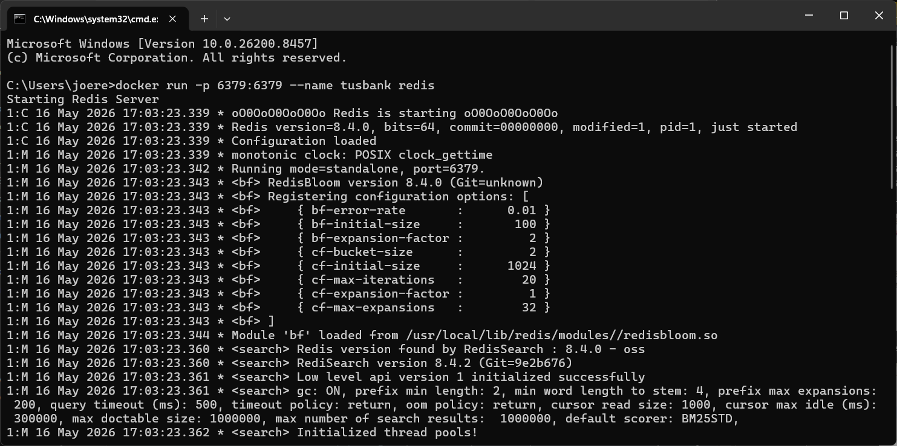
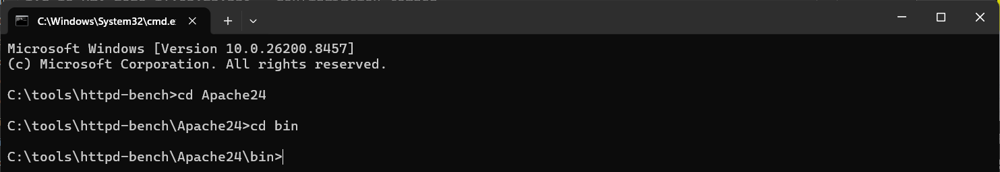
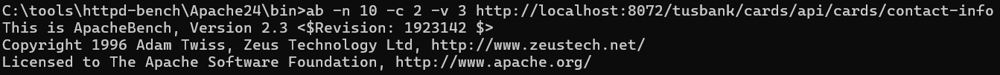
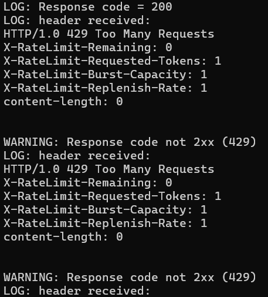
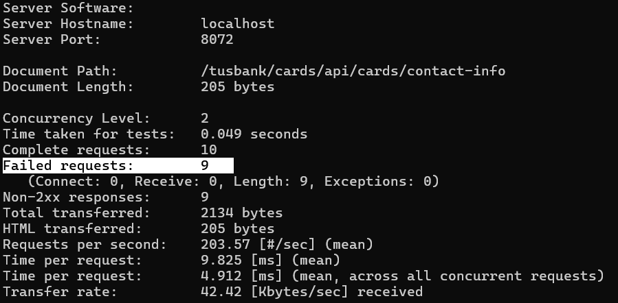
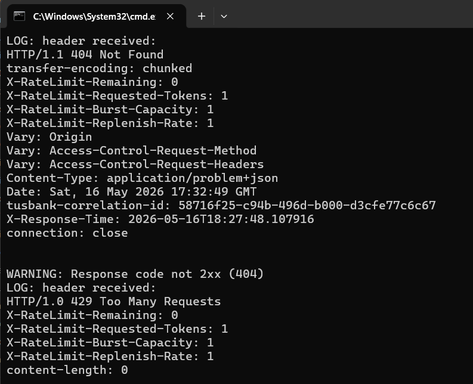
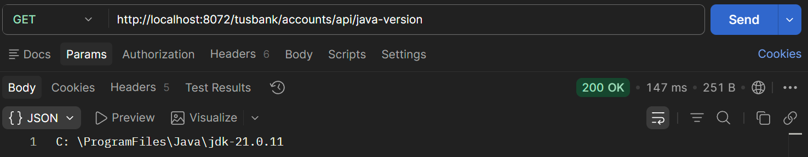
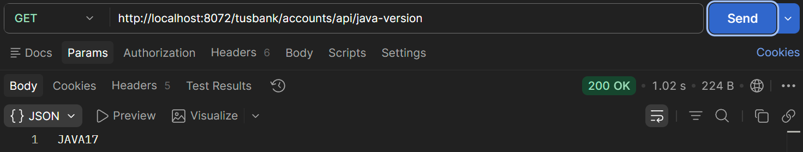

# Lab#34 Redis rate limiter in the gateway and in accounts service.

Step#1 We will implement the redis rate limiter in the gateway. Add the dependency in the pom for the gateway.

```xml title="Gateway: pom.xml" linenums="40"
		<dependency>
			<groupId>org.springframework.boot</groupId>
			<artifactId>spring-boot-starter-data-redis-reactive</artifactId>
		</dependency>
```

Step#2 Then we need to add two beans to the GatewayserverApplication class. We create a KeyResolver base on the user in the request header and if no user found default to anonymous. The other beans creates a RedisRateLimiter witharguments defaultReplenishRate, defaultBurstCapacity and defaultRequestedTokens. With values 1,1,1 the user can make 1 request per second.

```java title="Gateway: GatewayserverApplication.java" linenums="46"
	@Bean
	RedisRateLimiter redisRateLimiter() {
		return new RedisRateLimiter(1, 1, 1);
	}

	@Bean
	KeyResolver userKeyResolver() {
		return exchange -> Mono.justOrEmpty(exchange.getRequest().getHeaders().getFirst("user"))
				.defaultIfEmpty("anonymous");
	}
```

Step#3 Update the filters in the gateway for loans to add the redis rate limiter
 
```java title="" linenums="39"
    .route(p -> p.path("/tusbank/cards/**")
            .filters(f -> f.rewritePath("/tusbank/cards/(?<segment>.*)", "/${segment}")
                    .addResponseHeader("X-Response-Time", LocalDateTime.now().toString())
                    .requestRateLimiter(config -> config.setRateLimiter(redisRateLimiter())
                            .setKeyResolver(userKeyResolver()))) // Lab 34
            .uri("lb://CARDS"))
```

Step#4 Start redis as a docker container.

`docker run -p 6379:6379 --name tusbank redis`



    Figure 1. Redis as Docker Container

Now gatewayserver needs the connection details for the redis server.

```yml title="Gateway: application.yml" linenums="1"
spring:
  application:
    name: gatewayserver
  config:
    import: "optional:configserver:http://localhost:8071" # Lab 22
  cloud:
    gateway:
      server:
        webflux:
          discovery:
            locator:
              enabled: false
              lower-case-service-id: true # lab 27
          httpclient:
            connect-timeout: 1000 # lab 32
            response-timeout: 5s  # lab 32
# lab 34 redis
  data:
    redis:
      connect-timeout: 2s
      host: localhost
      port: 6379
      timeout: 1s
management:
  endpoints:
    web:
```

Restart the gateway server.

---

Step#5 See link on installing apache bench

<https://dev.to/gabriellaamah/load-testing-for-api-with-apache-benchmark-on-windows-58oj>

On windows download and unzip.



    Figure 2. Apache Benchmark



    Figure 3. ab command



    Figure 4. Output 1



    Figure 5. Output 2



    Figure 6. Output 2 404

`ab -n 10 -c 2 -v 3 http://localhost:8072/tusbank/cards/api/cards/contact-info`

Step#6 Now update accounts microservice for the get java-version endpointwith a fallback.

```java title="Accounts: AccountsController.java" linenums="51"
	@RateLimiter(name = "getJavaVersion", fallbackMethod = "getJavaVersionFallback") // Lab 34
	@GetMapping("/java-version")
	public ResponseEntity<String> getJavaVersion() {
		return ResponseEntity.status(HttpStatus.OK).body(environment.getProperty("JAVA_HOME"));
	}
	
	public ResponseEntity<String> getJavaVersionFallback(Exception ex) {
		return ResponseEntity.status(HttpStatus.OK).body("JAVA 17");
	}
```

And in the application.yml. This is one request for every 5 seconds. 

```yml title="Accounts: application.yml linenums="63"
resilience4j.circuitbreaker: # lab 31
  configs:
    default:
      # slidingWindowSize: 10
      # permittedNumberOfCallsInHalfOpenState: 2
      # failureRateThreshold: 50
      # waitDurationInOpenState: 10000 # 10 seconds
      timeoutDuration: 1000 # Lab 34
      limitRefreshPeriod: 5000 # Lab 34
      limitForPeriod: 1 # Lab 34
```

To avoid timeout in the circuit breaker I commented out the circuitbreaker in the gateway

```java title="Gateway: GatewayserverApplication.java" linenums="26"
		return routeLocatorBuilder.routes()
				.route(p -> p.path("/tusbank/accounts/**")
						.filters(f -> f.rewritePath("/tusbank/accounts/(?<segment>.*)", "/${segment}")
								.addResponseHeader("X-Response-Time", LocalDateTime.now().toString())
//								.circuitBreaker(config -> config.setName("accountsCircuitBreaker") // lab 29
//										.setFallbackUri("forward:/contactSupport")) // lab 30
						).uri("lb://ACCOUNTS"))
```

Restart the accounts microservice and the gateway

`http://localhost:8072/tusbank/accounts/api/java-version`



    Figure 8. Default Response

Refresh multiple times to see fallback message



    Figure 8. Rate limiter fallback