# Lab#37 Authorization Code grant type flow

Step#1 Create a new client in KeyCloak

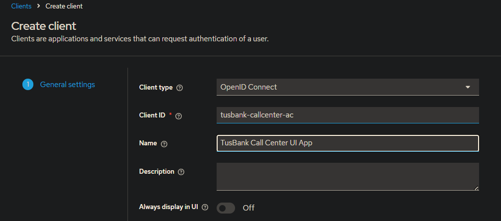

    Figure 1. Keycloak New Client

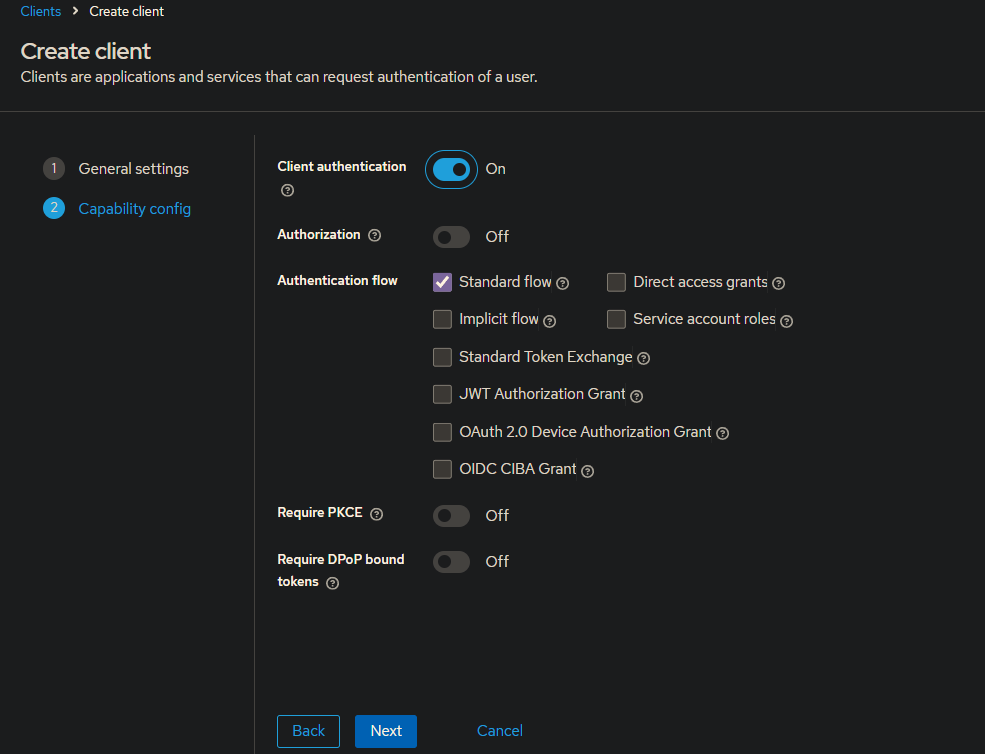

    Figure 2. Create Client 2 Capability Config

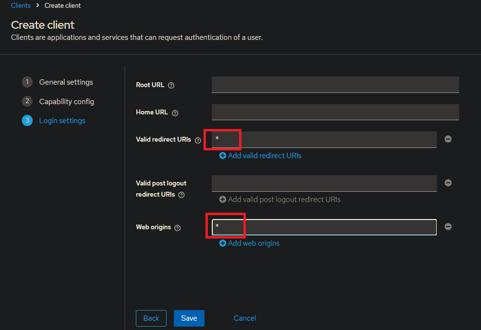

    Figure 3. Create Client 3 Login Settings

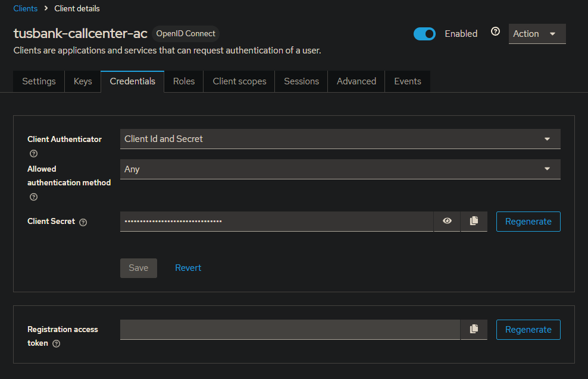

    Figure 4. Credentials

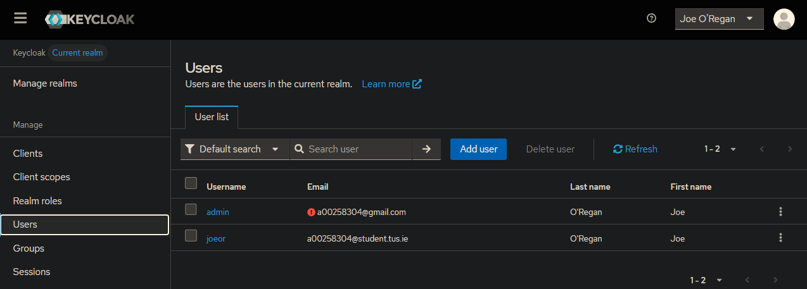

    Figure 5. Users

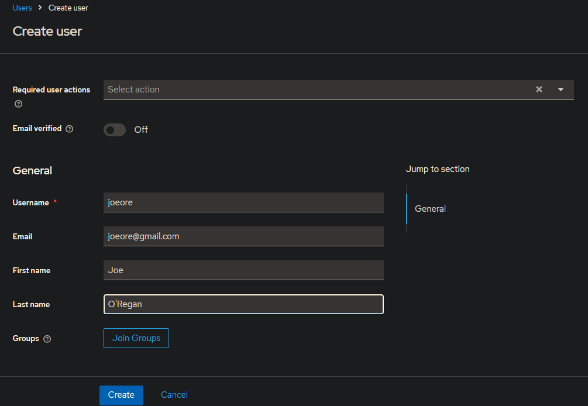

    Figure 6. Create User

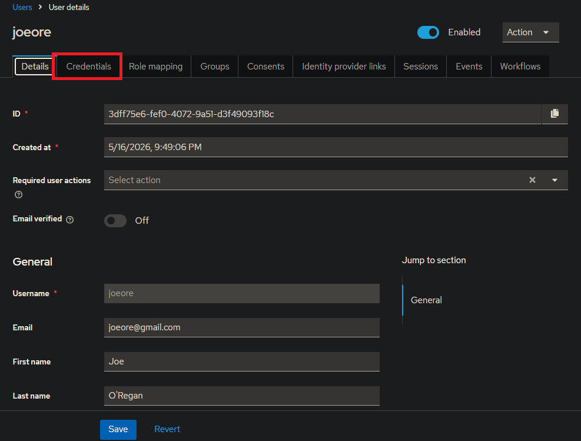

    Figure 7. Details

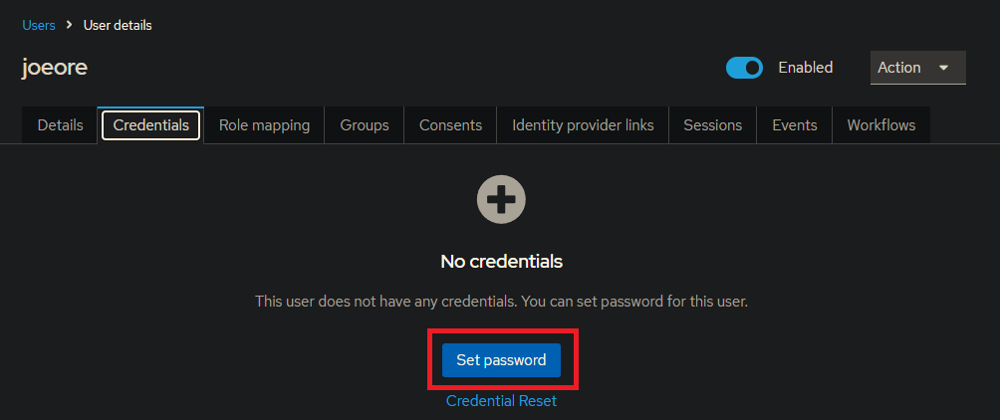

    Figure 8. Credentials.png

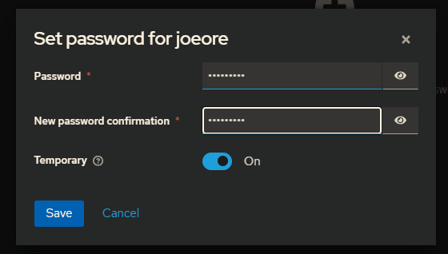

    Figure 9. Set Password

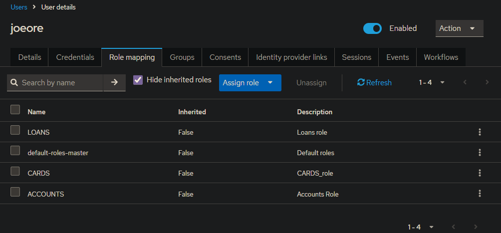

    Figure 10. Users

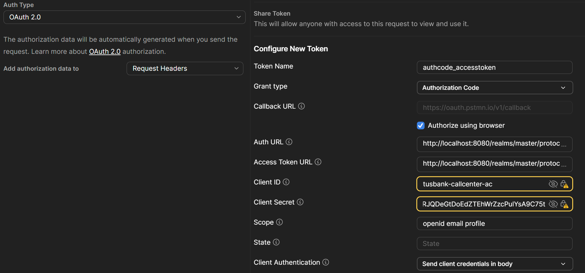

    Figure 11. Configure New Token

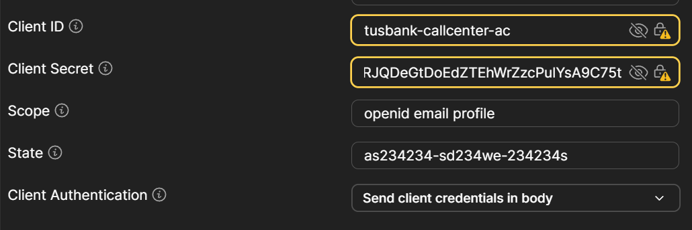

    Figure 12. Configure New Token
 
Close KeyCloak browser session or change your default browser to bing temporarily if you have issues. 

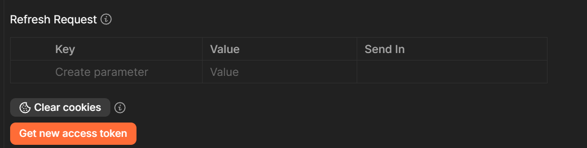

    Figure 13. Get New Access Token

Generate a new access token in Postman. You will be re-directed to KeyCloak to login. Enter the login details for the user that you created (not your Keycloak login).

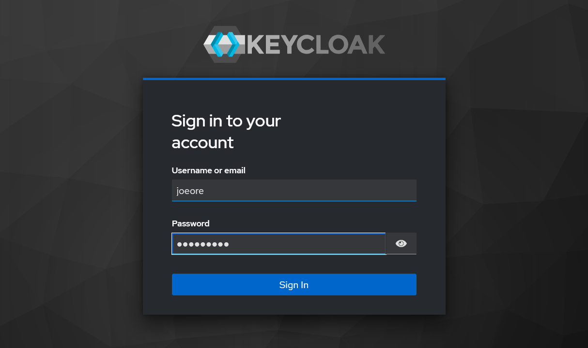

    Figure 14. Keycloak Login

You will be re-directed back to Postman

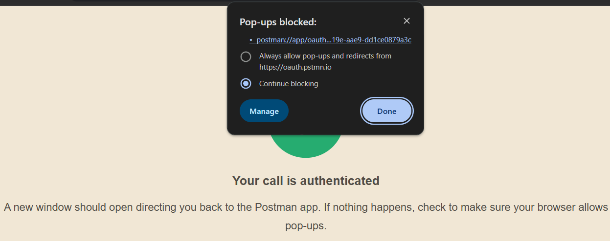

    Figure 15. Postman Re-direct

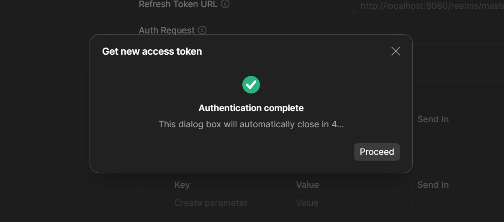

    Figure 16. Get New Access Token

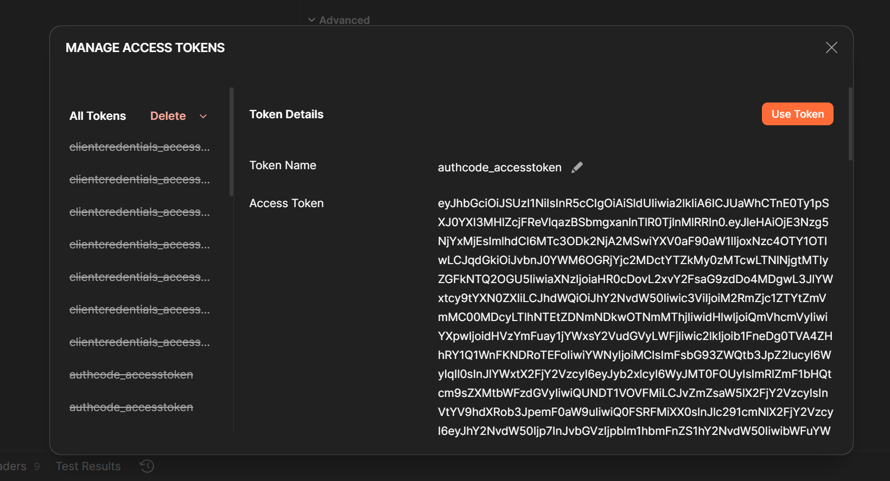

    Figure 17. Use Token

POST <localhost:8072/tusbank/accounts/api/accounts>

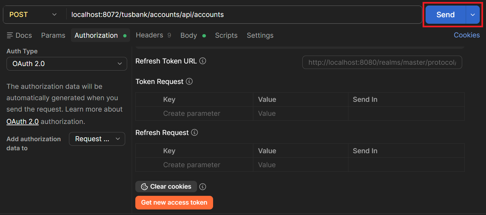

    Figure 18. Create New Account

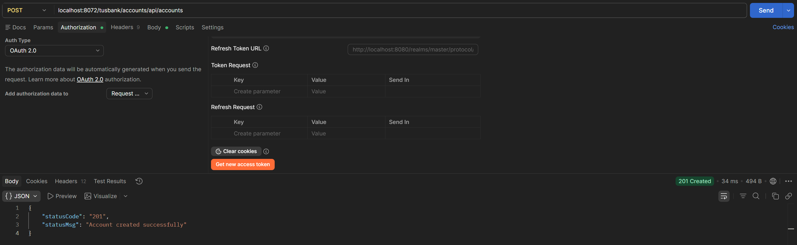

    Figure 19. Status 201 Account Created Successfully