# RESTful API Lab 8

## Lab#8 Loans MicroService

---

In this lab we will create a loans microservice, similar to the accounts service.

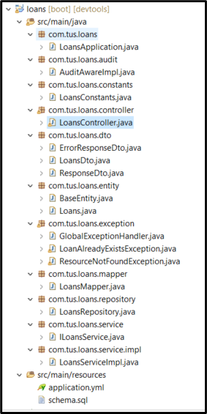

    Figure 1: Project Layout  

Schema.sql, LoansConstants, ILoansService and LoansServiceImpl and LoansMapper files are given. Use port 8090 in the .yml file.

---

### Creating a Loan
First create a customer as before using the accounts microservice.

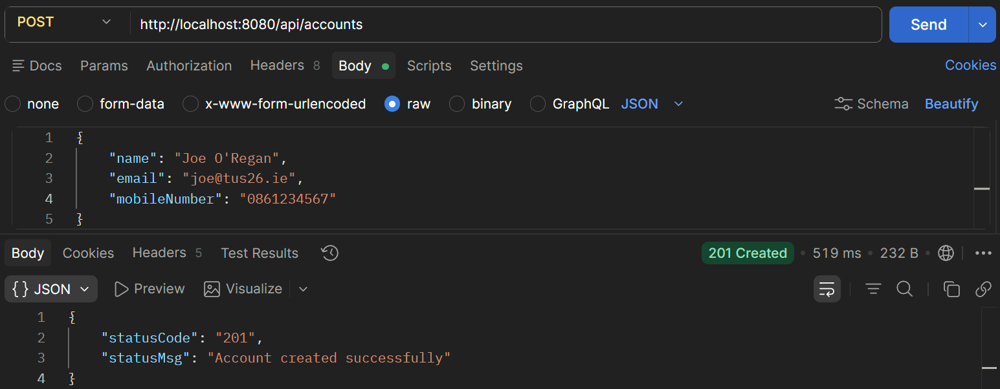   

    Fig. 2 Create a customer  

Now using the same mobile number create a loan. The mobile number supplied must be 10 digits long. A loan cannot already exist for the customer with given mobile number.
 
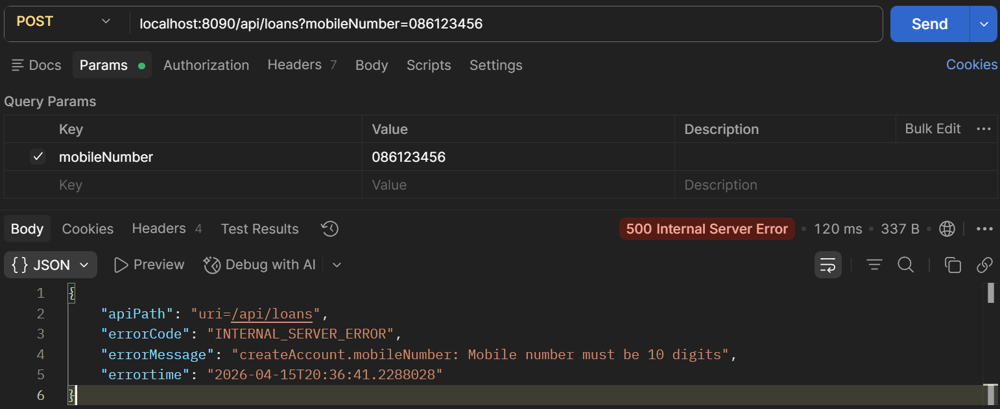  

    Fig. 3 Create a loan - Mobile number too short  
 
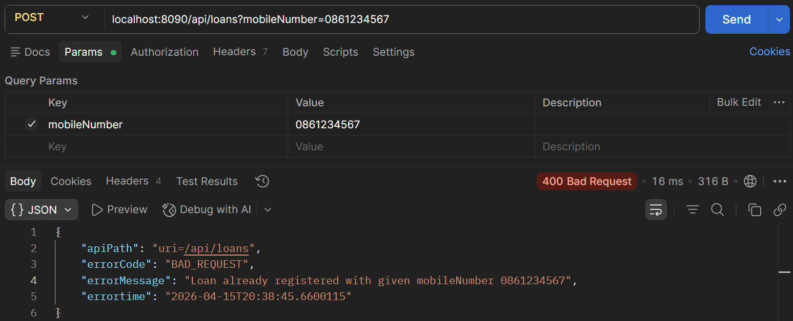  

    Fig. 4 Create a loan -  Loan already exists for customer  

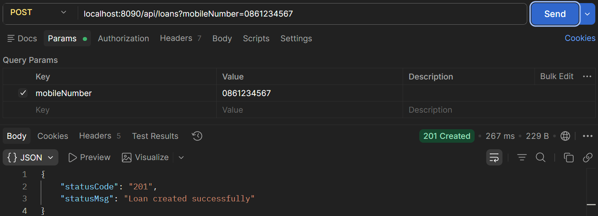  

    Fig. 5 Loan created success.  

```java title="Creating a loan – code in LoansServiceImpl" linenums="33"
private Loans createNewLoan(String mobileNumber) {
    Loans newLoan = new Loans();
    long randomLoanNumber = 100000000000L + new Random().nextInt(900000000);
    newLoan.setLoanNumber(Long.toString(randomLoanNumber));
    newLoan.setMobileNumber(mobileNumber);
    newLoan.setLoanType(LoansConstants.HOME_LOAN);
    newLoan.setTotalLoan(LoansConstants.NEW_LOAN_LIMIT);
    newLoan.setAmountPaid(0);
    newLoan.setOutstandingAmount(LoansConstants.NEW_LOAN_LIMIT);
    return newLoan;
}
```

The loan is create using default values as shown and the number is generated as shown

---

### Fetch loan details

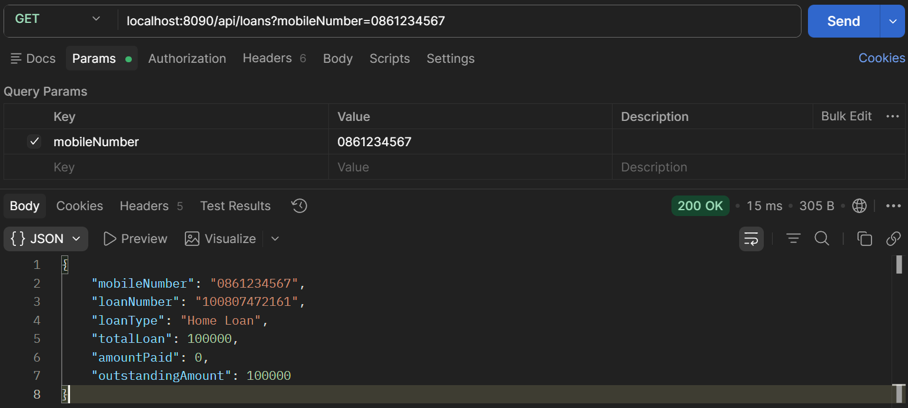  

    Fig. 6 Fetching loan details - success  

  

    Fig. 7 Fetching loan - mobile number not 10 digits

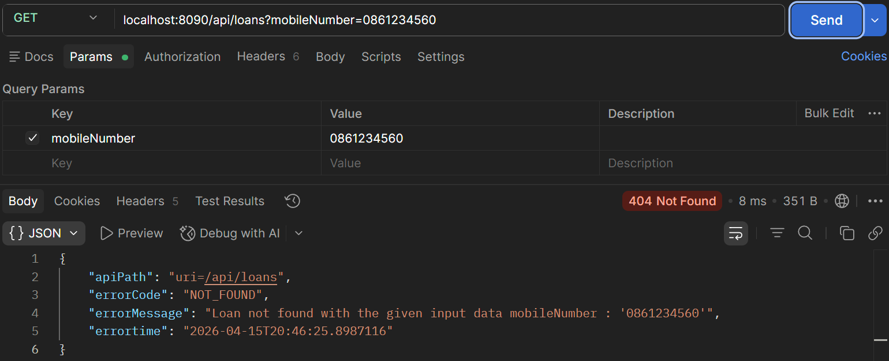  

    Fig. 8 Fetching loan – no loan for given mobile number  

---

### Update Loan details

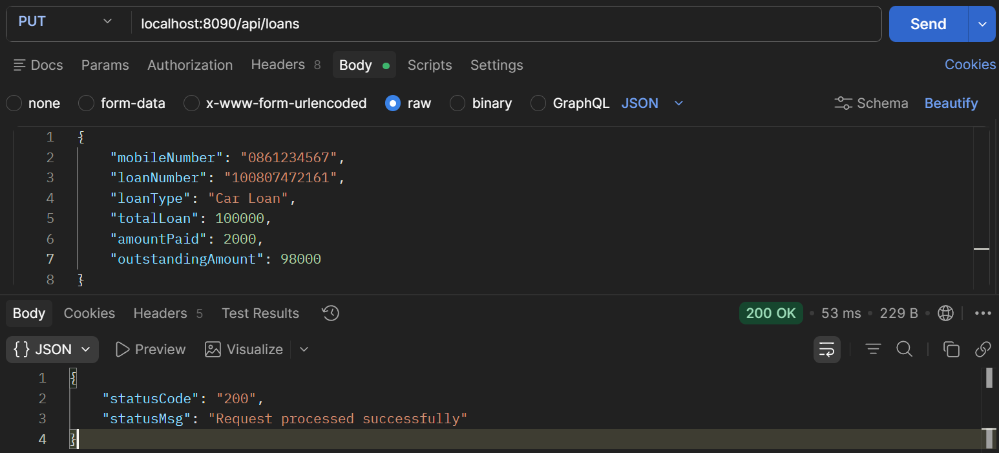  

    Fig. 9 Updating loan –loan details updated successfully

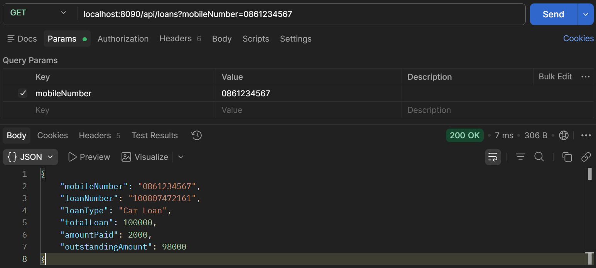  

    Fig. 10 Fetch updated values – loan details updated  

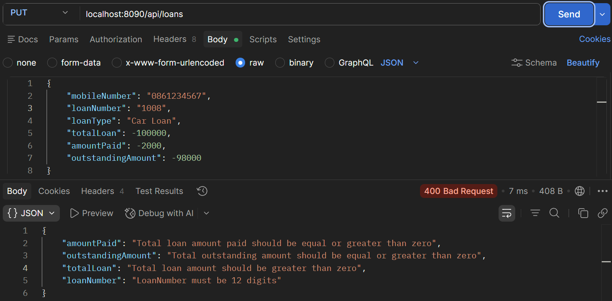  

    Fig. 11 Updating loan –validation errors in data  

See LoansDto for error example

```java title="Handling errors in LoansDto - LoansDto.java" linenums="9"
@Data
public class LoansDto {
	@NotEmpty(message = "MobileNumber cannot be null or empty")
	@Pattern(regexp = "(^$|[0-9]{10})", message = "Mobile Number must be 10 digits")
	private String mobileNumber;
	
	@NotEmpty(message = "LoanNumber cannot be null or empty")
	@Pattern(regexp = "(^$|[0-9]{12})", message = "LoanNumber must be 12 digits")
	private String loanNumber;

	@NotEmpty(message = "LaonType cannot be null or empty")
	private String loanType;

	@Positive(message = "Total loan amount should be greater than zero")
	private Integer totalLoan;

	@PositiveOrZero(message = "Total loan amount paid should be equal or greater than zero")
	private Integer amountPaid;

	@PositiveOrZero(message = "Total outstanding amount should be equal or greater than zero")
	private Integer outstandingAmount;
}
```

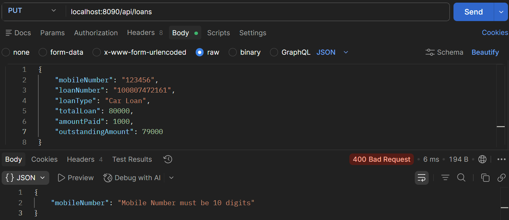  

    Fig. 12 Update loan - Mobile number not 10 digits  

---

### DELETE Mapping

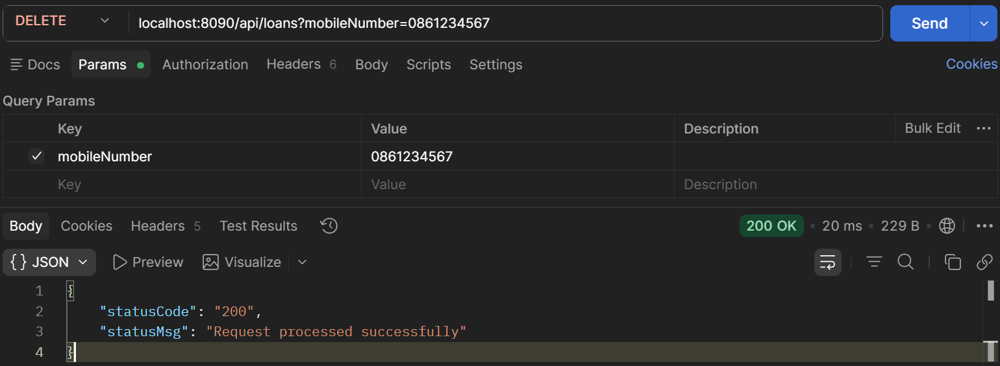  

    Fig. 13 Deleting a loan  

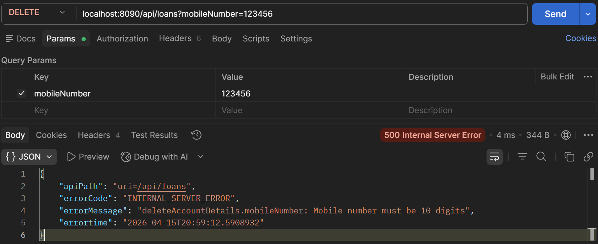  

    Fig. 14 Deleting a loan – mobile number too short  

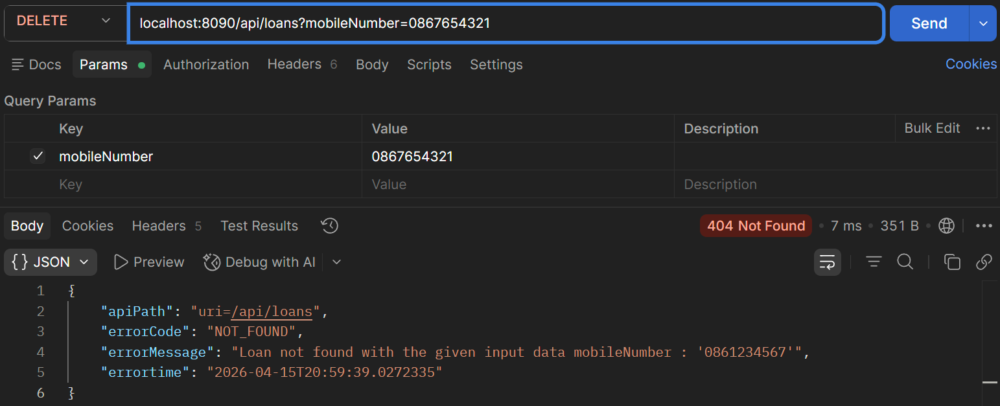  

    Fig. 15 Deleting a loan – loan with mobile number not found  