# RESTful API Lab 7

## Lab#8 Loans MicroService

---

In this lab we will create a loans microservice, similar to the accounts service.

  
**Figure 1: Project Layout**  

Schema.sql, LoansConstants, ILoansService and LoansServiceImpl and LoansMapper files are given. Use port 8090 in the .yml file.

---

### Creating a Loan
First create a customer as before using the accounts microservice.

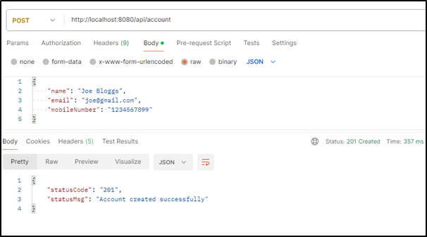   
**Fig. 2 Create a customer**  

Now using the same mobile number create a loan. The mobile number supplied must be 10 digits long. A loan cannot already exist for the customer with given mobile number.
 
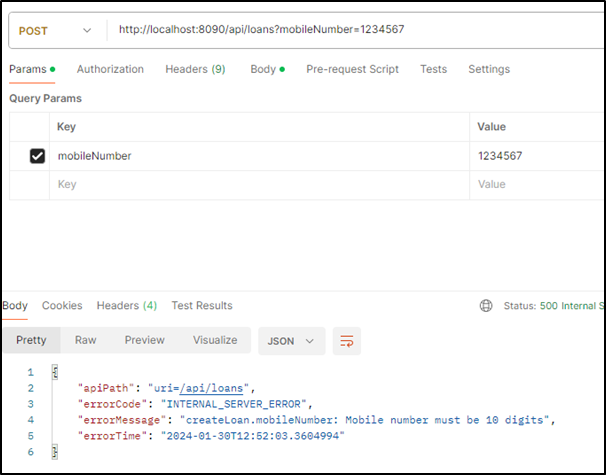  
**Fig. 3 Create a loan - Mobile number too short**
 
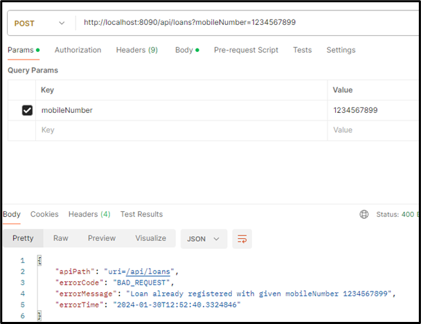  
**Fig. 4 Create a loan -  Loan already exists for customer**

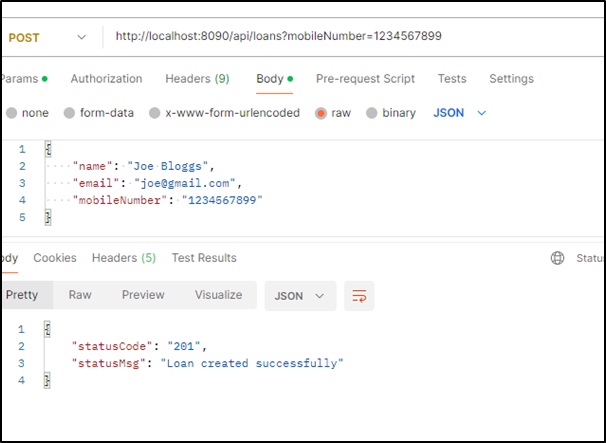  
**Fig. 5 Loan created success.**

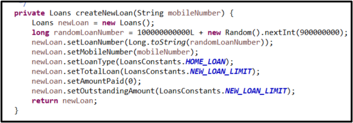  
**Fig. 6 Creating a loan – code in LoansServiceImpl**

The loan is create using default values as shown and the number is generated as shown

---

### Fetch loan details

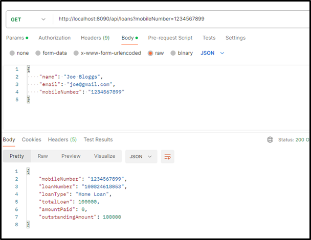  
**Fig. 7 Fetching loan details - success**

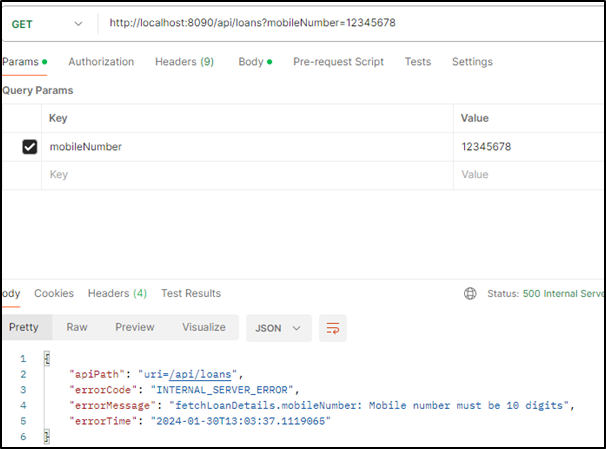  
**Fig. 8 Fetching loan - mobile number not 10 digits**

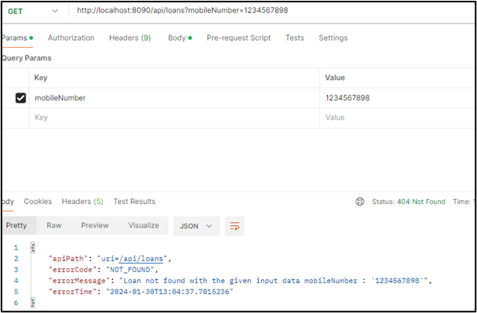  
**Fig. 9 Fetching loan – no loan for given mobile number**

---

### Update Loan details

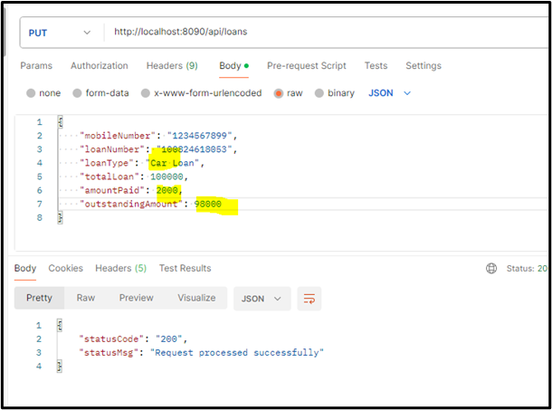  
**Fig. 10 Updating loan –loan details updated successfully**

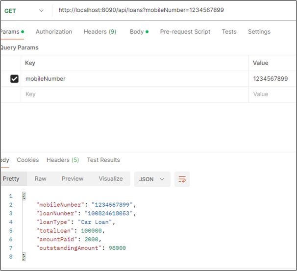  
**Fig. 11 Fetch updated values –loan details updated**

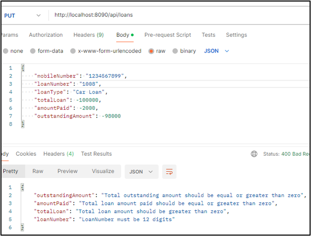  
**Fig. 12 Updating loan –validation errors in data**

See LoansDto for error example

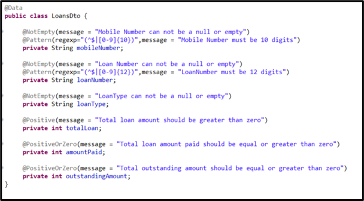  
**Fig. 13 Handling errors in LoansDto**

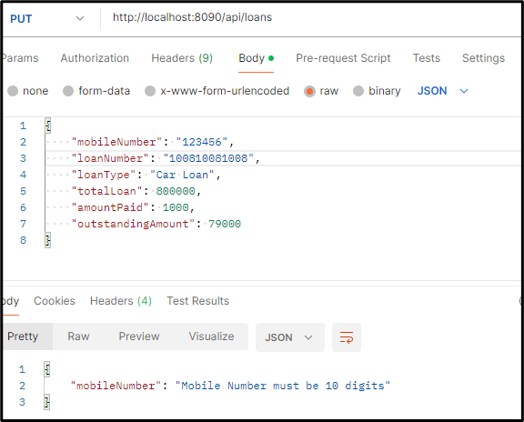  
**Fig. 14 Update loan - Mobile number not 10 digits**

---

### DELETE Mapping

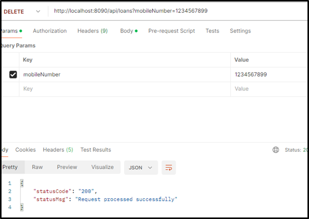  
**Fig. 15 Deleting a loan**

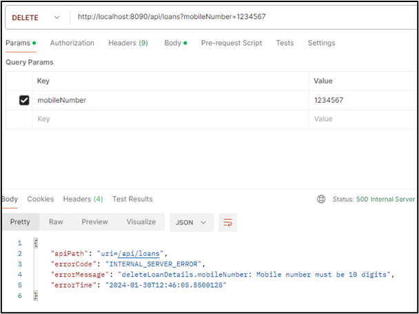  
**Fig. 16 Deleting a loan – mobile number too short**

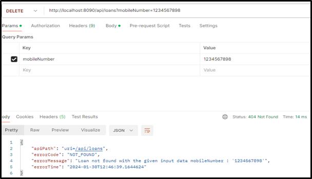  
**Fig. 17 Deleting a loan – loan with mobile number not found**