# RESTful API Lab 9

## Lab#9 Cards MicroService

---

In this lab we will create a cards microservice, similar to the loans service.

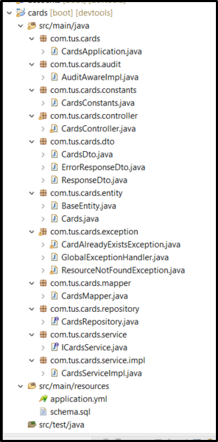  
**Figure 1: Project Layout**  

Schema.sql, CardsConstants, ICardsService and CardsServiceImpl and CardsMapper files are given. Use port 9000 in the .yml file.

### Creating a Card

Now a mobile number create a card. The mobile number supplied must be 10 digits long. A card cannot already exist for the customer with given mobile number.

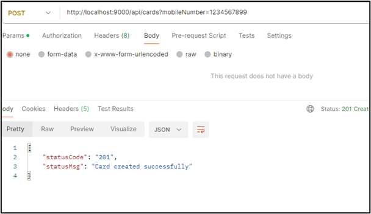  
**Fig. 2 Create a card - Success**  

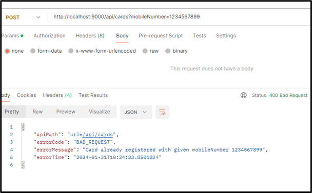  
**Fig. 3 Create a card -  Card already exists for mobile no.**  

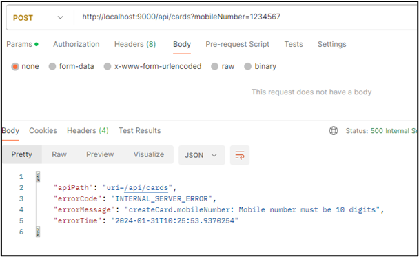  
**Fig. 4 Create a card- mobile number too short.**  

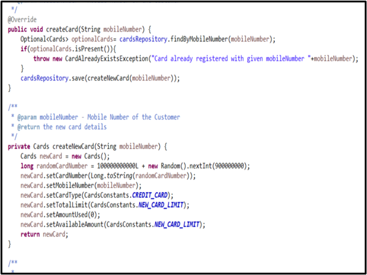  
**Fig. 5 Creating a card – code in CardsServiceImpl**  

The card is created using default values as shown and the number is generated as shown

### Fetch card details

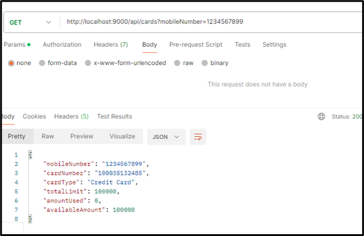  
**Fig. 6 Fetching card details - success**  

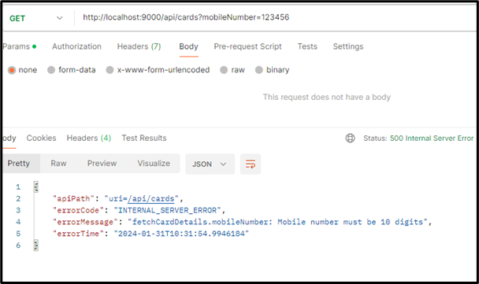  
**Fig. 7 Fetching card details - mobile number not 10 digits**  

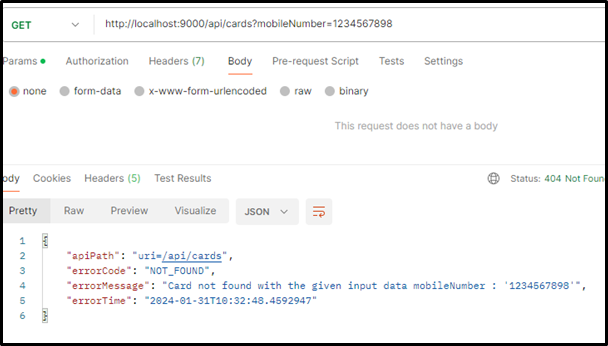  
**Fig. 8 Fetching card – no card for given mobile number**  

### Update Card details

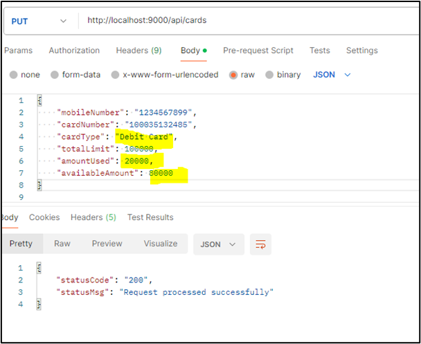  
**Fig. 9 Updating card – card details updated successfully**  

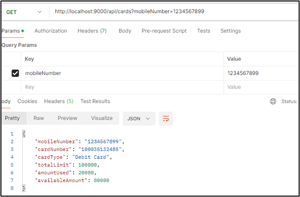  
**Fig. 10 Fetch updated values – card details updated**  

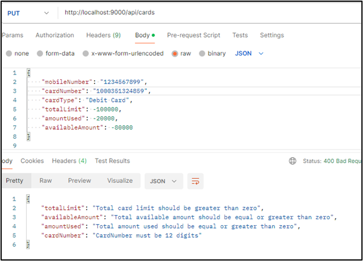  
**Fig. 11 Updating loan – validation errors in data**  

See CardsDto for error example

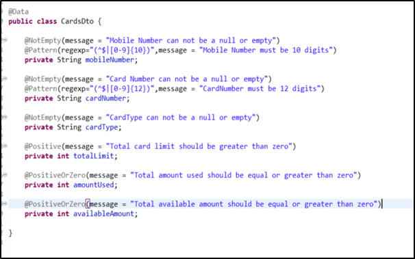  
**Fig. 12 Handling errors in CardsDto**  

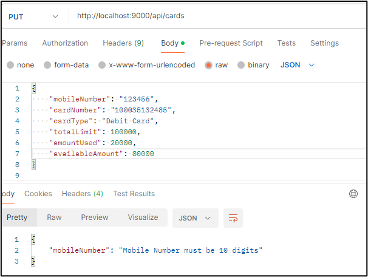  
**Fig. 13 Update card - Mobile number not 10 digits**  

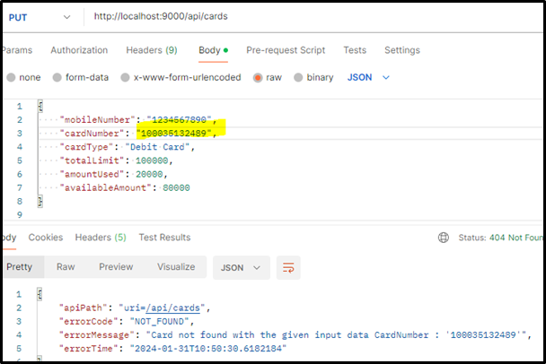  
**Fig. 14 Update card – Card number not found**  

### DELETE Mapping

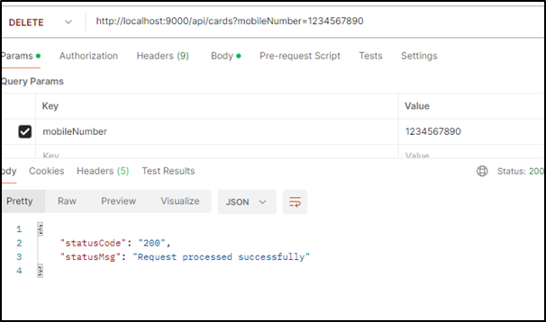  
**Fig. 15 Deleting a card**  

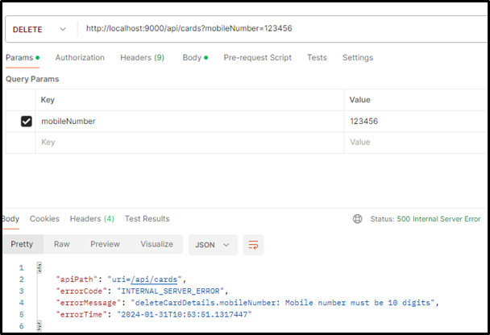  
**Fig. 16 Deleting a loan – mobile number too short**  

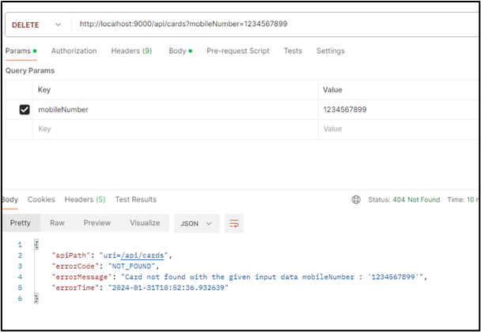  
**Fig. 17 Deleting a card – card with mobile number not found**  